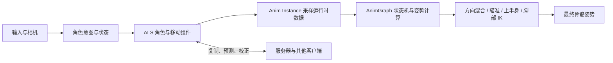

# ALS 大致框架

> 研究范围：本文以公开的 Advanced Locomotion System V4 思路为主，结合 [ALS-Community](https://github.com/PanicPetal/ALS-Community) 的 UE5.4 社区实现核对职责与数据流。Epic 官方文档、Lyra 示例负责说明 Unreal Engine 的通用动画与网络基础。ALS-Community 的 README 也明确提醒：这套 ALS 建立在较早期的动画编程方式上，现代项目应同时参考 Lyra 等模块化方案。

## 1. 总览：从输入到最终姿势

### How

1. 输入层给出移动方向、视角、步态、站姿和旋转模式等意图。
2. 角色类把意图转换为移动状态、旋转目标、速度、加速度等可消费数据；自定义移动组件负责实际移动、移动设置和网络移动预测。
3. `AnimInstance` 在动画更新阶段读取角色与移动组件的数据，计算相对速度、方向、瞄准角、脚部偏移等动画变量。
4. Animation Blueprint 的 `AnimGraph` 消费这些变量：状态机选择 Grounded / In Air / Ragdoll 等大状态，Blend Space 和 Aim Offset 负责连续变化，分层混合与 IK 负责局部修正。
5. 输出姿势经过插槽、覆盖层、脚部锁定和骨骼修正后，交给 Skeletal Mesh。

### Why

把“角色怎么移动”和“角色如何表现”拆开，可以让物理、网络、动画资产各自演进。动画图只关心稳定的状态与参数，角色代码也不需要知道每一帧具体播放哪条动画。Epic 对 Animation Blueprint 的定位正是：用专用图表控制 Skeletal Mesh 的动画、混合和每帧骨骼姿势。[Animation Blueprints](https://dev.epicgames.com/documentation/en-us/unreal-engine/animation-blueprints-in-unreal-engine)

## 2. 模块分层

| 层 | How：主要职责 | Why：这样拆分的原因 |
| --- | --- | --- |
| Unreal Engine 基础层 | `Character`、`CharacterMovementComponent`、Skeletal Mesh、Animation Blueprint、状态机、Blend Space、Aim Offset、骨骼分层与 IK 提供通用能力。 | 复用引擎的移动碰撞、复制、动画求值和资产工具，减少 ALS 自己维护底层机制。 |
| ALS 角色层 | 角色类集中保存输入意图、旋转模式、步态、站姿、覆盖层、移动状态和运行时运动信息；同时连接相机、输入和移动组件。 | 角色是玩法状态的归属点，动画只需通过统一接口读取状态。ALS-Community 的 `ALSBaseCharacter` 头文件按 Input、Movement System、Essential Information、State Values、Rotation System、Replication 等区域组织这些数据。[源码](https://github.com/PanicPetal/ALS-Community/blob/main/Source/ALSV4_CPP/Public/Character/ALSBaseCharacter.h) |
| ALS 移动层 | `ALSCharacterMovementComponent` 扩展标准移动组件，管理 Movement Settings、允许步态、最大加速度/制动，以及客户端 Saved Move 和预测数据。 | 速度、加速度和网络移动应由移动系统权威计算；动画层只消费结果。[源码](https://github.com/PanicPetal/ALS-Community/blob/main/Source/ALSV4_CPP/Public/Character/ALSCharacterMovementComponent.h) |
| 特性组件层 | Mantle、Debug 等功能可放入独立 Actor Component；相机也有独立的 Camera Manager / Camera Behavior。 | 将高频基础移动与可选功能隔离，降低角色基类复杂度，也方便按项目裁剪。ALS-Community 的蓝图目录可见 `MantleComponent` 和 `DebugComponent`。[资产目录](https://github.com/PanicPetal/ALS-Community/tree/main/Content/AdvancedLocomotionV4/Blueprints/Components) |
| 动画逻辑层 | Animation Blueprint 组织主状态机、循环、起停、空中、覆盖层、瞄准、IK 和插槽。 | 让动画师可以在可视化图表中调节过渡、混合和曲线，不必为每个动作修改角色代码。 |
| 动画数据层 | Animation Sequence、Blend Space、Aim Offset、曲线、DataTable、脚步数据和配置参数共同描述速度、步态、脚锁、覆盖层等映射。 | 把“数值到姿势”的关系数据化，便于换角色、换骨骼比例和调节动画节奏。ALS-Community 的资产中包含 `MovementModelTable`、`FootstepDataTable` 与 Curves 目录。[数据目录](https://github.com/PanicPetal/ALS-Community/tree/main/Content/AdvancedLocomotionV4/Data) |

## 3. 角色与移动组件

### How

- 角色类接收移动和视角输入，维护 `DesiredRotationMode`、`DesiredGait`、`DesiredStance` 等意图，再结合当前速度、加速度、落地和姿态得到实际状态。
- 角色保存动画需要的基础量：`Speed`、`Acceleration`、`MovementInputAmount`、输入/速度方向、`AimYawRate` 等。
- 自定义移动组件继承 `UCharacterMovementComponent`，在标准行走、加速度、制动和网络预测流程上加入 ALS 的 Movement Settings 与 Allowed Gait。
- 步态切换属于移动设置变化：客户端记录变化，移动预测数据携带必要标记，服务器确认后再影响最大行走速度和动画节奏。

### Why

输入意图、物理结果和动画参数是三种不同的语义。把它们依次落在角色、移动组件和 Anim Instance 中，能避免用动画变量反向驱动物理移动，也能让服务器只同步必要状态。Epic 的网络文档把 Replication 定义为客户端与服务器之间同步数据和过程调用的机制；ALS 的移动组件则直接采用“authoritative networked Character Movement”的设计。[Unreal Networking](https://dev.epicgames.com/documentation/en-us/unreal-engine/networking-and-multiplayer-in-unreal-engine) · [ALS 移动组件](https://github.com/PanicPetal/ALS-Community/blob/main/Source/ALSV4_CPP/Public/Character/ALSCharacterMovementComponent.h)

## 4. Animation Blueprint 与 Anim Instance

### How

- Skeletal Mesh 设置为使用 Animation Blueprint；Anim Blueprint 负责 `AnimGraph`，对应的 Anim Instance 保存运行时变量。[官方流程](https://dev.epicgames.com/documentation/en-us/unreal-engine/animation-blueprints-in-unreal-engine)
- ALS 的 `ALSCharacterAnimInstance` 初始化时缓存拥有它的 ALS 角色，开始播放时获取调试组件。
- 每次动画更新先同步 Character Information、Movement State、Movement Action、Stance、Rotation Mode、Gait、Overlay State，再按状态更新 Aiming、Layer、Foot IK、Grounded、In Air 或 Ragdoll 数据。
- AnimGraph 读取这些已经整理好的变量，完成状态机、姿势混合、局部层叠和最终输出。角色代码不直接逐帧选择动画资产。

### Why

Anim Instance 是“游戏状态”和“动画图”之间的适配层。它可以把世界空间速度转换为角色局部空间，把复杂判断预先整理成少量枚举、权重和连续参数，动画图因此更容易读懂、调试和替换。ALS 源码将更新函数按 Aiming、Layer、Foot IK、Movement、Rotation、In Air、Ragdoll 分组，体现了这种职责边界。[Anim Instance 头文件](https://github.com/PanicPetal/ALS-Community/blob/main/Source/ALSV4_CPP/Public/Character/Animation/ALSCharacterAnimInstance.h) · [更新实现](https://github.com/PanicPetal/ALS-Community/blob/main/Source/ALSV4_CPP/Private/Character/Animation/ALSCharacterAnimInstance.cpp)

## 5. 状态机：用大状态管理动画上下文

### How

ALS 的框架级状态可归纳为：

- **Grounded**：站立、行走、跑步、冲刺、蹲伏等地面循环；根据 `ShouldMove` 决定进入移动分支或待机分支。
- **In Air**：跳跃、上升、下落、落地预测和空中倾 lean；落地后根据 Grounded Entry State 选择合适的回地面表现。
- **Ragdoll**：物理布娃娃及其恢复表现。
- **Movement Action / Overlay State**：Mantle、滚翻、受击、武器或道具覆盖层等短时动作和局部姿势，通常通过插槽、覆盖层或独立组件叠加。

Grounded 内部通常再区分 Idle、Start、Cycle、Stop、Pivot、Turn In Place 等阶段。移动时更新速度混合和旋转；停止时允许原地旋转、原地转身和 Dynamic Transition。ALS 的 Anim Instance 代码明确按 Grounded、In Air、Ragdoll 分派更新逻辑，并用 `ShouldMoveCheck` 区分“有移动输入且正在移动”与“速度仍高于阈值”的情况。[状态更新实现](https://github.com/PanicPetal/ALS-Community/blob/main/Source/ALSV4_CPP/Private/Character/Animation/ALSCharacterAnimInstance.cpp)

### Why

状态机的价值在于限定上下文：地面循环需要脚部接触和起停，空中状态需要落地预测，布娃娃状态需要暂停常规脚部修正。把它们拆开可以减少互相冲突的过渡条件；把步态、站姿、旋转模式作为正交参数，又能避免为每个组合创建一张巨大的状态图。Epic 将 Animation State Machine 定位为通过状态和转换组织动画行为，实际项目应让状态表达“动画上下文”，让参数表达“上下文内的连续变化”。[State Machines](https://dev.epicgames.com/documentation/en-us/unreal-engine/state-machines-in-unreal-engine)

## 6. 姿态、方向与移动状态

### How

- **旋转模式**：Velocity Direction 让角色主要朝速度方向；Looking Direction / Aiming 允许角色朝视线方向，移动方向由速度或输入相对角色/瞄准旋转计算。
- **方向参数**：将速度向量反旋转到角色局部空间，得到前、后、左、右及对角分量；ALS 还将方向归一化，使对角线不会因为两个轴同时存在而被放大。
- **步态与速度**：用 Walking / Running / Sprinting 等状态选择动画族，再用 Stride Blend 和 Play Rate 让脚步距离、动画速度与真实移动速度匹配。`W_Gait` 等动画曲线用于在走、跑、冲刺之间平滑映射。
- **姿态参数**：Standing / Crouching 影响循环资产、播放速率、骨盆和脚部修正；Overlay State 决定武器、道具或特殊持姿。
- **连续混合**：Blend Space 根据一维或二维输入在样本之间插值；典型输入是速度与方向。Aim Offset 使用可叠加姿势表达瞄准角度。[Blend Spaces](https://dev.epicgames.com/documentation/en-us/unreal-engine/blend-spaces-in-unreal-engine) · [Aim Offset](https://dev.epicgames.com/documentation/en-us/unreal-engine/aim-offset-in-unreal-engine)

### Why

速度、方向、步态和站姿的组合数量很大。离散状态负责选择动画家族，Blend Space、曲线和播放速率负责连续变化，可以用较少的动画资产覆盖更多移动情况，同时保持脚步节奏和角色尺寸的一致性。ALS 源码把 Velocity Blend、Stride Blend、Walk/Run Blend、Standing Play Rate 和 Crouching Play Rate 分成独立计算，便于逐项调参。[计算实现](https://github.com/PanicPetal/ALS-Community/blob/main/Source/ALSV4_CPP/Private/Character/Animation/ALSCharacterAnimInstance.cpp)

## 7. 瞄准与上半身

### How

1. 从控制旋转与角色旋转得到 Aim Yaw / Pitch，并先做平滑，再计算瞄准角。
2. 将瞄准角输入 Aim Offset；根据覆盖层和曲线决定脊柱、头部、左右手臂、手部 IK 的权重。
3. 以下半身 Grounded / In Air 姿势为基础，通过 Spine、Head、Arm 等骨骼分层或 Additive Pose 叠加上半身。
4. 武器、交互或特殊动作使用局部骨骼混合与 Anim Slot，必要时把完整上半身动作覆盖到基础移动姿势。

### Why

移动循环和瞄准动作的变化频率不同。下半身继续保持脚步与方向，上半身独立响应视角和武器，角色才能边移动边瞄准，也能复用同一套移动资产。Epic 的 Blend Space 文档把 Aim Offset 定义为以 mesh-space additive 动画为样本的特殊 Blend Space；Animation Blueprint Linking 则提供 Linked Anim Graph、Linked Anim Layer 和 Template，用于把复杂动画拆成可复用模块。[Aim Offset](https://dev.epicgames.com/documentation/en-us/unreal-engine/aim-offset-in-unreal-engine) · [Animation Blueprint Linking](https://dev.epicgames.com/documentation/en-us/unreal-engine/animation-blueprint-linking-in-unreal-engine)

## 8. 脚部 IK 与脚锁定

### How

- 动画曲线控制每只脚何时启用 Foot IK、何时锁定。脚锁定时保存 IK 脚骨骼的组件空间位置和旋转。
- 角色移动或旋转后，用帧间位移和旋转差修正锁定目标，使脚保持在地面原处，减少滑步。
- 非空中状态下，从左右脚附近向下追踪可行走表面，读取接触点和法线，计算脚部位置/旋转偏移；取两脚中更低的目标驱动骨盆偏移。
- 进入空中或布娃娃时逐渐清零脚部与骨盆偏移。若 IK 脚与虚拟脚目标距离过大，则播放 Dynamic Transition，使脚回到可接受的姿态。

### Why

循环动画假设的是平地和固定步幅，真实场景会有斜坡、台阶、不同速度和网络校正。曲线提供动画师的启停控制，射线提供环境适配，脚锁定负责保持接触，骨盆补偿负责避免腿部被拉伸；四者配合比单纯把脚吸附到地面更稳定。ALS 的 `UpdateFootIK`、`SetFootLocking`、`SetFootOffsets`、`SetPelvisIKOffset` 和 `DynamicTransitionCheck` 直接体现了这条处理链。[脚部 IK 实现](https://github.com/PanicPetal/ALS-Community/blob/main/Source/ALSV4_CPP/Private/Character/Animation/ALSCharacterAnimInstance.cpp)

## 9. 转身、起步、停止与动态过渡

### How

- **起步**：从 Idle 转为移动时，`ShouldMove` 由输入、移动标志和速度阈值共同决定；状态机从 Start 进入 Cycle。
- **停止**：失去输入后，根据当前速度、加速度和方向选择 Stop；速度仍未归零时保持过渡，避免突然切回 Idle。
- **Pivot**：移动方向快速变化且速度降低时设置 Pivot 标记，播放改变支撑脚和方向的过渡。
- **原地旋转**：在 Aiming 或第一人称场景，根据 Aim Yaw 是否超过阈值设置左/右旋转，并用 Aim Yaw Rate 调整播放速度。
- **原地转身**：在第三人称 Looking Direction 模式下，只有角度持续超出阈值且视角变化速度较低时触发；按站姿与角度选择 90° 或 180° 动画，并根据实际角度缩放旋转。
- **Dynamic Transition**：站立且不移动时检查 IK 脚与目标虚拟骨骼的距离，超出阈值就播放短的添加式过渡。

### Why

起停和转身需要使用“意图 + 速度 + 持续时间”三个维度。仅靠角度会在玩家快速转镜头时频繁触发转身，加入 Aim Yaw Rate 和延迟可以过滤瞬时输入；仅靠速度会让脚步在换向时交叉，Pivot 与 Dynamic Transition 用短动作修正支撑关系。ALS 的实现将这些判断放在 Anim Instance，资产选择和过渡播放放在动画图/插槽，便于调参和替换。[转身与动态过渡实现](https://github.com/PanicPetal/ALS-Community/blob/main/Source/ALSV4_CPP/Private/Character/Animation/ALSCharacterAnimInstance.cpp)

## 10. 网络同步与性能

### How

- 服务器权威处理角色移动；客户端保留输入意图并进行本地预测，移动组件通过 Saved Move / 压缩标记传递必要的移动设置变化。
- 旋转模式、视角模式、覆盖层、可见网格和部分运动信息使用复制变量与 OnRep 回调；Anim Instance 在各端根据本地角色状态计算最终视觉参数。
- 只复制会改变玩法或远端表现的离散状态，速度、方向、脚部偏移等高频视觉量尽量从已同步状态和本地运动结果推导，避免逐帧发送。
- 动画计算应集中在必要的变量更新和图表求值；把 Mantle、Debug 等可选功能拆成组件，使用动画更新率、可见性 tick、更新预算等手段控制远端角色开销。ALS-Community 的实现还保留了网络优化开关、专用服务器动画 tick 选项和布娃娃相关的特殊处理。

### Why

网络同步关注权威性和带宽，动画表现关注连续性和稳定性。两者职责分开后，网络只保证状态与移动结果，动画在本地平滑补间、重新计算脚部 IK 和瞄准层，视觉质量不会直接等同于网络更新频率。Epic 的网络文档强调数据发送方式会直接影响性能与体验；Lyra 则把模块化、可扩展、在线多人和跨平台作为示例项目的架构目标。[Networking and Multiplayer](https://dev.epicgames.com/documentation/en-us/unreal-engine/networking-and-multiplayer-in-unreal-engine) · [Lyra Sample Game](https://dev.epicgames.com/documentation/en-us/unreal-engine/lyra-sample-game-in-unreal-engine)

## 11. 实现时的框架检查表

- **How**：先定义角色状态与移动组件的权威数据，再设计 Anim Instance 的只读快照，最后搭建 AnimGraph。
- **Why**：动画图应该消费稳定语义，避免直接依赖输入事件和网络包。
- **How**：用离散状态选择上下文，用 Blend Space、曲线和权重表达连续变化。
- **Why**：减少状态组合数量，让动画资产可复用、可调节。
- **How**：把脚部 IK、瞄准、覆盖层、Mantle、Debug 作为可独立启停的模块或动画层。
- **Why**：不同玩法只替换局部能力，不必重写整张移动图。
- **How**：以服务器权威移动、客户端预测、状态复制和本地视觉推导作为网络基线。
- **Why**：在可校正的前提下保持移动手感，并控制带宽和远端动画成本。

## 来源

### Epic / Unreal 官方

- [Advanced Locomotion System Tutorial](https://dev.epicgames.com/community/learning/tutorials/bX9J/unreal-engine-advanced-locomotion-system-tutorial)
- [Animation Blueprints](https://dev.epicgames.com/documentation/en-us/unreal-engine/animation-blueprints-in-unreal-engine)
- [State Machines](https://dev.epicgames.com/documentation/en-us/unreal-engine/state-machines-in-unreal-engine)
- [Blend Spaces](https://dev.epicgames.com/documentation/en-us/unreal-engine/blend-spaces-in-unreal-engine)
- [Aim Offset](https://dev.epicgames.com/documentation/en-us/unreal-engine/aim-offset-in-unreal-engine)
- [Animation Blueprint Linking](https://dev.epicgames.com/documentation/en-us/unreal-engine/animation-blueprint-linking-in-unreal-engine)
- [Networking and Multiplayer](https://dev.epicgames.com/documentation/en-us/unreal-engine/networking-and-multiplayer-in-unreal-engine)
- [Lyra Sample Game](https://dev.epicgames.com/documentation/en-us/unreal-engine/lyra-sample-game-in-unreal-engine)

### ALS 实现与资产核对

- [ALS-Community README](https://github.com/PanicPetal/ALS-Community)
- [ALS C++ Source Tree](https://github.com/PanicPetal/ALS-Community/tree/main/Source/ALSV4_CPP)
- [ALS Content / Blueprints](https://github.com/PanicPetal/ALS-Community/tree/main/Content/AdvancedLocomotionV4/Blueprints)
- [ALSCharacterAnimInstance.h](https://github.com/PanicPetal/ALS-Community/blob/main/Source/ALSV4_CPP/Public/Character/Animation/ALSCharacterAnimInstance.h)
- [ALSCharacterAnimInstance.cpp](https://github.com/PanicPetal/ALS-Community/blob/main/Source/ALSV4_CPP/Private/Character/Animation/ALSCharacterAnimInstance.cpp)
- [ALSCharacterMovementComponent.h](https://github.com/PanicPetal/ALS-Community/blob/main/Source/ALSV4_CPP/Public/Character/ALSCharacterMovementComponent.h)
- [ALSBaseCharacter.h](https://github.com/PanicPetal/ALS-Community/blob/main/Source/ALSV4_CPP/Public/Character/ALSBaseCharacter.h)
