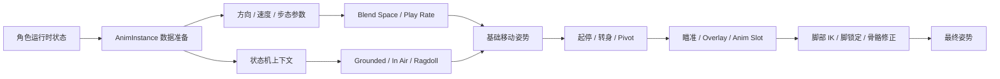

# ALS 动画框架

> 本文只梳理 Advanced Locomotion System 的动画部分。角色移动、网络同步和玩法组件只作为动画输入来源简单提及，具体实现放到后续专题。

## 1. 动画数据流

### How

1. 角色提供速度、加速度、移动方向、旋转模式、步态、站姿和空地状态。
2. `AnimInstance` 在动画更新阶段读取这些状态，并转换为动画图可以直接使用的变量。
3. `AnimGraph` 先选择动画上下文，再完成移动循环、起停、转身和局部姿势叠加。
4. 基础姿势经过瞄准、覆盖层、插槽和 IK 修正，最后输出给 Skeletal Mesh。

### Why

ALS 的动画图需要稳定的语义输入。将运行时状态整理成方向、速度、权重、枚举和曲线后，动画资产只处理姿势表现，状态判断也更容易调试。

## 2. AnimInstance：动画图的数据准备层

### How

`AnimInstance` 不直接决定角色移动，它负责把角色状态转换成动画参数。常见数据可以分成四组：

| 数据组 | 典型内容 | 动画用途 |
| --- | --- | --- |
| 基础运动 | Speed、Acceleration、Movement Input、Velocity Blend | 驱动移动方向、速度和脚步节奏 |
| 状态枚举 | Movement State、Movement Action、Stance、Gait、Rotation Mode | 决定状态机分支和动画资产族 |
| 姿势参数 | Aim Yaw、Aim Pitch、Overlay State、Layer Weight | 驱动瞄准、覆盖层和骨骼分层 |
| 接触修正 | Foot IK、Foot Lock、Pelvis Offset、Ground Normal | 适配地面并减少脚滑 |

更新过程通常先缓存拥有该 AnimInstance 的角色，再按 Character Information、Movement State、Aiming、Layer、Grounded、In Air 和 Foot IK 等主题更新变量。

### Why

AnimInstance 是游戏状态进入动画图前的适配层。它可以完成坐标空间转换、平滑、阈值判断和权重计算，避免在 AnimGraph 中堆叠大量重复逻辑。

参考：[ALSCharacterAnimInstance.h](https://github.com/PanicPetal/ALS-Community/blob/main/Source/ALSV4_CPP/Public/Character/Animation/ALSCharacterAnimInstance.h)、[ALSCharacterAnimInstance.cpp](https://github.com/PanicPetal/ALS-Community/blob/main/Source/ALSV4_CPP/Private/Character/Animation/ALSCharacterAnimInstance.cpp)

## 3. 主状态机：先确定动画上下文

### How

ALS 的动画主状态通常可以归纳为：

- **Grounded**：站立、行走、跑步、冲刺、蹲伏和地面起停。
- **In Air**：跳跃、上升、下落、落地前后过渡。
- **Ragdoll**：布娃娃姿势和恢复动画。

Grounded 内部继续划分 Idle、Start、Cycle、Stop、Pivot、Turn In Place 等阶段。Movement State 负责选择大上下文，Gait、Stance 和 Rotation Mode 负责选择上下文内的表现方式。

### Why

不同动画上下文需要不同的更新逻辑。地面状态关注脚步接触和起停，空中状态关注重力与落地，布娃娃状态则需要暂停常规移动图。先分上下文，可以减少状态之间的无效过渡。

参考：[Unreal Engine State Machines](https://dev.epicgames.com/documentation/en-us/unreal-engine/state-machines-in-unreal-engine)、[ALS AnimInstance 状态更新](https://github.com/PanicPetal/ALS-Community/blob/main/Source/ALSV4_CPP/Private/Character/Animation/ALSCharacterAnimInstance.cpp)

## 4. Grounded：移动循环的核心

### How

Grounded 的核心流程可以拆成四层：

1. 根据 `Should Move` 判断进入 Idle 分支还是移动分支。
2. 移动分支使用速度和方向驱动 Blend Space，得到前后左右及对角移动姿势。
3. 根据 Gait、Stance 和 Rotation Mode 选择对应的动画资产族与参数。
4. 通过 Stride Blend、Play Rate 和动画曲线，让动画步幅与实际速度保持一致。

常见的动画参数包括：

- **Velocity Blend**：将速度转换为前、后、左、右的局部权重。
- **Stride Blend**：根据速度和步态调整步幅。
- **Walk / Run Blend**：在行走和跑步资产之间平滑切换。
- **Play Rate**：修正动画播放速度，使脚步周期匹配移动速度。

### Why

移动方向和速度是连续变量，Blend Space 能用较少的动画样本覆盖连续变化。步幅混合和播放速率负责处理动画速度与实际移动速度的差异，减少脚滑和步频突变。

参考：[Blend Spaces](https://dev.epicgames.com/documentation/en-us/unreal-engine/blend-spaces-in-unreal-engine)、[ALS AnimInstance 运动计算](https://github.com/PanicPetal/ALS-Community/blob/main/Source/ALSV4_CPP/Private/Character/Animation/ALSCharacterAnimInstance.cpp)

## 5. 方向、旋转与姿势参数

### How

- 将世界空间速度转换到角色局部空间，得到前后左右的运动分量。
- 用速度方向、输入方向或瞄准方向决定角色的移动表现。
- 用 Rotation Mode 区分角色朝向速度、朝向视线或朝向瞄准方向。
- 将 Standing / Crouching、Walking / Running / Sprinting 等离散状态作为动画选择条件。
- 将方向、速度、瞄准角等连续数据作为 Blend Space、Aim Offset 和 Play Rate 的输入。

### Why

步态、站姿和旋转模式属于动画上下文，方向和速度属于连续参数。将两者分开后，状态机负责选择动画类型，Blend Space 和曲线负责处理同一类型内部的变化，可以避免状态组合快速膨胀。

## 6. 起步、停止、Pivot 与原地转身

### How

- **Start**：从 Idle 进入移动时，根据输入和速度阈值选择前进、后退或侧向起步。
- **Cycle**：起步动画完成后进入循环，循环姿势由速度和方向持续驱动。
- **Stop**：失去移动意图后，根据当前速度、方向和制动状态选择停止动画。
- **Pivot**：移动方向快速改变时，播放改变支撑关系的换向动作。
- **Turn In Place**：角色速度接近零且视线持续偏离角色朝向时，按偏转角、站姿和旋转速度选择原地转身。

转身判断通常会使用 Aim Yaw、Aim Yaw Rate、角度阈值和触发延迟。动画播放角度可以根据实际偏转量缩放。

### Why

起步、循环、停止和转身体现不同的身体重心变化，使用独立阶段可以保持动作衔接。加入角速度和延迟能过滤镜头的瞬时变化，减少原地转身的误触发。

## 7. 瞄准、Overlay 与上半身分层

### How

1. 计算控制器旋转与角色旋转的差值，得到 Aim Yaw 和 Aim Pitch。
2. 将瞄准角输入 Aim Offset，生成上半身的倾斜和转向姿势。
3. 以 Grounded 或 In Air 的全身移动姿势作为底层。
4. 使用 Layered Blend Per Bone、Additive Pose 或 Anim Slot，将瞄准、武器、交互和受击动作叠加到指定骨骼。
5. 根据 Overlay State 和 Layer Weight 控制脊柱、头部、手臂和手部 IK 的影响范围。

### Why

移动循环与瞄准动作的变化频率不同。下半身保持脚步和移动方向，上半身独立响应视角、武器和交互状态，可以复用同一套移动动画。骨骼分层也能限制局部动作对基础姿势的影响。

参考：[Aim Offset](https://dev.epicgames.com/documentation/en-us/unreal-engine/aim-offset-in-unreal-engine)、[Animation Blueprint Linking](https://dev.epicgames.com/documentation/en-us/unreal-engine/animation-blueprint-linking-in-unreal-engine)

## 8. Foot IK 与 Foot Lock

### How

- 根据动画曲线控制每只脚何时启用 IK 和脚锁定。
- 向脚部下方检测地面，读取接触点和法线，计算脚部位置与旋转偏移。
- 根据双脚目标高度计算 Pelvis Offset，避免腿部被过度拉伸。
- 脚锁定时保存脚的目标位置，并用角色移动和旋转的变化修正目标。
- 角色进入 In Air 或 Ragdoll 时逐渐降低 IK 权重，恢复到普通姿势。

ALS 常见的处理函数包括 `UpdateFootIK`、`SetFootLocking`、`SetFootOffsets`、`SetPelvisIKOffset` 和 `DynamicTransitionCheck`。

### Why

循环动画通常按平地制作，实际地形会包含斜坡、台阶和不规则接触面。地面检测负责环境适配，脚锁定负责保持支撑点，骨盆偏移负责维持合理腿长，动画曲线负责让这些修正跟随动作意图启停。

参考：[ALS Foot IK 实现](https://github.com/PanicPetal/ALS-Community/blob/main/Source/ALSV4_CPP/Private/Character/Animation/ALSCharacterAnimInstance.cpp)

## 9. 动画资产与图表组织

### How

可以按以下关系组织 ALS 动画资产：

- Animation Sequence：提供 Idle、Start、Cycle、Stop、Turn 等基础动作。
- Blend Space：组织速度、方向、步态等连续维度。
- Aim Offset：组织瞄准角度的 Additive Pose。
- Animation Curve：提供步态权重、脚锁定、IK 权重和过渡控制。
- Anim Layer / Linked Anim Graph：拆分武器、上半身和特殊动作。
- Anim Slot：承载需要在运行时插入的交互、受击或蒙太奇动作。

### Why

资产类型对应不同的动画问题：Sequence 负责动作本身，Blend Space 负责连续采样，Curve 负责时间和权重，Layer 与 Slot 负责模块化叠加。职责清晰后，替换角色骨骼或增加武器姿势时，改动范围更容易控制。

参考：[Animation Blueprints](https://dev.epicgames.com/documentation/en-us/unreal-engine/animation-blueprints-in-unreal-engine)、[Animation Blueprint Linking](https://dev.epicgames.com/documentation/en-us/unreal-engine/animation-blueprint-linking-in-unreal-engine)

## 10. 动画更新顺序与调试重点

### How

建议按以下顺序检查：

1. AnimInstance 是否成功获取角色引用。
2. Speed、Direction、Gait、Stance 和 Movement State 是否正确更新。
3. 状态机是否进入预期上下文，过渡规则是否被错误阈值阻断。
4. Blend Space 的轴范围、样本方向和速度标定是否一致。
5. Start、Stop、Pivot、Turn 的触发条件和动画剩余时间是否合理。
6. Aim Offset、Overlay、IK 的权重是否在正确的骨骼层级生效。
7. 脚部 IK 是否在空中、布娃娃和特殊动作期间正确降权。

### Why

ALS 的视觉问题通常沿着“数据 → 状态 → 姿势 → 局部修正”的链路传播。按这个顺序调试，可以先确认输入参数，再确认图表分支，最后定位资产、混合或 IK 的问题。

## 来源

### Epic / Unreal 官方

- [Advanced Locomotion System Tutorial](https://dev.epicgames.com/community/learning/tutorials/bX9J/unreal-engine-advanced-locomotion-system-tutorial)
- [Animation Blueprints](https://dev.epicgames.com/documentation/en-us/unreal-engine/animation-blueprints-in-unreal-engine)
- [State Machines](https://dev.epicgames.com/documentation/en-us/unreal-engine/state-machines-in-unreal-engine)
- [Blend Spaces](https://dev.epicgames.com/documentation/en-us/unreal-engine/blend-spaces-in-unreal-engine)
- [Aim Offset](https://dev.epicgames.com/documentation/en-us/unreal-engine/aim-offset-in-unreal-engine)
- [Animation Blueprint Linking](https://dev.epicgames.com/documentation/en-us/unreal-engine/animation-blueprint-linking-in-unreal-engine)

### ALS 实现核对

- [ALS-Community README](https://github.com/PanicPetal/ALS-Community)
- [ALSCharacterAnimInstance.h](https://github.com/PanicPetal/ALS-Community/blob/main/Source/ALSV4_CPP/Public/Character/Animation/ALSCharacterAnimInstance.h)
- [ALSCharacterAnimInstance.cpp](https://github.com/PanicPetal/ALS-Community/blob/main/Source/ALSV4_CPP/Private/Character/Animation/ALSCharacterAnimInstance.cpp)
