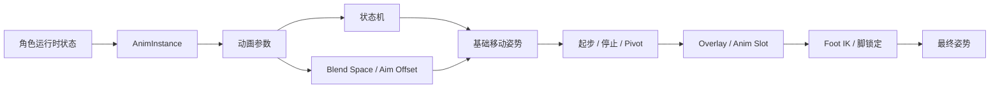

# ALS 整体架构

> ALS 将角色运行时状态转换为动画参数，再由状态机、姿势混合和局部修正生成最终姿势。

## 工作方式

ALS 的动画部分可以按四层理解：

1. **状态输入**：角色提供速度、方向、步态、站姿、旋转模式和空地状态。
2. **数据准备**：AnimInstance 将运行时状态转换为动画图使用的参数。
3. **姿势选择**：状态机和 Blend Space 选择基础动作，并处理起步、循环、停止和转身。
4. **姿势修正**：Overlay、瞄准、Anim Slot、脚部 IK 和脚锁定对基础姿势进行局部调整。

## 设计重点

- 离散状态负责选择动画上下文，例如 Grounded、In Air、Gait 和 Stance。
- 连续参数负责同一上下文中的变化，例如 Speed、Direction、Aim Yaw 和 Aim Pitch。
- AnimInstance 负责数据适配，AnimGraph 负责姿势组合，资产负责动作表现。
- 调试时沿着“数据 → 状态 → 姿势 → 局部修正”逐层检查。

## 相关主题

- [动画数据流](./02-动画数据流.md)
- [动画实例](./03-动画实例.md)
- [动画资产组织](./09-动画资产组织.md)
