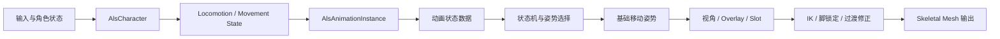

# ALS 整体架构

> ALS 的核心不是一张很大的动画蓝图，而是一条把角色状态逐层转换为最终姿势的处理链。

## 解决的问题

角色移动系统产生的是速度、输入、朝向和状态等运行时信息，动画系统需要的是可以采样、混合和过渡的姿势数据。ALS 通过 Character、AnimInstance、动画图和动画资产之间的分层，把这两种数据连接起来。

从实现思路看，Locomotion 大致有两种方向：一类主要由 Root Motion 等动画数据驱动，另一类先由代码和移动系统更新状态，再用这些状态驱动动画。 重构分析将 ALS 归入后者，并将“可控、响应快、适合多人移动”视为这种取舍的主要价值。这个判断适合用来理解 ALS 的设计倾向，但不是所有项目都必须采用同一种方案；最终取决于游戏玩法、网络同步和动作表现目标。

## 总体流程

可以把这条链理解成四个阶段：

1. **产生状态**：角色和移动组件根据输入、运动和环境维护当前状态。
2. **准备动画数据**：AnimInstance 读取状态，进行空间转换、平滑和派生计算。
3. **选择基础姿势**：状态机先选择动画上下文，再由 Sequence、Blend Space 等资产生成姿势。
4. **叠加局部修正**：视角、Overlay、Anim Slot、脚部 IK 和动态过渡修正基础姿势。

## 各层的职责边界

| 层                      | 主要职责                | 不应该承担的内容       |
| ---------------------- | ------------------- | -------------- |
| `AlsCharacter` / 移动组件  | 保存角色状态，处理输入、移动和状态切换 | 直接拼接最终动画姿势     |
| `AlsAnimationInstance` | 将角色状态转换为动画状态和参数     | 承担完整的角色移动规则    |
| 状态机与 AnimGraph         | 根据状态选择、混合和叠加姿势      | 重新计算一整套游戏状态    |
| 动画资产                   | 提供具体动作、采样空间和时间曲线    | 决定角色当前处于什么游戏状态 |
| Control Rig / IK       | 根据骨骼、地面和接触信息进行局部修正  | 替代基础移动姿势的选择    |

## 动画蓝图的组织方式

ALS 不把所有逻辑都塞进一个 AnimGraph。以 ALS Refactored 为例，主动画实例负责收集和准备公共状态，Linked Anim Instance 或动画层再按站姿、移动状态和局部功能拆分姿势逻辑。这样做的价值不是让文件数量变多，而是让每个动画层拥有相对明确的输入和输出：

- 主实例提供 Locomotion、View、Layering、Feet 等状态。
- 站立或蹲伏层负责对应姿势下的移动细节。
- Grounded、In Air 等更高层状态负责组合不同运动上下文。
- Overlay、Anim Slot 和 IK 在基础移动姿势之上继续叠加。

阅读 ALS 动画蓝图时，建议先看基础 Locomotion，再看 Standing/Crouching，最后看 Grounded 和更高层的 Locomotion 组合。这个顺序比直接从整张动画蓝图逐节点阅读更容易建立结构感。

## ALS 中的两类状态

### 选择上下文的状态

这些状态决定动画图应该走哪一类分支：

- `LocomotionMode`：例如 `Grounded`、`InAir`。
- `Gait`：例如 Walking、Running、Sprinting。
- `Stance`：例如 Standing、Crouching。
- `RotationMode`：决定角色朝向速度、视线或其他目标的方式。
- `OverlayMode`：决定上半身或特殊姿势的叠加方式。

### 驱动姿势变化的参数

这些参数在同一上下文内连续变化：

- Speed、Acceleration、Velocity Yaw。
- 局部空间中的 Direction 或 Velocity Blend。
- View Yaw、View Pitch 和旋转速度。
- 各类动画曲线、权重和 IK Alpha。

状态负责“选择哪一类动画”，参数负责“这一类动画具体表现成什么样”。把两者混在一起，会使状态机分支快速膨胀。

## ALS Refactored 中的落点

以 ALS Refactored 4.17 为例，`AAlsCharacter` 持有 `LocomotionState`、`LocomotionMode`、`RotationMode`、`Stance` 和 `Gait` 等角色侧状态；`UAlsAnimationInstance` 在动画更新时读取这些状态，并维护自己的 `LocomotionState`、`GroundedState`、`InAirState`、`FeetState`、`LayeringState` 等动画侧状态。

这里的两个状态层不要混为一谈：角色侧状态描述角色当前的运行状态，动画侧状态则是为了生成姿势而整理出的数据，可能包含平滑值、局部空间值、权重和过渡信息。

ALS Refactored 还使用 Gameplay Tag 表达 LocomotionMode、RotationMode、Stance、Gait 和 OverlayMode 等状态。相比固定枚举，Gameplay Tag 更容易在蓝图和配置中扩展；但它也把“Tag 是否匹配正确”的责任交给了项目结构和命名约定，调试时不能只看变量有值，还要确认 Tag 层级和动画图分支一致。

## 调试入口

出现动画问题时，沿以下顺序检查：

1. 角色状态是否正确，例如 Gait、Stance 和 LocomotionMode。
2. AnimInstance 是否读取并更新了对应状态。
3. 动画状态机是否进入了预期分支。
4. Blend Space、Sequence 或曲线是否产生了预期基础姿势。
5. Overlay、IK 或动态过渡是否在最后阶段改变了结果。

这个顺序的价值在于先定位“错误从哪一层开始出现”，而不是直接在最终姿势上反复调整节点。

## 相关主题

- [动画数据流](./02-动画数据流.md)
- [动画实例](./03-动画实例.md)
- [动画资产组织](./09-动画资产组织.md)

## 参考资料

### 官方与源码

- [ALS Refactored](https://github.com/Sixze/ALS-Refactored)
- [Unreal Engine Animation Blueprints](https://dev.epicgames.com/documentation/en-us/unreal-engine/animation-blueprints-in-unreal-engine)
- [ALS Refactored `AlsCharacter.h`](https://github.com/Sixze/ALS-Refactored/blob/4.17/Source/ALS/Public/AlsCharacter.h)
- [ALS Refactored `AlsAnimationInstance.h`](https://github.com/Sixze/ALS-Refactored/blob/4.17/Source/ALS/Public/AlsAnimationInstance.h)

### 其他资料

- [【UE5】【3C】ALSv4重构分析（二）：Locomotion导读](https://zhuanlan.zhihu.com/p/605417871)
- [ALS 简述](https://zhuanlan.zhihu.com/p/603429659)
