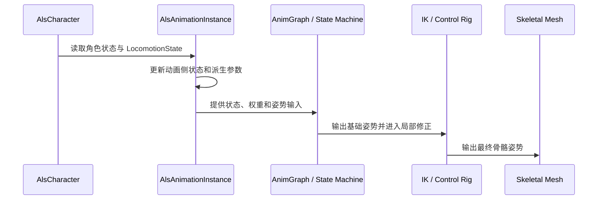

# ALS 动画数据流

> 动画数据流的关键是：先读取角色状态，再生成动画侧状态，最后把这些状态交给姿势图和局部修正系统。

## 解决的问题

角色移动数据通常以世界空间向量、Gameplay Tag 和组件状态存在，而动画资产需要局部方向、速度权重、姿势状态和过渡参数。AnimInstance 负责完成这次适配，使动画图不必直接理解移动组件的全部实现细节。

## 一帧中的主要阶段

在 ALS Refactored 的 `UAlsAnimationInstance` 中，这个过程可以从几个更新阶段观察到：

1. `NativeInitializeAnimation()`：缓存拥有该 AnimInstance 的 `AAlsCharacter`。
2. `NativeUpdateAnimation()`：读取角色侧状态，并更新移动基础、视角、Locomotion、In Air、Feet 和 Ragdoll 等游戏线程数据。
3. `NativeThreadSafeUpdateAnimation()`：更新 Layering、Pose、View、Feet 和 Transitions 等适合动画线程处理的状态。
4. `NativePostUpdateAnimation()`：将需要传给 Control Rig 等后续阶段的数据整理到动画代理中。

不同 ALS 版本的函数细节可能不同，但“游戏状态读取”和“动画姿势计算”分开是理解数据流的关键。在当前 ALS Refactored 实现中，`NativeUpdateAnimation` 更偏向收集和整理数据，`NativeThreadSafeUpdateAnimation` 则在动画图更新前执行适合并行处理的逻辑。这个理解需要以当前引擎版本和具体源码为准。

## 输入：角色侧状态

角色侧状态不是最终动画参数，而是动画数据流的起点。常见输入包括：

| 输入 | 含义 | 后续用途 |
| --- | --- | --- |
| `LocomotionMode` | 当前运动上下文 | 选择 Grounded、In Air 等主分支 |
| `RotationMode` | 角色的朝向规则 | 影响目标旋转、方向计算和转身 |
| `Stance` | 站立或蹲伏等姿态 | 选择姿势资产和骨盆高度 |
| `Gait` | 当前步态 | 选择 Walk、Run、Sprint 等动画族 |
| `LocomotionState` | 速度、输入、方向和移动标志 | 驱动移动循环、起停和转向 |
| `ViewState` / 视角数据 | 视角旋转及其变化 | 驱动瞄准、脊柱和头部姿势 |

ALS Refactored 使用 Gameplay Tag 表达不少离散状态。这样新增或组合状态时，不必为每个状态都增加 C++ 枚举，但动画图仍需要明确这些 Tag 对应的姿势分支。

## 转换：AnimInstance 生成动画状态

AnimInstance 会将输入转换成更适合动画图的数据。例如：

- 将世界空间速度转换成角色或网格局部空间的方向信息。
- 从速度变化计算加速度、制动趋势和移动平滑状态。
- 根据角色旋转与视角旋转的差值计算 Yaw、Pitch 等瞄准参数。
- 根据步态、站姿和移动速度生成 Blend Space 所需的权重。
- 根据地面检测、动画曲线和脚部状态生成 Foot IK、Foot Lock 和 Pelvis Offset 数据。
- 将状态变化转换为起步、停止、Pivot、Turn In Place 等过渡条件。

### 输入方向与速度方向不是一回事

输入方向表示玩家希望角色往哪里走，速度方向表示角色实际上正在往哪里移动。两者在加速、减速、滑动、转向或移动基座改变时可能不同。ALS 同时保存和使用这类角度数据，正是为了让动画能够分别处理“输入意图”和“当前运动结果”。

这些值通常不是简单复制角色变量，而是经过平滑、限制、坐标转换或时间累积后的派生数据。因此在调试时，不能只检查角色侧的 Speed 是否正确，还要检查 AnimInstance 中实际供动画图使用的变量。

## 输出：姿势图使用的数据

动画图接收的数据大致可以分为四类：

| 数据类别 | 示例 | 作用 |
| --- | --- | --- |
| 上下文状态 | Grounded、In Air、Stance、Gait | 选择状态机和动画资产族 |
| 连续采样参数 | Speed、Direction、Aim Yaw、Aim Pitch | 驱动 Blend Space、Aim Offset 和播放速率 |
| 姿势权重 | Layer Weight、Pose Amount、IK Alpha | 控制分层和局部修正的影响程度 |
| 时间与过渡数据 | 动画剩余时间、曲线值、Transition 状态 | 控制起停、转身、脚锁定和动态过渡 |

## 动画曲线在数据流中的位置

动画曲线不是单纯的美术标记。在 ALS 中，曲线可以把动作时间轴上的信息传给 AnimGraph 或动画实例，例如脚锁定、脚部 IK、姿势权重、Stride 和旋转偏移。它们的特点是“随动画播放时间变化”，因此适合表达某个动作阶段什么时候开始、什么时候结束。

曲线是理解 ALS 的关键入口之一，常见用途包括 Foot Lock、Rotation Yaw Offset 和姿势权重。这里需要注意：曲线的具体名称和读取方式属于项目约定，不能只看到曲线名就推断它一定具有某种标准含义。

## 一个具体例子：从速度到移动姿势

以角色向前移动为例：

1. 角色和移动组件产生世界空间速度。
2. AnimInstance 读取速度，并结合角色旋转计算局部前后左右分量。
3. 局部分量被整理为 Speed、Direction 或 Velocity Blend。
4. 状态机根据 LocomotionMode、Stance 和 Gait 进入对应的 Grounded 移动分支。
5. Blend Space 根据速度和方向采样移动循环。
6. Stride、Play Rate 等参数修正步幅和步频。
7. Overlay、视角姿势和 Foot IK 在基础姿势上继续叠加。

这个例子说明：Blend Space 并不负责判断角色是否应该进入 Grounded，也不负责决定当前是走路还是冲刺；它只在上层已经确定动画上下文后，根据连续参数生成姿势。

## 多线程边界

Unreal 官方文档将 Animation Blueprint 的更新区分为 Game Thread 和 Worker Threads，并建议把满足线程安全条件的逻辑放入 Thread Safe Update Animation 或 Thread Safe Functions。当前 ALS Refactored 的代码也将读取角色和组件状态的工作线程阶段，与 `RefreshLayering`、`RefreshPose`、`RefreshView`、`RefreshFeet` 和 `RefreshTransitions` 等线程安全更新区分开来。

因此，阅读 ALS 源码时要先问两个问题：

1. 这个数据在哪个更新阶段被写入？
2. 这个数据在哪个线程、通过什么方式被读取？

特别是 Linked Anim Instance 或 Property Access 读取父级 AnimInstance 数据时，不能只因为变量能被访问就认为它一定线程安全。需要确认变量的写入阶段、读取阶段和引擎提供的线程安全访问路径。

## 数据流中的边界

- **角色状态正确，动画仍不对**：检查 AnimInstance 是否读取、转换或覆盖了状态。
- **参数正确，分支没有进入**：检查状态机过渡条件和 Gameplay Tag 是否匹配。
- **基础姿势正确，最终姿势错误**：检查 Overlay、Anim Slot、IK 和 Control Rig 的权重或执行顺序。
- **只有特定地形或动作出错**：检查地面检测、动画曲线、移动基座和特殊状态的降权逻辑。

## 相关主题

- [整体架构](./01-整体架构.md)
- [动画实例](./03-动画实例.md)
- [Grounded](./04-Grounded.md)
- [Foot IK](./08-Foot-IK.md)

## 参考资料

### 官方与源码

- [ALS Refactored](https://github.com/Sixze/ALS-Refactored)
- [Unreal Engine Animation Blueprints](https://dev.epicgames.com/documentation/en-us/unreal-engine/animation-blueprints-in-unreal-engine)
- [Unreal Engine Animation Optimization](https://dev.epicgames.com/documentation/en-us/unreal-engine/animation-optimization-in-unreal-engine)：官方关于 Game Thread、Worker Threads、Thread Safe Update Animation、Property Access 和 Fast Path 的说明。
- [ALS Refactored `AlsAnimationInstance.cpp`](https://github.com/Sixze/ALS-Refactored/blob/4.17/Source/ALS/Private/AlsAnimationInstance.cpp)

### 其他资料

- [【UE5】【3C】ALSv4重构分析（二）：Locomotion导读](https://zhuanlan.zhihu.com/p/605417871)
- [[UE4/UE5][alsv4]alsv4手把手复现2](https://zhuanlan.zhihu.com/p/610827802)
- [UE4动画系统更新源码分析](https://zhuanlan.zhihu.com/p/405437842)
