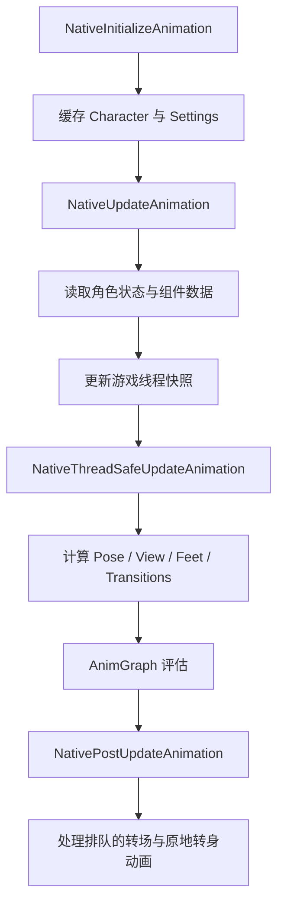

# ALS 动画实例

> `AnimInstance` 不是简单的变量中转站，而是角色状态进入动画图之前的缓存、转换和派生数据计算层。

## 解决的问题

角色和移动组件中的数据通常服务于游戏逻辑，动画图则需要局部空间向量、动画状态、混合权重和过渡信息。`UAlsAnimationInstance` 负责把前者整理成后者，同时隔离角色逻辑与动画图之间的实现细节。

## 主要职责

- 缓存拥有该动画实例的 `AAlsCharacter`。
- 读取角色的运动、视角、姿态和运动模式。
- 保存动画图需要的状态快照。
- 将世界空间数据转换为角色或网格空间数据。
- 对速度、加速度、方向和权重进行平滑或归一化。
- 计算 Grounded、In Air、Layering、Feet 和 Transition 等动画侧状态。
- 为 AnimGraph、Linked Anim Instance 和 Control Rig 提供输入。

## 状态分层

ALS Refactored 的动画实例同时维护两类状态。

### 角色侧状态的快照

这些字段描述角色当前处于什么状态，通常直接来自 `AAlsCharacter`：

- `ViewMode`
- `LocomotionMode`
- `RotationMode`
- `Stance`
- `Gait`
- `OverlayMode`
- `LocomotionAction`

它们主要用于决定动画图应该选择哪一个上下文。

### 动画侧派生状态

这些字段是为了生成姿势而整理出来的数据：

- `LocomotionState`：速度、输入、方向、加速度和角色变换。
- `ViewState`、`SpineState`、`HeadState`：视角、脊柱和头部姿势。
- `GroundedState`：Velocity Blend、移动方向和 Rotation Yaw Offset。
- `StandingState`、`CrouchingState`：Stride Blend、Play Rate 和冲刺过渡。
- `InAirState`：垂直速度、跳跃播放速率和落地预测。
- `FeetState`：脚部位置、脚锁定和骨盆修正所需的数据。
- `LayeringState`、`PoseState`：Overlay、姿势和分层混合权重。
- `TransitionsState`、`TurnInPlaceState`：动态过渡和原地转身。

角色侧状态回答“角色正在做什么”，动画侧状态回答“动画应该如何表现”。两者名称相似时尤其需要区分。

## 更新阶段

### `NativeInitializeAnimation()`

初始化阶段缓存拥有该 AnimInstance 的角色，并准备动画实例使用的设置对象。此时重点是建立引用，不是计算完整动画状态。

### `NativeUpdateAnimation()`

这一阶段读取角色侧状态，并执行依赖游戏线程对象的数据更新。在 ALS Refactored 4.17 中，它会更新：

- Movement Base
- View
- Locomotion
- In Air
- Feet
- Ragdolling

同时还会复制 `LocomotionMode`、`RotationMode`、`Stance`、`Gait` 和 `OverlayMode` 等标签状态。

可以把这一阶段理解为“从角色和组件获取本帧动画快照”。它不是所有动画计算的终点。

### `NativeThreadSafeUpdateAnimation()`

这一阶段处理可以在线程安全条件下进行的动画侧计算。在当前实现中，主要包括：

- `RefreshLayering()`
- `RefreshPose()`
- `RefreshView(DeltaTime)`
- `RefreshFeet(DeltaTime)`
- `RefreshTransitions()`

这些函数会根据已经准备好的快照计算姿势权重、视角姿势、脚部修正和转场数据。

### `NativePostUpdateAnimation()`

部分动画请求需要等动画更新完成后再处理。ALS 会在这一阶段播放或停止排队的 Transition Animation 和 Turn In Place Animation，并处理相关的后更新状态。

因此，起步、停止或原地转身不能简单概括为“状态机直接切换一个 Sequence”。状态判断、动画数据计算、AnimGraph 评估和最终播放请求可能分布在不同阶段。

## 一个数据转换例子

以角色速度为例：

1. `AAlsCharacter` 在运动更新中维护世界空间速度和速度方向。
2. `NativeUpdateAnimation()` 将这些数据复制到动画实例的 `LocomotionState`。
3. `RefreshGrounded()` 将速度转换到角色空间，并计算 Velocity Blend 与 Lean。
4. `RefreshGroundedMovement()` 根据速度相对于视角的角度计算移动方向和 Rotation Yaw Offset。
5. `RefreshStandingMovement()` 根据速度、步态和曲线计算 Stride Blend 与 Play Rate。
6. AnimGraph 使用这些结果采样移动姿势并完成混合。

同一个“速度”在不同阶段承担不同意义：角色层的速度描述实际运动，动画层的速度则可能已经被缩放、转换或用于生成新的权重。

## 调试方法

出现动画问题时，建议按更新阶段定位：

1. `Character` 中的状态是否正确。
2. `NativeUpdateAnimation()` 是否复制到了正确的状态。
3. 动画侧派生状态是否计算正确，例如 `GroundedState` 或 `InAirState`。
4. AnimGraph 是否使用了正确变量和状态分支。
5. `NativePostUpdateAnimation()` 是否改变了最终播放结果。

如果只观察最终模型，很难判断问题是状态错误、数据转换错误，还是姿势评估后的局部修正造成的。

## 相关主题

- [整体架构](./01-整体架构.md)
- [动画数据流](./02-动画数据流.md)
- [Grounded](./04-Grounded.md)
- [In Air](./05-In-Air.md)
- [Foot IK](./08-Foot-IK.md)

## 参考资料

### 官方与源码

- [Unreal Engine Animation Blueprints](https://dev.epicgames.com/documentation/en-us/unreal-engine/animation-blueprints-in-unreal-engine)
- [Unreal Engine Animation Optimization](https://dev.epicgames.com/documentation/en-us/unreal-engine/animation-optimization-in-unreal-engine)
- [ALS Refactored `AlsAnimationInstance.h`](https://github.com/Sixze/ALS-Refactored/blob/4.17/Source/ALS/Public/AlsAnimationInstance.h)
- [ALS Refactored `AlsAnimationInstance.cpp`](https://github.com/Sixze/ALS-Refactored/blob/4.17/Source/ALS/Private/AlsAnimationInstance.cpp)

### 其他资料

- [[UE4/UE5][alsv4]alsv4手把手复现2](https://zhuanlan.zhihu.com/p/610827802)
- [UE4动画系统更新源码分析](https://zhuanlan.zhihu.com/p/405437842)
