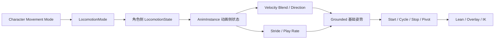

# ALS Grounded

> Grounded 是角色处于可行走地面时的动画上下文，负责把地面移动状态转换为站立、移动、起步、停止和换向所需的动画数据。

## 本章结构

Grounded 不应被理解为单独的一张状态机，而是一组由角色状态、动画实例派生数据和动画图共同组成的地面移动系统。

1. [Grounded 状态与进入条件](./04.1-Grounded状态与进入条件.md)
2. [局部速度与 Velocity Blend](./04.2-局部速度与VelocityBlend.md)
3. [移动方向与 Rotation Yaw Offset](./04.3-移动方向与RotationYawOffset.md)
4. [Grounded Lean](./04.4-GroundedLean.md)
5. [Standing 移动](./04.5-Standing移动.md)
6. [Crouching 移动](./04.6-Crouching移动.md)
7. [步态混合与播放速率](./04.7-步态混合与播放速率.md)
8. [Grounded 动画图结构](./04.8-Grounded动画图结构.md)
9. [Grounded 调试](./04.9-Grounded调试.md)

## 总体数据链

## 阅读顺序

建议先阅读 `04.1`，确认 Grounded 是如何由角色移动模式驱动的；再阅读 `04.2`，理解速度如何转换成动画混合权重。之后再进入方向、Lean、站立、蹲伏和动画图结构等专题。

## 相关主题

- [动画实例](./03-动画实例.md)
- [In Air](./05-In-Air.md)
- [起步、停止与转身](./06-起步停止与转身.md)
- [Foot IK](./08-Foot-IK.md)
- [调试问题](./10-调试问题.md)

## 参考资料

- [ALS Refactored `AlsCharacter.cpp`](https://github.com/Sixze/ALS-Refactored/blob/4.17/Source/ALS/Private/AlsCharacter.cpp)
- [ALS Refactored `AlsAnimationInstance.cpp`](https://github.com/Sixze/ALS-Refactored/blob/4.17/Source/ALS/Private/AlsAnimationInstance.cpp)
- [ALS Refactored `AlsGroundedState.h`](https://github.com/Sixze/ALS-Refactored/blob/4.17/Source/ALS/Public/State/AlsGroundedState.h)
