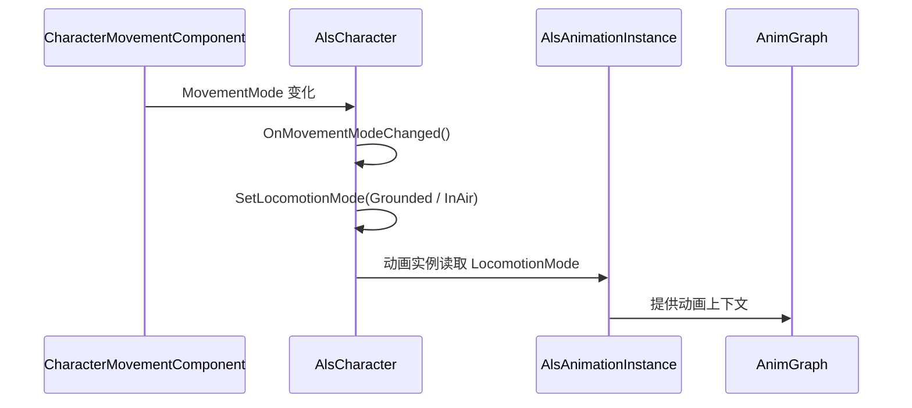

# 04.1 Grounded 状态与进入条件

> Grounded 首先是角色的运动模式，其次才是动画图中的地面移动分支。

## 解决的问题

动画系统需要知道角色当前是否处于可行走地面，才能决定使用地面移动、空中移动还是其他运动上下文。这个判断不应由动画图根据速度或某个动画播放状态自行猜测，而应来自角色的移动模式。

## `LocomotionMode` 的来源

在 ALS Refactored 4.17 中，`AAlsCharacter::OnMovementModeChanged()` 会根据 `CharacterMovementComponent` 的 `MovementMode` 设置 ALS 的 `LocomotionMode`：

| Unreal 移动模式 | ALS LocomotionMode |
| --- | --- |
| `MOVE_Walking` | `Grounded` |
| `MOVE_NavWalking` | `Grounded` |
| `MOVE_Falling` | `InAir` |
| 其他模式 | 空标签或项目自定义模式 |

因此，Grounded 的进入条件是角色移动模式发生变化，而不是“角色速度大于零”。角色静止站立时仍然可以处于 Grounded。

## 状态切换流程

角色状态切换后，`AAlsCharacter::NotifyLocomotionModeChanged()` 还可能执行落地、滚动、布娃娃和旋转限制等逻辑。因此从 In Air 回到 Grounded 并不只是切换一个动画分支。

## Grounded 与速度的关系

Grounded 和速度是两个不同维度：

- Grounded + 低速：可能是 Idle 或停止阶段。
- Grounded + 有速度：可能是 Walk、Run、Sprint 或其他地面移动。
- In Air + 有水平速度：仍然不能使用 Grounded 的脚步循环。
- Grounded + 特殊 `LocomotionAction`：可能进入 Rolling、Mantling 结束或其他特殊动作。

动画图应先根据 `LocomotionMode` 选择上下文，再在 Grounded 内部根据 Speed、Gait、Stance 和其他参数选择具体姿势。

## Grounded 内部的状态层次

可以按以下层次理解 Grounded：

1. **运动模式**：是否处于 Grounded。
2. **站姿**：Standing 或 Crouching。
3. **步态**：Walking、Running 或 Sprinting。
4. **移动阶段**：Idle、Start、Cycle、Stop、Pivot。
5. **局部修正**：Lean、Overlay、Foot IK、Foot Lock 和动态过渡。

这些层次不应全部压缩成一个枚举，否则状态组合会迅速膨胀，也难以判断某个变量到底负责选择上下文还是调整姿势。

## 落地后的特殊处理

从 In Air 回到 Grounded 时，角色层会根据垂直速度和设置决定是否：

- 触发 Ragdoll；
- 触发 Rolling；
- 临时增加制动摩擦，减少落地滑动；
- 暂时阻止角色朝最后输入方向旋转，避免落地动画中的腿部扭转。

这些行为属于角色和移动逻辑，但会直接影响 Grounded 动画的进入方式。

## 调试重点

1. 查看 `CharacterMovementComponent->MovementMode`。
2. 确认 `AAlsCharacter::LocomotionMode` 是否切换正确。
3. 确认 `UAlsAnimationInstance` 是否复制了正确的 `LocomotionMode`。
4. 检查动画图是否使用了同一组 Gameplay Tag。
5. 如果是落地后异常，再检查 Rolling、Ragdoll、制动摩擦和旋转限制。

## 常见误区

- Grounded 不等于角色正在移动。
- Speed 为零不代表角色已经离开 Grounded。
- 动画图不应根据 Speed 自行推断 Grounded。
- 从 In Air 回到 Grounded 后不一定直接进入 Idle 或 Cycle。
- `LocomotionMode`、`MovementMode` 和具体动画状态机 State 不是同一个概念。

## 相关主题

- [动画数据流](./02-动画数据流.md)
- [动画实例](./03-动画实例.md)
- [Grounded](./04-Grounded.md)
- [In Air](./05-In-Air.md)
- [起步、停止与转身](./06-起步停止与转身.md)

## 参考资料

### 官方与源码

- [ALS Refactored `AlsCharacter.cpp`](https://github.com/Sixze/ALS-Refactored/blob/4.17/Source/ALS/Private/AlsCharacter.cpp)
- [ALS Refactored `AlsCharacter.h`](https://github.com/Sixze/ALS-Refactored/blob/4.17/Source/ALS/Public/AlsCharacter.h)
- [Character Movement Component](https://dev.epicgames.com/documentation/en-us/unreal-engine/character-movement-component-in-unreal-engine)

### 其他资料

- [【UE5】【3C】ALSv4重构分析（二）：Locomotion导读](https://zhuanlan.zhihu.com/p/605417871)
