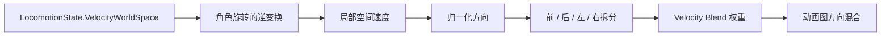

# 04.2 局部速度与 Velocity Blend

> Velocity Blend 将角色的实际运动速度转换成动画可以使用的前、后、左、右方向权重。

## 解决的问题

角色移动组件通常提供世界空间速度，但地面移动动画需要知道角色相对于自身朝向的运动方向。例如，同样是向世界 X 轴移动，对不同朝向的角色来说，可能分别对应前进、后退或侧移。

`Velocity Blend` 就是这次转换后的动画数据。它不是实际速度，也不是输入方向，而是局部空间速度经过归一化和拆分后的混合权重。

## 数据转换流程



在当前 ALS Refactored 实现中，`UAlsAnimationInstance::GetVelocity()` 使用 `LocomotionState.RotationQuaternionWorldSpace.UnrotateVector()` 将世界空间速度转换到角色空间，然后 `RefreshVelocityBlend()` 对结果进行处理。

## 四个方向权重

`FAlsVelocityBlendState` 保存四个主要值：

| 字段 | 含义 |
| --- | --- |
| `ForwardAmount` | 局部前向速度权重 |
| `BackwardAmount` | 局部后向速度权重 |
| `LeftAmount` | 局部左向速度权重 |
| `RightAmount` | 局部右向速度权重 |

正向和负向分量会被拆成不同的非负权重。例如：

- 局部速度 `(1, 0)`：Forward 接近 1。
- 局部速度 `(-1, 0)`：Backward 接近 1。
- 局部速度 `(0, 1)`：Right 接近 1，具体左右定义取决于项目坐标约定。
- 局部速度 `(1, 1)`：Forward 和侧向共同参与混合。

## 为什么还要用绝对值之和归一化

这里实际上有两次不同性质的处理：

1. `Normalize()` 将速度转换成长度为 1 的方向向量。
2. 再除以各分量绝对值之和，将方向转换成四个总量受控的混合权重。

对于 Grounded 的水平移动，可以把第二步理解为 **L1 归一化**：

```text
权重 = 方向分量 / (|X| + |Y| + |Z|)
```

在通常 `Z = 0` 的情况下，四个方向权重的总和不会超过 1。正向分量进入 `ForwardAmount`，负向分量的绝对值进入 `BackwardAmount`；Y 分量同理拆成 Left 和 Right。

### 与普通 Normalize 的区别

普通 `Normalize()` 使用的是欧氏长度：

```text
长度 = sqrt(X² + Y² + Z²)
```

例如前右 45 度方向的速度是 `(1, 1, 0)`：

```text
普通 Normalize：
(1, 1, 0) → (0.707, 0.707, 0)
```

如果直接把这两个值作为前进和右移的混合权重，那么两个权重相加约为 `1.414`。对于需要多个方向权重的 Blend Multi 来说，这会让对角姿势的总体混合量高于正前或正右，可能造成对角动作被过度强化。

ALS 再进行一次绝对值之和归一化：

```text
|0.707| + |0.707| = 1.414

(0.707, 0.707, 0) / 1.414
    → (0.5, 0.5, 0)
```

最终得到：

```text
Forward = 0.5
Right   = 0.5
```

这表示“前向贡献和右向贡献各占一半”，而不是两个方向都以接近完整强度参与。

### 几个方向的例子

| 局部方向 | L1 归一化后的权重 |
| --- | --- |
| 正前 `(1, 0)` | Forward = 1 |
| 正右 `(0, 1)` | Right = 1 |
| 前右 `(1, 1)` | Forward = 0.5，Right = 0.5 |
| 前右但更偏前 `(2, 1)` | Forward ≈ 0.667，Right ≈ 0.333 |
| 后左 `(-1, -1)` | Backward = 0.5，Left = 0.5 |

因此，这个处理保留了方向比例：角色越偏向前，Forward 权重越高；越偏向侧面，Left 或 Right 权重越高。同时又让同一方向组合中的总混合量保持可控。

### 为什么对角运动会更稳定

这里的“稳定”不是指角色速度被限制了，也不是指移动速度变慢了，而是指动画混合输入具有稳定的权重关系：

- 正前、正右和前右之间不会因为向量长度公式而产生额外的总权重。
- 角度连续变化时，方向权重也会连续变化。
- 对角移动不会仅仅因为同时包含两个轴，就比单轴移动获得更大的混合强度。
- 停止时四个目标权重都会回到 0，再由插值控制姿势如何平滑收敛。

需要注意，Velocity Blend 描述的是方向构成，不是移动速度大小。速度大小仍然由 `LocomotionState.Speed` 以及后续的 Stride Blend、Play Rate 等参数处理。

## 为什么不直接使用 Blend Space

标准 Blend Space 可以直接使用速度和方向采样动画，但 ALS 的 Velocity Blend 还承担了额外的方向权重控制：

- 可以分别控制前、后、左、右的混合量。
- 可以让对角方向保持可预测的权重关系。
- 可以与动画图中的 Blend Multi 或其他姿势混合节点配合。
- 可以在停止和换向时独立平滑各方向权重。

这并不表示 Blend Space 不再使用。Velocity Blend 负责准备方向权重，Blend Space 或其他动画节点仍然负责根据这些参数生成具体姿势。

## 插值与停止姿势

Velocity Blend 不是每帧立即跳到目标值。除首次初始化或关闭插值外，ALS 会使用阻尼插值逐渐接近目标权重。

当前实现使用 `DamperExactAlpha()` 计算插值量，而不是简单使用 `FInterpTo()`。原因是普通插值在低帧率或较大 Delta Time 下可能变得过快，使停止阶段的姿势突然变化。

因此，Velocity Blend 的插值不仅是视觉平滑处理，也会直接影响：

- 停止动作的方向连续性；
- 换向时的姿势稳定性；
- 起步和停止之间的支撑关系；
- 动画曲线和 Foot Lock 的衔接。

## Velocity Blend 与输入方向

输入方向代表玩家的移动意图，Velocity Blend 代表角色当前的实际运动结果。两者可能在以下阶段不同：

- 加速阶段：有输入但速度还没有完全建立。
- 减速阶段：输入已经释放，但角色仍有残余速度。
- 换向阶段：输入方向改变，速度方向尚未改变。
- 移动基座旋转时：角色的世界空间速度和局部空间速度同时变化。

如果动画只使用输入方向，角色可能会提前播放新的方向动作，但身体实际仍然沿旧方向移动；如果只使用速度，也可能缺少对玩家意图的及时响应。ALS 会根据不同动画阶段分别使用输入、速度和派生状态。

## 与 Grounded Movement Direction 的区别

Velocity Blend 是连续的四方向权重；`GroundedState.MovementDirection` 是根据相对视角角度得到的离散移动方向缓存。

两者可以同时存在：

- `MovementDirection` 用于选择或组织方向状态。
- `VelocityBlend` 用于在方向之间连续混合。

不要把四个 Velocity Blend 数值直接当作 Movement Direction 枚举，也不要用离散方向替代连续权重。

## 调试方法

建议依次观察：

1. `LocomotionState.VelocityWorldSpace` 是否符合角色实际运动。
2. `GetVelocity()` 转换后的局部速度方向是否正确。
3. 四个 Velocity Blend 权重之和和变化趋势是否合理。
4. 角色停止时权重是否平滑归零。
5. 动画图是否按预期使用了这些权重。
6. 如果只有对角移动异常，检查局部空间转换和归一化方式。

## 常见误区

- 把 Velocity Blend 当成世界空间速度。
- 把 Velocity Blend 当成输入方向。
- 认为对角移动时两个方向都应该是 1。
- 只调整动画样本，不检查速度转换后的坐标空间。
- 忽略插值半衰期对停止和换向姿势的影响。

## 相关主题

- [Grounded](./04-Grounded.md)
- [移动方向与 Rotation Yaw Offset](./04.3-移动方向与RotationYawOffset.md)
- [Grounded Lean](./04.4-GroundedLean.md)
- [Standing 移动](./04.5-Standing移动.md)
- [调试问题](./10-调试问题.md)

## 参考资料

### 官方与源码

- [Unreal Engine Blend Spaces](https://dev.epicgames.com/documentation/en-us/unreal-engine/blend-spaces-in-unreal-engine)
- [ALS Refactored `AlsAnimationInstance.cpp`](https://github.com/Sixze/ALS-Refactored/blob/4.17/Source/ALS/Private/AlsAnimationInstance.cpp)
- [ALS Refactored `AlsGroundedState.h`](https://github.com/Sixze/ALS-Refactored/blob/4.17/Source/ALS/Public/State/AlsGroundedState.h)

### 其他资料

- [【UE5】【3C】ALSv4重构分析（二）：Locomotion导读](https://zhuanlan.zhihu.com/p/605417871)
- [UE4/UE5 骨骼动画高级运动系统 ALS 旋转](https://zhuanlan.zhihu.com/p/680719803)
