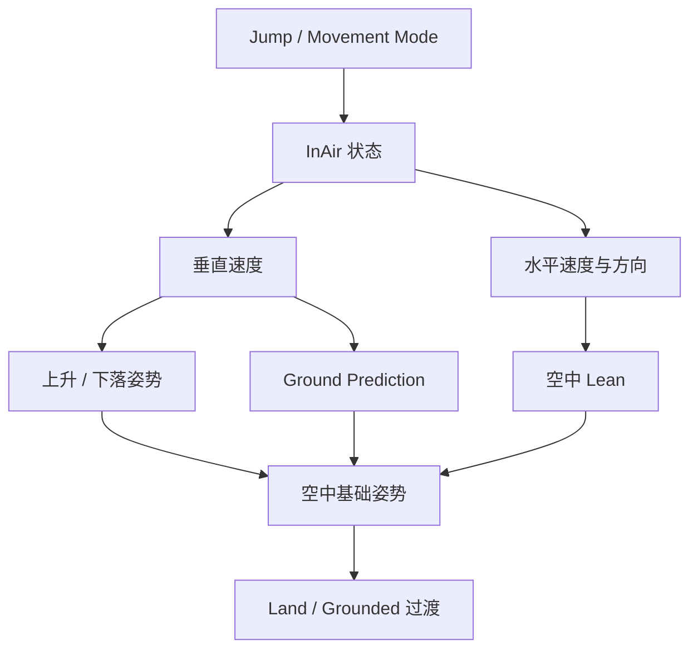

# ALS In Air

> In Air 是角色处于空中或下落状态时的动画上下文，负责跳跃、上升、下落、落地预测和落地后的衔接。

## 解决的问题

角色离开地面后，普通地面移动循环不再适用。动画需要根据垂直速度、水平移动、跳跃请求和预计落点，在上升、下落、准备落地和重新接触地面之间连续变化。

## 进入与离开 In Air

ALS Refactored 会根据 Character Movement Component 的移动模式更新 `LocomotionMode`：

- `MOVE_Falling` 时进入 `InAir`。
- `MOVE_Walking` 或 `MOVE_NavWalking` 时回到 `Grounded`。

从 Grounded 到 In Air 的切换不只是动画状态变化，它同时意味着角色的旋转、脚部修正、地面移动和落地逻辑需要使用另一套规则。

## 空中数据流

## 跳跃请求与 Jump Play Rate

动画实例中的 `InAirState` 会保存 `bJumpRequested` 和 `bJumped` 两个阶段性标志：

- `bJumpRequested` 表示收到了跳跃请求。
- `bJumped` 表示该请求已经转换为本次空中动画需要处理的跳跃事件。

在动画更新过程中，跳跃事件会被消费，并根据角色水平速度计算 `JumpPlayRate`。因此起跳动画的播放速率可以随起跳时的移动速度变化，而不是始终使用固定速率。

## 垂直速度

`VerticalVelocityWorldSpace` 单独保存角色的世界空间垂直速度，用于区分上升和下落，并估计落地冲击速度。

它不应该被水平速度替代：

- 水平速度决定空中移动方向和部分身体倾斜。
- 垂直速度决定上升、下落、落地预测和落地表现。

当垂直速度从正值转为负值时，动画上下文通常从上升阶段转向下落阶段。随着下落速度增加，落地预测和下落姿势的权重也会发生变化。

## Ground Prediction

Ground Prediction 用于在角色真正接触地面之前预测落点，并提前将姿势向落地状态过渡。

当前 ALS Refactored 的处理过程大致是：

1. 只有在角色以足够的负垂直速度下落时才启用预测。
2. 沿角色速度方向进行 Sweep。
3. 根据垂直速度映射检测距离，下落越快，预测范围越大。
4. 检查命中表面的法线是否满足可行走地面条件。
5. 根据命中时间和 Ground Prediction 曲线计算 `GroundPredictionAmount`。
6. 将该权重提供给空中与落地姿势的混合。

这不是简单地检测“前方有没有地面”，而是结合下落方向、速度和可行走表面来估计即将发生的接触。

## 空中 Lean

空中 Lean 使用水平移动方向和垂直速度曲线共同计算：

- 水平速度决定身体向前后或左右倾斜的方向。
- 垂直速度曲线控制从上升到下落时倾斜方向和强度的变化。
- 插值处理让空中姿势不会因为速度瞬时变化而跳变。

因此空中 Lean 不是简单复制 Grounded 中的 Lean。两者使用的状态、速度含义和曲线都可能不同。

## 落地处理

当移动模式从 In Air 回到 Grounded 后，角色侧还可能根据下落速度执行不同处理：

- 普通落地：短时间增加制动摩擦，减少落地后的滑动。
- 较重落地：根据设置触发 Ragdoll。
- 达到滚动阈值：触发 Rolling。
- 普通落地动画期间：暂时限制朝最后输入方向旋转，避免腿部扭转。

这说明落地不是单纯的“切回 Grounded 状态”。角色侧的移动、旋转和动作系统可能同时参与落地后的表现。

## Foot IK 的关系

In Air 期间通常需要降低或暂停地面接触相关的 Foot IK 和 Foot Lock，避免脚部继续保持离开地面前的支撑点。具体权重和时机由动画曲线、Feet 状态和项目动画图决定，因此 In Air 只提供空中上下文，不替代 Foot IK 系统本身。

## 调试顺序

1. Character Movement Component 是否进入 Falling。
2. `LocomotionMode` 是否切换到 In Air。
3. `bJumpRequested` 和 `bJumped` 是否按预期变化。
4. `VerticalVelocityWorldSpace` 是否正确反映上升和下落。
5. Ground Prediction Sweep 的方向、距离、碰撞通道和可行走地面判断是否正确。
6. 空中 Lean 和落地预测曲线是否产生了正确权重。
7. 回到 Grounded 后是否触发了预期的 Land、Rolling 或 Ragdoll 行为。
8. Foot IK 和 Foot Lock 是否在空中正确降权。

## 常见误区

- 只根据是否按下跳跃键判断 In Air，而不检查实际 Movement Mode。
- 用水平速度判断落地冲击，忽略垂直速度。
- 把 Ground Prediction 当成普通地面检测，忽略它与下落速度和命中时间的关系。
- 认为回到 Grounded 后一定直接进入 Idle 或 Cycle，忽略落地、滚动和布娃娃等特殊动作。
- 只调整落地动画，却没有检查 Character 侧的制动摩擦和旋转限制。

## 相关主题

- [整体架构](./01-整体架构.md)
- [动画数据流](./02-动画数据流.md)
- [动画实例](./03-动画实例.md)
- [Grounded](./04-Grounded.md)
- [Foot IK](./08-Foot-IK.md)
- [调试问题](./10-调试问题.md)

## 参考资料

### 官方与源码

- [Unreal Engine Animation Blueprints](https://dev.epicgames.com/documentation/en-us/unreal-engine/animation-blueprints-in-unreal-engine)
- [ALS Refactored `AlsCharacter.cpp`](https://github.com/Sixze/ALS-Refactored/blob/4.17/Source/ALS/Private/AlsCharacter.cpp)
- [ALS Refactored `AlsAnimationInstance.cpp`](https://github.com/Sixze/ALS-Refactored/blob/4.17/Source/ALS/Private/AlsAnimationInstance.cpp)
- [ALS Refactored `AlsInAirState.h`](https://github.com/Sixze/ALS-Refactored/blob/4.17/Source/ALS/Public/State/AlsInAirState.h)

### 其他资料

- [【UE5】【3C】ALSv4重构分析（二）：Locomotion导读](https://zhuanlan.zhihu.com/p/605417871)
- [[UE4/UE5][alsv4]alsv4手把手复现2](https://zhuanlan.zhihu.com/p/610827802)
