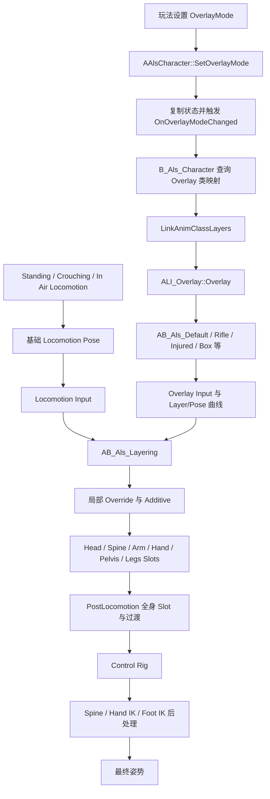

# ALS 瞄准与 Overlay

> ALS 的 Overlay 不是单纯把一段持枪动画盖到上半身，而是用 Gameplay Tag 选择一套姿势资源，再通过动画曲线决定头部、脊柱、双臂、双手、骨盆和双腿分别以 Override、Additive、Slot 或 IK 的方式参与最终合成。

## 解决的问题

基础 Locomotion 负责站立、蹲伏、行走、冲刺和空中等全身运动，但角色还需要同时表达持物、受伤、双手被绑、性别化姿态、瞄准和交互动作。如果为每一种组合都制作独立的完整移动动画，资源数量会迅速膨胀：站立持枪、蹲伏持枪、空中持枪、受伤行走、抱箱行走等组合都会重复制作同一套下半身运动。

ALS 将这个问题拆成两部分：

- **基础姿势**回答角色如何移动，由 Locomotion、Grounded、Standing、Crouching 和 In Air 等动画图生成。
- **Overlay 姿势**回答角色当前要额外表达什么，并携带各身体区域应如何参与叠加的动画曲线。

最终的姿势不是二者做一次固定比例的上半身混合，而是由 `AB_Als_Layering` 按身体区域、混合类型和曲线权重重新组合。Rifle 只是这套机制的一种实现；Default、Injured、HandsTied、Bow、Box 和 Barrel 都使用同一条通用链路。

## 先区分几个容易混淆的概念

| 概念 | 回答的问题 | 主要形式 |
| --- | --- | --- |
| `OverlayMode` | 当前采用哪一套附加姿态 | Character 上可复制的 Gameplay Tag |
| Overlay 动画蓝图 | 这套附加姿态具体输出什么姿势 | 实现 `ALI_Overlay` 的 Linked Anim Layer |
| `LayeringState` | 头、脊柱、手臂等区域如何混合 | 从 `Layer*` 动画曲线读取的权重 |
| `PoseState` | 基础姿势当前处于站立、蹲伏、地面、空中或何种步态 | 从 `Pose*` 动画曲线读取的权重 |
| `RotationMode == Aiming` | 角色朝向和视角旋转是否按瞄准规则处理 | Character 状态，不属于 Overlay Mode |
| `ViewState` / `SpineState` / `HeadState` | 视角差值怎样分配给脊柱和头部 | C++ 派生状态与独立动画层 |
| Hand IK | 叠加后如何让手继续对准持物辅助骨 | Control Rig 中的最终约束 |

因此，“切到 Rifle Overlay”和“进入 Aiming Rotation Mode”是两件不同的事。角色可以持枪但暂时不瞄准，也可以让某种非武器 Overlay 使用瞄准方向。Overlay 决定姿势资源，Aiming 决定角色旋转和视角姿势如何响应。

## 完整数据链路



这条链路可以分成四层：状态选择、资源输出、曲线分层和最终约束。任何一层出错，都可能表现成“Overlay 没生效”，但排查方法完全不同。

## OverlayMode 如何进入动画系统

`AAlsCharacter` 将 `OverlayMode` 保存为 `FGameplayTag`，默认值是 `Als.OverlayMode.Default`。当前源码定义了 Default、Masculine、Feminine、Injured、HandsTied、Rifle、PistolOneHanded、PistolTwoHanded、Bow、Torch、Binoculars、Box 和 Barrel 等模式。

调用 `SetOverlayMode()` 后，Character 会：

1. 检查新旧 Tag 是否相同以及当前网络角色是否允许修改。
2. 保存新 Tag，并通过 Push Model 标记复制属性为 Dirty。
3. 调用可由蓝图实现的 `OnOverlayModeChanged()`。
4. 根据 Authority 或 Autonomous Proxy 方向发送 Client / Server RPC。
5. 远端收到复制结果后，由 `OnReplicated_OverlayMode()` 再次触发变化事件。

C++ 的默认 `OnOverlayModeChanged_Implementation()` 是空函数。这意味着 C++ 负责状态所有权和网络同步，但不硬编码“Rifle Tag 必须使用哪个 Anim Blueprint”。

插件中的 `B_Als_Character` 资产包含 `OverlayAnimationInstanceClasses` 映射、`RefreshOverlayLinkedAnimationLayer()` 和 `LinkAnimClassLayers` 调用，并引用全部 Overlay 动画蓝图。由此可以确认示例 Character 会在 Overlay Mode 变化时，从 Tag 到动画实例类的映射中选择实现，再重新链接对应的 Anim Layers。

`UAlsAnimationInstance::NativeUpdateAnimation()` 随后每帧通过 `Character->GetOverlayMode()` 把当前 Tag 复制到动画实例。Linked Overlay 动画蓝图可以通过 Parent AnimInstance 的属性访问同时读取 `OverlayMode`、`RotationMode`、`LocomotionMode`、`PoseState` 和移动派生数据。

这种结构的关键是：**Tag 只负责选择语义，Linked Anim Layer 类负责实现姿势。** 新增一种 Overlay 时，不必修改 `RefreshLayering()` 的 C++ 算法，只需要增加 Tag、实现 `ALI_Overlay` 的动画蓝图、准备动画和曲线，并在 Character 的映射中注册。

## 资源层：ALI_Overlay 与各 Overlay 动画蓝图

`ALI_Overlay` 是统一的 Anim Layer Interface，其中定义了 `Overlay` 动画层。主动画蓝图和 `AB_Als_Layering` 只依赖这个接口，不需要知道当前连接的是 Rifle、Box 还是 Injured。

插件为不同语义提供了独立实现：

- `AB_Als_Default`：默认身体姿态。
- `AB_Als_Masculine`、`AB_Als_Feminine`、`AB_Als_Injured`、`AB_Als_HandsTied`：风格或状态姿态。
- `AB_Als_Rifle`、`AB_Als_PistolOneHanded`、`AB_Als_PistolTwoHanded`、`AB_Als_Bow`：武器姿态。
- `AB_Als_Torch`、`AB_Als_Binoculars`、`AB_Als_Box`、`AB_Als_Barrel`：持物或交互姿态。

不同实现可以有完全不同的内部复杂度。Box 主要根据 Standing、Crouching 和 Walking 等状态选择抱物姿势；Rifle 还会读取 Rotation Mode、Locomotion Mode、Velocity Blend、步态权重、冲刺加速度、视角 Pitch 和 Transition 状态，并使用专门的 Aim、Run Arms、Sprint Arms 与 Sprint Impulse 资源。

接口隔离让 Overlay 成为可替换的“姿势提供者”，而不是主 Locomotion 状态机中的一组巨大分支。

## PoseState：让 Overlay 跟随基础姿势

`RefreshPose()` 从当前动画曲线读取以下状态：

| 曲线 | 写入状态 | 用途 |
| --- | --- | --- |
| `PoseGrounded` / `PoseInAir` | `GroundedAmount` / `InAirAmount` | 判断地面和空中姿势当前各占多少权重 |
| `PoseStanding` / `PoseCrouching` | `StandingAmount` / `CrouchingAmount` | 让 Overlay 跟随站立与蹲伏过渡 |
| `PoseMoving` | `MovingAmount` | 表示移动姿势的参与程度 |
| `PoseGait` | Walking / Running / Sprinting 权重 | 让 Overlay 跟随步态混合 |

这些值不是 Character Tag 的简单 0 或 1 副本，而是来自当前动画姿势的曲线权重。例如站立切换到蹲伏时，`StandingAmount` 和 `CrouchingAmount` 可以同时处于中间值。Overlay 使用这些权重，就能与基础姿势的实际混合进度保持一致，而不是在 Character 的 Stance Tag 改变时立即跳变。

`PoseGait` 还会被拆成 Walking、Running 和 Sprinting 三段权重。ALS 另外计算 Unweighted Gait，在 Grounded 刚进入、Grounded 总权重还没有完全升起时，也能得到完整步态值，避免 Overlay 或 Stride 逻辑在状态过渡开头显得迟钝。

这就是 Standing、Crouching 和 In Air 能复用同一 Overlay 系统的原因：基础 Locomotion 继续生成各自的全身运动，Overlay 实现读取 `PoseState` 后选择或混合与当前基础姿势匹配的附加姿态。某个 Overlay 可以提供专门的蹲伏瞄准资源，也可以只提供一套通用姿势；是否细分由该 Overlay 自己决定。

## LayeringState：曲线决定身体各区域怎样叠加

Overlay 动画不仅输出骨骼姿势，还在动画资源中写入 `Layer*` 曲线。`RefreshLayering()` 从曲线缓冲中读取这些值，填入 `FAlsLayeringState`。`AB_Als_Layering` 再通过线程安全的属性访问取得这些权重。

### 身体区域与权重

| 区域 | 普通覆盖 | Additive | Slot | 额外控制 |
| --- | --- | --- | --- | --- |
| Head | `LayerHead` | `LayerHeadAdditive` | `LayerHeadSlot` | — |
| Arm Left | `LayerArmLeft` | `LayerArmLeftAdditive` | `LayerArmLeftSlot` | Local / Mesh Space |
| Arm Right | `LayerArmRight` | `LayerArmRightAdditive` | `LayerArmRightSlot` | Local / Mesh Space |
| Hand Left | `LayerHandLeft` | — | — | 手部独立层 |
| Hand Right | `LayerHandRight` | — | — | 手部独立层 |
| Spine | `LayerSpine` | `LayerSpineAdditive` | `LayerSpineSlot` | — |
| Pelvis | `LayerPelvis` | — | `LayerPelvisSlot` | — |
| Legs | `LayerLegs` | — | `LayerLegsSlot` | — |

这种曲线布局意味着“一个 Overlay”并没有一个全局 Alpha。Rifle 可以完整控制双臂和双手，只给脊柱增加一部分 Additive 偏移，同时让骨盆和双腿继续保留基础 Locomotion；HandsTied 或 Injured 则可以使用另一组区域组合。

曲线值来自动画资源，因此权重还可以随时间变化。例如进入瞄准、放下武器或播放冲刺手臂摆动时，各区域不是必须同时切换。姿势作者可以让手臂先接管、手指和武器骨稍后稳定，或者让脊柱的 Additive 影响逐渐升起。

### 为什么需要重新整理曲线

Layering 图中包含专门的曲线混合步骤。资产注释明确说明，它会重新组合 Locomotion Pose 与 Overlay Pose 中的曲线，并覆盖此前分层造成的曲线干扰。

这是因为 Layer 曲线既是姿势的一部分，又反过来驱动后续姿势混合。如果让曲线像普通骨骼结果一样在多轮 Layered Blend、Additive 和 Slot 中无约束地累积，最终权重就很难预测。重新取回两路输入姿势的曲线，可以让 `RefreshLayering()` 读到更稳定的控制值。

## Override、Additive、局部骨骼权重和资源层的区别

### Override：用 Overlay 姿势替换基础姿势

普通的 `LayerHead`、`LayerArmLeft`、`LayerSpine` 等 Blend Amount 控制对应骨骼区域在基础 Locomotion Pose 和 Overlay Pose 之间混合。权重为 1 时，该区域主要采用 Overlay 的绝对姿势；权重为 0 时保留 Locomotion。

Override 适合必须建立明确结构的姿态，例如双手抬起、抱住箱子或手臂进入完整持枪姿势。它解决的是“这个区域应当采用哪一套姿势”。

### Additive：把差值叠加到基础姿势

`AB_Als_Layering` 包含 `Make Dynamic Additive`、`Apply Additive` 和 `Apply Mesh Space Additive` 节点，并使用站立与蹲伏基础 Pose 作为参考。资产中同时准备 Local Space 与 Mesh Space 的动态 Additive，使不同身体区域能够选择更合适的差值空间。

Additive 不直接替换基础姿势，而是把相对于参考姿势的旋转和位移差叠加上去。它适合受伤偏斜、呼吸、瞄准微调或上半身随冲刺产生的附加运动，因为下层仍然保留当前 Standing、Crouching 或 In Air 姿势。

### Local Space 与 Mesh Space

双臂各有 `LayerArmLeftLocalSpace` 和 `LayerArmRightLocalSpace` 曲线。C++ 读取 Local Space 权重后，将 Mesh Space 权重设置为“Local Space 没有达到满权重”。这不是两个可以任意同时拉满的独立通道，而是在两种 Additive 处理空间之间选择。

资产注释说明 Local Space 更适合手臂，因为手臂的附加运动会继承脊柱已经产生的旋转；Mesh Space 更适合需要相对整个网格保持方向的身体区域。选择错误时，常见表现是瞄准过程中手臂随脊柱转动两次，或者武器无法保持朝向。

### 局部骨骼权重

`AB_Als_Layering` 使用多个 `Layered Blend Per Bone`，以 Branch Filter 组织 Head、Spine、Arms、Hands、Pelvis 和 Legs。资产中可以确认 `spine_01`、`hand_l`、`hand_r` 及多个手部虚拟骨参与配置。

局部骨骼权重决定“影响扩散到骨架的哪里”，Layer 曲线决定“这个区域当前影响多大”，Additive / Override 决定“以什么数学方式合成”。三者不能互相替代。

### 资源层

资源层决定 Overlay 实际提供哪些动画，例如 Rifle 的 Aim、Aim Crouch、Run Arms 和 Sprint Arms，Box 的抱物姿势，Injured 的受伤姿势。资源层输出姿势和曲线；Layering 图只执行通用合成规则。

因此，修改一条 Rifle 动画不会改变其他 Overlay 的分层算法；修改 `AB_Als_Layering` 的骨骼范围，则可能同时影响所有 Overlay。

## 瞄准如何分配给 Spine 和 Head

瞄准链路与 Overlay 选择并行工作。

Character 的 `bDesiredAiming` 会进入 `RefreshRotationMode()`。该函数结合 Locomotion Mode、Sprint 优先级和是否允许空中瞄准等设置，决定最终 `RotationMode` 是否为 `Als.RotationMode.Aiming`。Grounded 和 In Air 的角色旋转随后使用专门的 Aiming Rotation 约束，把角色朝向限制在视角附近。

动画实例的 `RefreshView()` 计算视角相对于角色的角度：

```text
ViewYaw   = ViewRotation.Yaw   - CharacterRotation.Yaw
ViewPitch = ViewRotation.Pitch - CharacterRotation.Pitch
PitchAmount = 0.5 - ViewPitch / 180
```

然后读取两条曲线：

- `ViewBlock`：暂时阻止视角姿势影响，例如某些全身动作期间。
- `PoseAiming`：当前姿势应把视角差值交给瞄准脊柱还是普通头部 Look。

核心分配关系是：

```text
HeadBlendAmount  = (1 - ViewBlock) × (1 - PoseAiming)
SpineBlendAmount = (1 - ViewBlock) × PoseAiming
```

当 `PoseAiming` 接近 0 时，`AB_Als_Head` 使用 `HeadState` 和 `BS_Als_Look` 表现普通观察；当它接近 1 时，头部 Look 影响下降，视角 Yaw 主要进入 `SpineState`。这样可以避免头部和脊柱同时完整追踪同一视角，导致旋转被叠加两次。

`RefreshSpine()` 只在 Aiming Rotation Mode 或第一人称视角中允许完整脊柱旋转。进入时使用约 `0.1 s` 半衰期快速跟随，退出时使用约 `0.7 s` 半衰期较慢回正，并把残留世界空间偏差限制在 `±30°`，减少角色旋转时脊柱突然弹回。

最终 `SpineState.FinalYawAngle` 通过 `GetControlRigInput()` 传入 `CR_Als`，由 Control Rig 在脊柱链上执行旋转分配。Overlay 的 Aim 资源则可以继续使用 `ViewState.PitchAmount` 生成俯仰姿势。以 Rifle 为例，其动画蓝图确认读取 Aiming Tag、Pitch Amount、Standing / Crouching / In Air 权重以及专门的 Aim 资源；但横向身体朝向并不是简单由 Aim 动画单独完成，而是 Character Aiming Rotation、Spine Yaw 和 Overlay 姿势共同作用的结果。

## 手臂、手部层与 Hand IK

手臂和手部被拆开，是为了保护手指、武器骨和持物关系。

如果把一段 Additive 手臂运动从上臂一直无差别传播到手指和武器辅助骨，手臂摆动可能会让握枪手型变形，或者让物体相对手掌发生二次偏移。`AB_Als_Layering` 因此提供独立的 Hand Layer，并使用 `VB hand_l_to_hand_r`、`VB hand_l_to_ik_hand_gun`、`VB hand_r_to_hand_r` 和 `VB hand_r_to_ik_hand_gun` 等虚拟骨辅助保持手与持物目标的关系。

这里要区分两组曲线：

- `LayerHandLeft` / `LayerHandRight` 控制分层图中手部区域采用哪一路姿势。
- `HandLeftIk` / `HandRightIk` 控制 Control Rig 中手部 IK 的解算权重。

`GetControlRigInput()` 还会传入 `bUseHandIkBones` 总开关。`CR_Als` 中可以确认存在左右手 IK、`ik_hand_l`、`ik_hand_r` 和对应 Layer Hand 曲线读取。逻辑上应先完成 Locomotion 与 Overlay 的姿势合成，再让 IK 把最终手臂链约束到辅助骨目标；否则后续 Overlay 继续旋转手臂时，会再次破坏 IK 已经对齐的结果。

Hand IK 不是用来生成“持枪动作”的。持枪姿势仍来自 Rifle Overlay 动画；IK 负责处理动画混合、瞄准偏转和不同身体比例之后产生的末端误差。

## Anim Layers 与 Slots 分别负责什么

### Anim Layers：替换长期姿态实现

Linked Anim Layers 用于切换整套长期存在的姿态逻辑。`ALI_Overlay` 规定输入输出契约，`B_Als_Character` 根据 Overlay Mode 调用 `LinkAnimClassLayers()`，把 Default、Rifle、Box 等实现链接到主动画蓝图。

它适合持续数秒甚至更久的状态：角色持枪、受伤、抱箱或双手被绑。切换的是一套可持续更新、可读取 Locomotion 状态的动画图，不是一段一次性播放的动画。

### Slots：在现有分层结构中注入短时动作

`AB_Als_Layering` 定义了 Head、左右 Arm、Spine、Pelvis 和 Legs 的区域 Slot，每个 Slot 都有对应的 `Layer*Slot` 曲线权重。资产注释给出的典型用途是换弹和装备：同一个 Montage 可以在手臂层播放普通姿势，在身体层播放 Additive 版本，从而复用 Standing 与 Crouching 的基础姿势。

主 `AB_Als` 还包含 `PostLocomotion` Slot，用于翻滚、攀爬、闪避等全身动作。区域 Slot 解决“只改哪些身体区域”，PostLocomotion 解决“暂时接管最终全身姿势”。

如果 Montage 需要改变 Layer 曲线，还必须让曲线也通过相应的 Curves Slot 进入分层链路。否则骨骼动画已经接管手臂，但 `LayeringState` 仍保留旧 Overlay 的权重，结果可能是动作被再次混回去或只在部分骨骼上生效。

## 基础 Locomotion 与 Overlay 的合成顺序

从资产接口和数据依赖可以确认以下稳定顺序：

1. Locomotion Linked Anim Graph 先根据 Grounded、Standing、Crouching、In Air 等状态生成基础全身姿势。
2. 当前 Overlay Linked Anim Layer 根据同一组 `PoseState`、步态和视角数据生成附加姿势与控制曲线。
3. `AB_Als_Layering` 同时接收 `Locomotion Input` 和 `Overlay Input`，建立局部与 Mesh Space Additive，并按区域执行普通覆盖和 Additive 合成。
4. 区域 Slots 在分层结构中注入上半身或局部 Montage。
5. 主图中的 PostLocomotion Slot 和过渡层可以进一步接管全身。
6. Control Rig 在较后的阶段消费 Spine Yaw、Hand IK 和 Foot IK 数据，对已经合成的姿势做骨骼约束。

这也解释了为什么同一套 Overlay 可以跨 Standing、Crouching 和 In Air 使用：Overlay 没有替代基础状态机，而是在基础姿势产生之后按当前 Pose 权重参与合成。下半身是否保留、脊柱是否 Additive、双臂是否 Override，都由当前 Overlay 资源中的曲线决定。

## Rifle 例子：它只是通用链路的一种配置

切换到 `Als.OverlayMode.Rifle` 时，示例 Character 将 `ALI_Overlay` 链接到 `AB_Als_Rifle`。该动画蓝图引用：

- `A_Als_Rifle_Poses`
- `A_Als_Rifle_Aim` 与 `A_Als_Rifle_Aim_Crouch`
- `A_Als_Rifle_Run_Arms`
- `A_Als_Rifle_Sprint_Arms`
- `A_Als_Rifle_Sprint_Impulse_Arms`
- `CF_Als_Aim_In` 与 `CF_Als_Aim_Out`

它还读取 Velocity Blend、Walking / Running / Sprinting 权重、Standing / Crouching / In Air 权重、Sprint Acceleration、Aiming Tag 和视角 Pitch。`A_Als_Rifle_Poses` 中可以确认存在 `PoseAiming`、左右 Arm Layer、Arm Additive、Arm Local Space、Head、Spine、Pelvis、Legs、`LayerHandRight` 和 `HandLeftIk` 等曲线。这里呈现的是典型的双手持枪分工：右手姿势随武器 Overlay 建立，左手再通过 IK 对齐枪体辅助目标，而不是假设两只手都使用相同的 IK 曲线。

因此一个典型结果是：

- 双臂使用 Rifle 的明确持枪姿势。
- 脊柱根据曲线接收部分 Additive 姿势，并继续响应视角 Yaw。
- 下半身保留基础 Walk / Run / Crouch / In Air 运动。
- 冲刺时使用专门的手臂摆动和起步冲量，而不是完全冻结持枪姿势。
- 最后由 Hand IK 修正手与武器辅助骨之间的误差。

Box、Injured 或 HandsTied 只是在相同框架下换了资源、状态分支和 Layer 曲线。理解 Rifle 的价值不在于记住一套武器节点，而在于看清 ALS 如何把“语义选择、姿势资源、区域权重和最终约束”解耦。

## C++ 能确认什么，蓝图还需要在哪里核对

### 可以从 C++ 直接确认

- `OverlayMode` 的 Tag 定义、默认值、网络复制、RPC 和变化事件。
- `NativeUpdateAnimation()` 将 Character 的 Overlay、Rotation、Stance、Gait 等状态复制到 AnimInstance。
- `RefreshLayering()` 读取的所有 `Layer*` 曲线名称及其写入字段。
- `RefreshPose()` 对 Grounded、In Air、Standing、Crouching、Moving 和 Gait 曲线的拆分方式。
- `RefreshView()` 中 Head 与 Spine 的权重分配公式。
- `RefreshSpine()` 的启用条件、进入和退出插值、世界空间残留补偿与 `±30°` 限制。
- `GetControlRigInput()` 把 Spine Yaw 和 Hand IK 总开关交给 Control Rig。

### 可以从插件资产元数据确认

- `ALI_Overlay` 接口及每种 Overlay 动画蓝图的实现关系。
- `B_Als_Character` 保存 Overlay Tag 到 Anim Blueprint Class 的映射并调用 `LinkAnimClassLayers()`。
- `AB_Als_Layering` 使用 Linked Input Pose、Layered Blend Per Bone、Make Dynamic Additive、Local / Mesh Space Additive、区域 Slots 和曲线重混合。
- 主 `AB_Als` 组合 Locomotion、Overlay、Layering、Head、PostLocomotion、Ragdolling 与 Control Rig。
- 各 Overlay 引用哪些动画资源、读取哪些 Parent 状态，以及动画资源中包含哪些曲线名称。

### 仅靠二进制资产文本不能完整确认

- AnimGraph 中每一根 Pin 的精确连接顺序和所有节点的运行时 Alpha。
- 每个 Layered Blend Per Bone 的完整 Branch Filter 深度与每根骨骼权重。
- 每条动画曲线在时间轴上的具体数值和关键帧。
- Montage Slot Group、同步组和 Notify 在项目编辑器中的最终配置。
- 示例蓝图中的 Map 查找失败、Fallback 和切层混合细节。

这些内容需要在 Unreal Editor 中打开 `B_Als_Character`、`AB_Als`、`AB_Als_Layering`、目标 Overlay Anim Blueprint 和对应 Animation Sequence 逐项核对。笔记中的主链路以 C++ 和资产可见依赖为依据，不把无法恢复的蓝图连线猜成源码事实。

## 常见问题与调试顺序

### Overlay Mode 正确，但姿势没有变化

先检查 `B_Als_Character` 的 `OverlayAnimationInstanceClasses` 是否包含该 Tag，以及 `RefreshOverlayLinkedAnimationLayer()` 是否真正链接到目标类。然后确认目标 Anim Blueprint 实现了 `ALI_Overlay`，而不是只创建了普通 Anim Graph。

### 上半身正确，下半身也被持物姿势覆盖

检查 Overlay 动画中的 `LayerPelvis`、`LayerLegs` 曲线和 `AB_Als_Layering` 的骨骼过滤范围。问题通常不是 Locomotion 停止了，而是 Overlay 对 Pelvis 或 Legs 的 Override 权重过高。

### 站立正常，切换蹲伏时突然跳变

观察 `PoseState.StandingAmount` 和 `CrouchingAmount` 是否连续变化，并检查 Overlay 是否提供正确的 Crouch 资源或中间混合。不要只观察 Character 的 `Stance` Tag，因为 Tag 已经切换时，基础姿势可能仍在过渡。

### 瞄准时头和脊柱旋转过量

同时观察 `PoseAiming`、`ViewState.HeadBlendAmount` 和 `SpineState.FinalYawAngle`。如果 Aim 资源本身已经烘焙了完整 Yaw，Control Rig 又再次分配 Spine Yaw，就可能发生双重旋转。

### 手臂姿势正确，但手指或武器抖动

检查 Arm Additive 使用的是 Local Space 还是 Mesh Space，再检查独立 Hand Layer、`HandLeftIk` / `HandRightIk` 曲线、虚拟骨和 `bUseHandIkBones`。不要只提高 Hand IK 权重；如果分层阶段已经把手部骨骼混坏，IK 只能修正末端位置，无法恢复正确手型。

### Montage 播放了，但只有部分身体响应

确认 Montage 使用了正确的 Head、Arm、Spine、Pelvis 或 Legs Slot，并检查对应 `Layer*Slot` 曲线。若动作需要改变 Layer 曲线，还要确认 Curves Slot 也获得了正确动画。

### 推荐排查顺序

1. Character 的 `OverlayMode` 和 `RotationMode` 是否分别正确。
2. Overlay Tag 是否映射到正确的 Linked Anim Layer 类。
3. Overlay 动画蓝图是否输出了预期姿势，并读取到正确的 `PoseState`。
4. 动画资源中的 `Layer*`、`PoseAiming` 和 Hand IK 曲线是否存在且数值正确。
5. `LayeringState` 与 `PoseState` 是否得到合理权重。
6. `AB_Als_Layering` 的骨骼区域、Additive 空间和 Slot 是否符合预期。
7. 最后再检查 Control Rig 中的 Spine 和 Hand IK，避免把上游分层错误误判为 IK 问题。

## 关键源码与资产

- `Source/ALS/Private/AlsCharacter.cpp:564-751`：Desired Aiming 与最终 Rotation Mode。
- `Source/ALS/Private/AlsCharacter.cpp:1029-1077`：Overlay Mode 设置、RPC、复制回调与变化事件。
- `Source/ALS/Private/AlsAnimationInstance.cpp:98-190`：Character 状态进入动画实例以及线程安全更新顺序。
- `Source/ALS/Private/AlsAnimationInstance.cpp:235-256`：Spine 与 Hand IK 总开关进入 Control Rig。
- `Source/ALS/Private/AlsAnimationInstance.cpp:287-334`：`RefreshLayering()`。
- `Source/ALS/Private/AlsAnimationInstance.cpp:336-374`：`RefreshPose()`。
- `Source/ALS/Private/AlsAnimationInstance.cpp:386-520`：View、Aiming、Head / Spine 权重与脊柱旋转。
- `Source/ALS/Public/State/AlsLayeringState.h`：各身体区域的分层权重。
- `Source/ALS/Public/State/AlsPoseState.h`：基础姿势与步态权重。
- `Source/ALS/Public/State/AlsViewAnimationState.h`、`AlsSpineState.h`、`AlsHeadState.h`：视角姿势状态。
- `Source/ALS/Public/Utility/AlsGameplayTags.h`：Overlay 与 Rotation Mode 标签。
- `Source/ALS/Public/Utility/AlsConstants.h`：Layer、Pose、Hand IK 和 Slot 曲线名称。
- `Content/ALS/Character/B_Als_Character.uasset`：Overlay 类映射与 Linked Anim Layer 切换。
- `Content/ALS/Character/ALI_Overlay.uasset`：Overlay 动画层接口。
- `Content/ALS/Character/AB_Als.uasset`：最终动画图入口。
- `Content/ALS/Character/AnimationInstances/AB_Als_Layering.uasset`：通用分层合成。
- `Content/ALS/Character/AnimationInstances/Overlays/`：各 Overlay 的动画蓝图实现。
- `Content/ALS/Animations/Overlays/`：Overlay 姿势、Aim 和移动附加动画。
- `Content/ALS/Character/CR_Als.uasset`：Spine、Hand IK 与 Foot IK 的最终约束。

## 相关主题

- [公共基础：姿态叠加与动画分层](../Fundamentals/01-姿态叠加与动画分层.md)
- [整体架构](./01-整体架构.md)
- [动画数据流](./02-动画数据流.md)
- [动画实例](./03-动画实例.md)
- [Grounded](./04-Grounded.md)
- [In Air](./05-In-Air.md)
- [脚部 IK 锁定](./08.1-脚部IK锁定.md)
- [动画资产组织](./09-动画资产组织.md)
- [调试问题](./10-调试问题.md)

## 参考资料

### 官方与源码

- [ALS-Refactored 4.17：AlsCharacter.cpp](https://github.com/Sixze/ALS-Refactored/blob/4.17/Source/ALS/Private/AlsCharacter.cpp)
- [ALS-Refactored 4.17：AlsAnimationInstance.cpp](https://github.com/Sixze/ALS-Refactored/blob/4.17/Source/ALS/Private/AlsAnimationInstance.cpp)
- [ALS-Refactored 4.17：AlsLayeringState.h](https://github.com/Sixze/ALS-Refactored/blob/4.17/Source/ALS/Public/State/AlsLayeringState.h)
- [ALS-Refactored 4.17：AlsPoseState.h](https://github.com/Sixze/ALS-Refactored/blob/4.17/Source/ALS/Public/State/AlsPoseState.h)
- [ALS-Refactored 4.17：AlsGameplayTags.h](https://github.com/Sixze/ALS-Refactored/blob/4.17/Source/ALS/Public/Utility/AlsGameplayTags.h)
- [ALS-Refactored 4.17：AlsConstants.h](https://github.com/Sixze/ALS-Refactored/blob/4.17/Source/ALS/Public/Utility/AlsConstants.h)
- [Unreal Engine：Animation Blueprint Linking](https://dev.epicgames.com/documentation/en-us/unreal-engine/animation-blueprint-linking-in-unreal-engine)
- [Unreal Engine：Layered Animations](https://dev.epicgames.com/documentation/en-us/unreal-engine/using-layered-animations-in-unreal-engine)
- [Unreal Engine：Animation Montage](https://dev.epicgames.com/documentation/en-us/unreal-engine/animation-montage-in-unreal-engine)
- [Unreal Engine：Animation Curves](https://dev.epicgames.com/documentation/en-us/unreal-engine/animation-curves-in-unreal-engine)
- [Unreal Engine：Aim Offset](https://dev.epicgames.com/documentation/en-us/unreal-engine/aim-offset-in-unreal-engine)
- [Unreal Engine：Control Rig in Animation Blueprints](https://dev.epicgames.com/documentation/en-us/unreal-engine/control-rig-in-animation-blueprints-in-unreal-engine)
