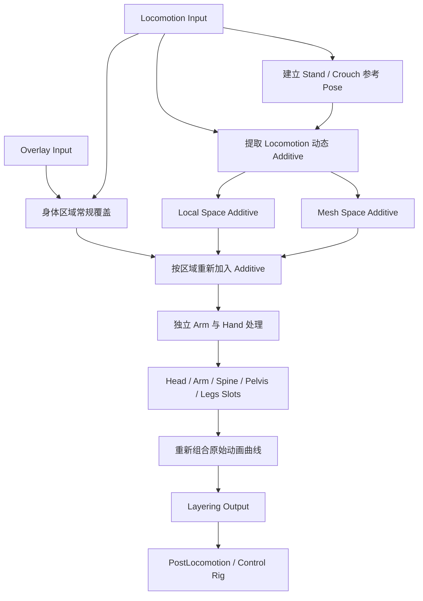

# AB_Als_Layering 的设计思路

> `AB_Als_Layering` 不是简单的上半身混合图，而是 ALS 的通用姿势合成器：它在 Locomotion 与 Overlay 之间按身体区域分配姿势所有权，重新加入运动 Additive，插入局部 Montage，并在最后恢复稳定的动画曲线。

## 解决的问题

基础 Locomotion 已经包含完整的站立、蹲伏、走跑、跳跃和身体惯性；Overlay 又需要让角色表现持枪、抱箱、受伤或双手被绑等附加姿态。如果只做一次从脊柱开始的 `Layered Blend Per Bone`，会遇到几个问题：

- 持物姿势能够接管双臂，但会丢失走跑中的身体起伏和运动节奏。
- 同一 Overlay 很难分别控制 Head、Spine、Arm、Hand、Pelvis 和 Legs。
- 手臂 Additive 会沿骨骼层级传播到手指、武器骨和 IK 辅助骨。
- 换弹、装备等 Montage 需要在不同身体区域以不同方式参与合成。
- `Layer*` 曲线既驱动混合又随 Pose 传播，多轮混合后容易被自身污染。

因此，`AB_Als_Layering` 将姿势合成拆成多个阶段，每个阶段只解决一种问题。

## 在系统中的位置

主动画蓝图先取得两路姿势：

- `Locomotion Input`：Grounded、In Air、Standing、Crouching 等图生成的基础全身运动。
- `Overlay Input`：当前 Overlay Linked Anim Layer 生成的附加姿势和 `Layer*` 曲线。

二者进入 `AB_Als_Layering` 后才执行区域混合。其结果离开 Layering 图后，还会经过 `PostLocomotion`、过渡和 `CR_Als` 等后续阶段。



这张图表达的是设计阶段和数据依赖。资产中的节点类型、动画引用和注释可以确认这些职责；每个节点 Pin 的精确连接仍应在 Unreal Editor 中逐项核对。

## 第一阶段：缓存被多次使用的 Pose

资产中存在 `Save Cached Pose` 和 `Use Cached Pose`。这是因为 Locomotion、Overlay 和动态 Additive 会被多个身体区域反复读取。

在 AnimGraph 中，Pose 不是已经计算完成的普通变量。若同一复杂输入被多个分支直接引用，可能重复更新和求值。先缓存输入可以：

- 保证各分支读取的是同一帧、同一状态下的结果；
- 避免 Locomotion 和 Overlay 子图被重复求值；
- 让后续图按照“准备来源，再逐层合成”的方式组织。

所以图左侧通常先处理输入和缓存，而不是立即开始 Layered Blend。

## 第二阶段：建立当前 Stance 的参考姿势

资产引用了：

- `A_Als_Stand_Pose`
- `A_Als_Crouch_Pose`
- `PoseState.StandingAmount`
- `PoseState.CrouchingAmount`
- `Multi Way Blend`

这些节点用于建立与当前 Stance 相匹配的中立参考姿势。

```text
ReferencePose =
    StandPose  × StandingAmount
  + CrouchPose × CrouchingAmount
```

参考姿势不是最终要显示的动画。它主要用于回答：当前 Locomotion 相对站立或蹲伏的基础姿态产生了多少运动变化。

如果角色正在蹲伏，却始终以 Standing Pose 计算 Additive，那么差值中会包含完整的蹲伏高度、骨盆下降和腿部弯曲。将这个差值重新叠到 Overlay 上时，角色可能被重复压低。因此参考姿势必须跟随 Standing/Crouching 的实际混合进度，而不能只读取 Character 的离散 Stance Tag。

## 第三阶段：从 Locomotion 提取动态 Additive

资产注释说明，图中会从 Locomotion Pose 制作动态 Additive，并同时生成 Local Space 和 Mesh Space 两个版本。对应节点包括：

- `Make Dynamic Additive`
- `Apply Additive`
- `Apply Mesh Space Additive`
- `Locomotion Additive Local Space`
- `Locomotion Additive Mesh Space`

设计意图可以表示为：

```text
LocomotionDelta = CurrentLocomotionPose - StanceReferencePose
```

这个 Delta 保存的不是完整走跑姿势，而是当前 Locomotion 相对中立姿势产生的变化，例如：

- 骨盆和身体的上下起伏；
- 脊柱随步态产生的运动；
- 肩膀和手臂的运动节奏；
- 加速、冲刺和转向产生的部分动态。

Overlay 可以先建立明确的持物或受伤结构，再根据 `Layer*Additive` 曲线重新接收一部分 Locomotion 动态。这样角色既不会丢失武器姿势，也不会像一尊固定上半身的雕像。

## 为什么同时需要 Local Space 和 Mesh Space

### Local Space

Local Space Additive 沿父子骨骼的局部空间累积，特别适合手臂。资产注释说明，手臂使用 Local Space 时，可以自然继承 Spine 已经产生的旋转。

例如角色瞄准时胸腔先向右旋转，左臂的运动 Delta 应当相对新的肩部方向继续作用：

```text
Spine Rotation
    ↓
Clavicle / Upper Arm Local Space Delta
    ↓
手臂自然跟随胸腔
```

### Mesh Space

Mesh Space Additive 相对 Skeletal Mesh 表达旋转，更适合需要保持整体方向稳定的身体区域。它可以减少父骨骼局部轴变化对增量方向的影响。

资产中还存在 Mesh Space Rotation Blend 等配置，说明图在处理大范围身体区域时，不只是简单沿父骨骼局部空间插值。

### Arm 的空间选择

`RefreshLayering()` 中的计算是：

```cpp
ArmLeftLocalSpaceBlendAmount = LayerArmLeftLocalSpace;
ArmLeftMeshSpaceBlendAmount =
    !FAnimWeight::IsFullWeight(ArmLeftLocalSpaceBlendAmount);
```

右臂逻辑相同。这意味着 Mesh Space 是默认有效路径；Local Space 权重逐渐升高时，结果可以向 Local Space 过渡；当 Local Space 达到完整权重时，Mesh Space 路径关闭。

它不是两个可以独立随意拉满的效果强度，而是在两种 Additive 空间之间分配手臂的处理方式。

### 具体应用例子

#### 手臂跑步 / 冲刺摆动 → Local Space

角色奔跑时，脊柱会随骨盆做反向旋转。手臂的跑步或冲刺 Additive 若用 Local Space，摆动方向是相对肩膀的：肩膀随脊柱转动，摆动就跟着转，于是摆臂和躯干扭转保持一致。这正是资产注释推荐手臂用 Local Space 的原因，也是 `LayerArmLeftLocalSpace` 拉满时关闭 Mesh Space 路径的意图。

若此处误用 Mesh Space，摆臂会保持相对网格的固定方向，而躯干仍在扭转，结果就是"上半身在转、手臂却自顾自摆"，摆臂与步态脱节。

#### 瞄准 / 持枪结构 → Mesh Space

瞄准或持枪时，枪口朝向需要相对角色网格保持稳定。Aim Offset 官方要求样本使用 Mesh Space Additive，正是因为 Yaw / Pitch 表达的是相对网格的方向。若用 Local Space，脊柱为响应视角 Yaw 先转一次，Local Space 的持枪增量又会随父骨骼再转一次，枪口就出现"二次偏转"，无法保持朝向。

#### 判断口诀

增量需要"跟着父骨骼转"就用 Local Space；增量需要"相对网格保持方向"就用 Mesh Space。选错时的表现可以反推：瞄准时手臂或枪口随脊柱转动两次，通常是把该用 Mesh Space 的地方做成了 Local Space；摆臂与躯干旋转脱节，则通常是把该用 Local Space 的地方做成了 Mesh Space。

## 第四阶段：按身体区域处理普通覆盖与 Additive

`FAlsLayeringState` 为不同区域保存独立权重：

| 区域 | 普通覆盖 | Additive | Slot | 额外控制 |
| --- | --- | --- | --- | --- |
| Head | `LayerHead` | `LayerHeadAdditive` | `LayerHeadSlot` | — |
| Arm Left | `LayerArmLeft` | `LayerArmLeftAdditive` | `LayerArmLeftSlot` | Local / Mesh Space |
| Arm Right | `LayerArmRight` | `LayerArmRightAdditive` | `LayerArmRightSlot` | Local / Mesh Space |
| Hand Left | `LayerHandLeft` | — | — | 独立手部层 |
| Hand Right | `LayerHandRight` | — | — | 独立手部层 |
| Spine | `LayerSpine` | `LayerSpineAdditive` | `LayerSpineSlot` | — |
| Pelvis | `LayerPelvis` | — | `LayerPelvisSlot` | — |
| Legs | `LayerLegs` | — | `LayerLegsSlot` | — |

这里需要区分两种不同含义。

### 普通覆盖决定结构

普通的 `LayerHead`、`LayerArmLeft` 或 `LayerSpine` 决定该区域在 Locomotion 与 Overlay 的绝对姿势之间采用哪一个结果。

例如 Rifle 可以让双臂完整使用持枪姿势，但让 Pelvis 和 Legs 继续使用基础跑步。

### Additive 决定重新加入多少动态

`LayerArmLeftAdditive`、`LayerSpineAdditive` 等权重决定从 Locomotion 提取出的运动差值，有多少重新作用到已经建立的区域姿势上。

因此可以把一个区域粗略理解为：

```text
区域结构 = Blend(Locomotion, Overlay, RegionBlendAmount)

区域结果 = 区域结构
         + LocomotionDelta × RegionAdditiveAmount
```

这只是帮助理解的概念公式，不代表蓝图内部每个 Pin 的直接数学展开。

## 为什么需要多个 Layered Blend Per Bone

一个 `Layered Blend Per Bone` 很难同时表达 ALS 的所有要求。以左臂为例，它至少涉及：

- Overlay 的绝对姿势权重；
- Locomotion Additive 权重；
- Local / Mesh Space 选择；
- Montage Slot 权重；
- 手掌和手指是否需要从 Arm 传播中隔离。

Head、Spine、Pelvis 和 Legs 又有不同组合。将这些职责拆成多个节点，可以按从广到窄的区域逐层解决所有权：

```text
全身和躯干
    → Spine / Head
        → Left Arm / Right Arm
            → Left Hand / Right Hand
```

骨骼范围较大的层先建立总体结果，范围更具体的层放在后面，负责覆盖父级混合造成的不希望结果。节点排布因此更接近有明确优先级的合成器，而不是一个平铺的动画列表。

## 第五阶段：为什么 Arms 后面还有独立 Hands 层

手臂骨骼会向下影响手掌、手指和武器辅助骨：

```text
upperarm
  → lowerarm
    → hand
      → fingers
      → weapon / virtual bones
```

资产注释明确说明，额外 Hands Layer 用于阻止 Arm Additive 继续播放到手指、枪械和物体骨骼上。

如果没有这一层，常见问题包括：

- 手臂运动正确，但握枪手型发生扭曲；
- 手指跟随跑步 Additive 摆动；
- 武器相对手掌产生二次偏移；
- 双手或 `ik_hand_gun` 关系不稳定。

图中还能确认以下虚拟骨参与手部关系维护：

- `VB hand_l_to_hand_r`
- `VB hand_l_to_ik_hand_gun`
- `VB hand_r_to_hand_r`
- `VB hand_r_to_ik_hand_gun`

可以将分工理解为：

```text
Arm Layer   = 控制整个手臂链的大体姿势和动态
Hand Layer  = 重新确立手掌、手指和武器骨关系
Control Rig = 最后修正手部末端与 IK 目标的误差
```

Hand Layer 不是 Hand IK。前者仍属于动画姿势合成，后者是后续约束求解。

## 第六阶段：区域 Slots 为什么位于 Layering 图中

资产中定义了：

- `LayerHeadSlot`
- `LayerArmLeftSlot`
- `LayerArmRightSlot`
- `LayerSpineSlot`
- `LayerPelvisSlot`
- `LayerLegsSlot`

Slot 本身只是 Montage 的动画图插入位置，并不会自动只影响某个身体区域。将 Slot 放进 Layering 图，可以让同一个 Montage 在不同区域采用不同表达方式。

例如换弹可以设计为：

```text
Left / Right Arm Slot = 完整 Override 换弹动作
Spine Slot            = Additive 身体动作
Pelvis / Legs          = 继续保留 Locomotion
```

这样同一个换弹 Montage 可以复用 Standing、Crouching 和移动中的基础姿势，而不必为每种 Stance 制作一套完整全身换弹。

资产注释也提醒：Montage 还应包含 Curves Slot。骨骼动画与控制 Layering 的曲线必须同时进入管线，否则可能出现双臂已经播放换弹，但 `LayeringState` 仍然按照旧 Overlay 权重把动作混回去的问题。

## 第七阶段：为什么最后要重新混合动画曲线

这是整张图最重要的稳定性设计之一。

`LayerHead`、`LayerArmLeft` 等曲线有双重身份：

1. 它们跟随 Locomotion 或 Overlay Pose 一起传播。
2. `RefreshLayering()` 下一帧又会读取它们，继续控制姿势混合。

前面的 Layered Blend、Additive 和 Slot 都可能改变曲线。如果直接输出这些经过多轮混合的曲线，就可能形成反馈污染：

```text
Layer 曲线控制姿势分层
    ↓
姿势分层节点又修改 Layer 曲线
    ↓
下一帧读取已经被自身影响的曲线
```

资产注释说明，Layering 图会在最后从 Locomotion Pose 和 Overlay Pose 重新取得动画曲线，并覆盖此前分层造成的干扰。

ALS 为此实现了 `FAlsAnimNode_CurvesBlend`。这个节点先求值 `BasePose`，保留其骨骼姿势，然后单独求值 `CurvePose`，只按照指定模式处理动画曲线。它支持 Accumulate、Lerp、Combine、Override 等模式。

因此，最后的 Curves Blend 不是为了再次修改骨骼，而是为了让控制系统读到稳定、可预测的曲线来源。

## 为什么 Control Rig 不放进这张图内部

`AB_Als_Layering` 主要解决语义姿势的合成：角色当前哪些区域属于 Locomotion、Overlay、Additive 或 Montage。

Hand IK、Spine Yaw 和 Foot IK 处理的是最终约束。如果在 Layering 完成前运行 IK，后面的 Overlay、Additive 或 Montage 还会继续改变骨骼，使 IK 结果失效。

所以稳定的职责顺序是：

```text
Locomotion / Overlay 选择
    → AB_Als_Layering 姿势合成
    → PostLocomotion 和全身动作
    → CR_Als Spine / Hand / Foot 约束
```

## Rifle 跑步时的完整例子

假设角色正在持枪奔跑：

1. `Locomotion Input` 输出完整跑步，包括腿、骨盆、脊柱起伏和普通摆臂。
2. Stand 或 Crouch Pose 作为参考，从当前跑步中提取动态 Additive。
3. Rifle Overlay 提供双臂、肩膀、手掌和武器的结构性姿势。
4. Pelvis 和 Legs 主要保留 Locomotion。
5. Left / Right Arm 使用 Rifle 的绝对持枪姿势。
6. 根据 `LayerArm*Additive`，把部分跑步节奏重新加入持枪手臂。
7. 根据 `LayerArm*LocalSpace`，决定手臂动态如何继承 Spine 旋转。
8. 独立 Hand Layer 恢复手掌、手指和武器辅助骨的稳定关系。
9. Reload 或 Equip Montage 可以从区域 Slot 暂时接管双臂和部分 Spine。
10. Curves Blend 恢复正确的 `Layer*` 控制曲线。
11. 输出离开 Layering 后，Control Rig 再修正 Spine Yaw、Hand IK 和 Foot IK。

最终结果不是简单的：

```text
跑步 + 持枪 Pose
```

而是：

```text
跑步的全身运动
+ Rifle 的结构性姿势
+ 从跑步中重新提取的局部动态
+ Montage 事件动作
+ 手部姿势保护
+ 最终 Control Rig 约束
```

## 调试时如何沿图排查

### Overlay 结构不正确

先关闭 Additive 和 Slot，只观察普通区域覆盖。确认 `LayerHead`、`LayerSpine`、`LayerArm*`、`LayerPelvis` 和 `LayerLegs` 是否符合预期。

### 持枪正确但身体太僵硬

检查对应的 `Layer*Additive`，并确认动态 Additive 使用了正确的 Stand / Crouch 参考姿势。

### 瞄准时手臂发生二次旋转

分别观察 Arm 的 Local Space 和 Mesh Space 路径，确认 `LayerArm*LocalSpace` 是否符合动画资源的制作方式。

### 手掌、手指或武器抖动

先检查独立 Hand Layer 和虚拟骨，再检查后续 Hand IK。不要直接提高 IK 权重来掩盖 Arm Additive 已经污染手部姿势的问题。

### Montage 播放但只有部分身体响应

检查 Montage Slot、对应的 `Layer*Slot` 曲线以及 Curves Slot。确认动作的骨骼姿势和 Layer 控制曲线一起进入了 Layering 图。

### 权重随时间异常或越来越难预测

观察最终 Curves Blend 前后的曲线值，确认输出曲线没有被前面的多轮姿势混合污染。

## 证据边界

可以从 C++、资产引用、序列化节点类型和资产注释确认：

- Stand / Crouch 参考 Pose 与 `PoseState` 权重参与基础姿势构建。
- 图中生成 Local Space 与 Mesh Space 两份动态 Locomotion Additive。
- Head、Spine、Arms、Hands、Pelvis、Legs 使用独立 Layer 权重。
- Arms 使用 Local / Mesh Space 选择，并拥有独立 Hands 层。
- 图中存在各身体区域 Slot 和自定义 Curves Blend。
- Curves Blend 的目的在于恢复 Locomotion 与 Overlay 的原始曲线控制。

仍应在 Unreal Editor 中核对：

- 每个 `Layered Blend Per Bone` 的完整 Branch Filter 和 Blend Depth。
- 所有节点 Pin 的精确连接顺序。
- 各 Slot 的 Group 配置与 Montage 轨道对应关系。
- 每个 Curves Blend 节点使用的具体 Blend Mode。
- 不同 Overlay 动画资源中每条 `Layer*` 曲线的实际关键帧。

## 相关主题

- [瞄准与 Overlay](./07-瞄准与Overlay.md)
- [动画数据流](./02-动画数据流.md)
- [动画实例](./03-动画实例.md)
- [公共基础：姿态叠加与动画分层](../Fundamentals/01-姿态叠加与动画分层.md)
- [不同武器的姿态与重心如何实现](../Fundamentals/02-不同武器的姿态与重心如何实现.md)

## 关键源码与资产

- `Source/ALS/Private/AlsAnimationInstance.cpp:287-334`：`RefreshLayering()` 与各区域曲线权重。
- `Source/ALS/Public/State/AlsLayeringState.h`：Layering State 数据结构。
- `Source/ALS/Public/State/AlsPoseState.h`：Standing、Crouching 等参考姿势权重。
- `Source/ALS/Public/Nodes/AlsAnimNode_CurvesBlend.h`：曲线混合模式与节点接口。
- `Source/ALS/Private/Nodes/AlsAnimNode_CurvesBlend.cpp`：只重新组合曲线的求值实现。
- `Content/ALS/Character/AnimationInstances/AB_Als_Layering.uasset`：Layering 动画蓝图。
- `Content/ALS/Animations/Base/A_Als_Stand_Pose.uasset`：Standing 参考姿势。
- `Content/ALS/Animations/Base/A_Als_Crouch_Pose.uasset`：Crouching 参考姿势。

## 参考资料

- [ALS-Refactored 4.17：AlsAnimationInstance.cpp](https://github.com/Sixze/ALS-Refactored/blob/4.17/Source/ALS/Private/AlsAnimationInstance.cpp)
- [ALS-Refactored 4.17：AlsLayeringState.h](https://github.com/Sixze/ALS-Refactored/blob/4.17/Source/ALS/Public/State/AlsLayeringState.h)
- [Unreal Engine：Using Layered Animations](https://dev.epicgames.com/documentation/en-us/unreal-engine/using-layered-animations-in-unreal-engine)
- [Unreal Engine：Animation Montage](https://dev.epicgames.com/documentation/en-us/unreal-engine/animation-montage-in-unreal-engine)
- [Unreal Engine：Animation Curves](https://dev.epicgames.com/documentation/en-us/unreal-engine/animation-curves-in-unreal-engine)

