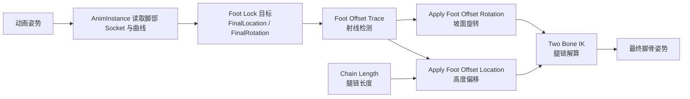

# ALS Foot Offset

> Foot Offset 在 Foot Lock 之后、腿部 IK 之前，用一次向下的射线检测找到真实地面，把脚部目标修正到贴合斜坡、台阶和不规则表面；它只解决"脚悬空 / 穿地 / 不贴坡"，不解决"脚沿地面水平滑动"。

## 解决的问题

Foot Lock 保持的是"捕获那一刻"的脚部目标变换，它不询问地面在哪里。所以脚被锁定后，脚骨会忠实地停在动画期望的高度上：

- 上坡时脚陷进坡面；
- 下坡或下台阶时脚悬空；
- 站在斜面时脚掌仍保持水平，脚跟或脚尖翘起。

Foot Offset 补上的是"真实地面"这一步：在每只脚的水平位置向下做射线检测，用命中点和地面法线重新确定脚的高度与朝向。它和 Foot Lock 是串联关系，不是互相替代——Foot Lock 防止水平滑动，Foot Offset 防止垂直穿地/悬空。

## 在系统中的位置

Foot Offset 运行在 Control Rig 资产 `CR_Als` 内部，是整条脚部修正链的一段：



- `FinalLocation` / `FinalRotation` 由 `GetControlRigInput()` 传入 `CR_Als`，它们是 Foot Lock 的输出，也是 Foot Offset 的输入。
- Foot Offset 只修改这两路目标，不直接碰骨骼；真正把腿摆到位的是后面的 Two Bone IK。
- `PelvisOffset` 是另一条独立的骨盆下沉逻辑，但它的值也会作为下限传给 Foot Offset 的位置节点（见下文）。

## 工作方式

### 1. Foot Offset Trace：找到地面

`FAlsRigUnit_FootOffsetTrace` 的输入：

| 参数 | 默认值 | 作用 |
| --- | --- | --- |
| `FootTargetLocation` | — | 当前脚部目标位置（脚骨的 X/Y 被用来定位射线） |
| `TraceChannel` | `ECC_Visibility` | 射线碰撞通道 |
| `TraceDistanceUpward` | `50 cm` | 起点相对脚平面向上偏移 |
| `TraceDistanceDownward` | `80 cm` | 终点相对脚平面向下偏移 |
| `WalkableFloorAngle` | `45°` | 判断地面是否可站立的法线夹角 |
| `FootHeight` | `13.5 cm` | 脚骨枢轴到脚底的距离 |
| `bEnabled` / `bDrawDebug` | `true` / `false` | 总开关与调试绘制 |

它用脚目标的 X/Y，在 Z 方向从 `+TraceDistanceUpward` 到 `-TraceDistanceDownward` 拉一条线做 `LineTraceSingleByChannel`。命中后做两步判断：

1. 无可站立命中，或命中法线的 Z 分量小于 `cos(WalkableFloorAngle)`（说明面太陡）时，直接输出 `OffsetLocationZ = 0`、`OffsetNormal = Up`，即本轮不修正。
2. 命中且可站立时，计算 Z 偏移：

```text
SlopeOffsetZ = FootHeight / cos(坡度) - FootHeight
OffsetLocationZ = HitLocation.Z + SlopeOffsetZ
OffsetNormal = HitNormal
```

`FootHeight / cos(坡度) - FootHeight` 是斜面修正项：脚底到脚骨枢轴在斜面上的垂直距离会随坡度变大，这段额外高度补偿进去，脚掌才不会陷进坡面；平坦地面 `cos = 1`，该项为 0。

### 2. Apply Foot Offset Location：调整高度

`FAlsRigUnit_ApplyFootOffsetLocation` 把 Trace 输出的 Z 偏移作用到脚目标上，核心不是直接相加，而是先限幅、再插值：

```text
MaxFootLocationZ       = PelvisZ - MinPelvisToFootDistanceZ
TargetOffsetLocationZ  = Min(FootOffsetLocationZ, MaxFootLocationZ)
TargetOffsetLocationZ  = Max(TargetOffsetLocationZ, PelvisOffset)

OffsetLocationZ = SpringDamper(OffsetLocationZ, TargetOffsetLocationZ, Δt, ...)

FootLocation.XY = FootTargetLocation.XY
FootLocation.Z  = FootTargetLocation.Z + OffsetLocationZ
```

两条限制：

- `MinPelvisToFootDistanceZ`（默认 `50 cm`）限制脚相对骨盆能被抬多高，防止坡太陡时腿被拉得过高。
- 用 `Max(..., PelvisOffset)` 保证脚偏移不低于骨盆下沉量，避免骨盆已经下降时腿被反向拉直。

然后经过 `UAlsMath::SpringDamperFloat` 平滑，相关参数是 `OffsetInterpolationFrequency`（默认 `12 hz`）、`OffsetInterpolationDampingRatio`（默认 `2.0`）、`OffsetInterpolationTargetVelocityAmount`（默认 `0.0`）。频率越高响应越快，阻尼比越大越不容易震荡。

最后还有一步防腿完全伸直：

```text
FootLocation = ThighLocation + Clamp(FootLocation - ThighLocation, LegLength × MaxLegStretchRatio)
```

`LegLength` 由 Chain Length 节点算出（骨盆到脚沿骨骼链的距离），`MaxLegStretchRatio` 默认 `0.99`，保证腿始终留一点弯曲余量。

### 3. Apply Foot Offset Rotation：贴合坡面

`FAlsRigUnit_ApplyFootOffsetRotation` 让脚掌对齐地面法线。它不直接输出"把脚转 N 度"，而是：

1. 用 `DamperExact` 把当前法线朝目标法线插值（`OffsetInterpolationHalfLife` 默认 `0.1 s`）。
2. 计算把 Up 向量转到法线的旋转：`OffsetRotation = FindBetweenVectors(Up, OffsetNormal)`。
3. 把当前脚旋转和目标脚旋转都转换到**小腿（Calf）空间**，并减去初始姿态下的脚-小腿相对旋转，得到"动画之外额外施加了多少摆动"。
4. 在这个小腿空间里，对三个轴分别限幅：

| 轴 | 参数 | 默认范围 |
| --- | --- | --- |
| Yaw（Swing 1） | `Swing1LimitAngle` | `-20° ~ 40°` |
| Pitch（Swing 2） | `Swing2LimitAngle` | `-15° ~ 5°` |
| Roll（Twist） | `TwistLimitAngle` | `0° ~ 0°` |

限幅的关键在 `ConstraintTargetAngle`：它把目标角度夹在"当前动画角度与限幅边界"之间，因此**动画里本来已经转 45° 的脚不会被强行拉回 0°**，限幅只约束额外偏移，不破坏原始姿势。

### 4. Chain Length：给位置节点提供腿长

`FAlsRigUnit_ChainLength` 沿骨骼层级（支持单亲和多亲元素）累加相邻骨骼的距离，算出祖先到后代（这里即骨盆到脚）的链长。`bInitial` 选择用初始全局变换还是当前全局变换。它的输出 `Length` 喂给位置节点的 `LegLength`，用于上面的防伸直限幅。

## 与 Foot Lock、Pelvis Offset、Leg IK 的边界

| 环节 | 运行位置 | 解决的问题 | 是否检测地面 |
| --- | --- | --- | --- |
| Foot Lock | `UAlsAnimationInstance`（CR 之前） | 支撑脚水平滑动 | 否 |
| Foot Offset | `CR_Als`（Control Rig） | 脚悬空、穿地、不贴坡 | 是 |
| Pelvis Offset | `CR_Als` | 双脚高度差导致的腿过度拉伸 | 间接（消费脚部目标） |
| Leg IK | `CR_Als`（最后） | 把腿链解算到最终脚目标 | 否 |

一个容易混淆的点：`FootOffsetLocation` 的 Z 修正和 `PelvisOffset` 都影响高度，但方向相反、分工不同。Foot Offset 是"把脚放到地面"，Pelvis Offset 是"当地面把脚压低了，把骨盆也往下拉一点以保持腿长"。位置节点用 `Max(TargetOffset, PelvisOffset)` 把两者约束在一致的方向上，避免互相打架。

## 常见问题

### 脚锁住了但仍然穿地 / 悬空 / 不贴坡

这是 Foot Offset 链路的问题，不要继续调 Foot Lock。检查 `Foot Offset Trace` 的碰撞通道、上下检测距离、可行走坡度和 Foot Height。

### 平坦地面正常，斜坡上脚陷进坡面

优先查 `FootHeight` 与 `WalkableFloorAngle`。Foot Height 偏小会让斜面补偿不足；Walkable Floor Angle 偏小会把本应处理的斜坡判为不可站立，从而不修正。

### 上台阶时脚跟不上，悬空几帧

查 `TraceDistanceDownward` 是否够长，以及 `OffsetInterpolationFrequency` / `DampingRatio`。检测距离不足会漏掉更低的地面；弹簧响应过慢会让脚来不及贴到新高度。

### 脚下有微抖或延迟

一般是插值参数问题。频率过高 + 阻尼过低会抖，频率过低或阻尼过大则显"慢半拍"。`OffsetInterpolationTargetVelocityAmount` 默认 0，是为了抑制噪声，若需要更跟手可以适当提高。

### 坡面脚掌角度被强行回正

查三个限幅角度。`TwistLimitAngle` 默认 `0°~0°` 会几乎禁止脚掌绕脚轴向扭转；如果动画本身带明显扭转，这个默认值可能不合适，但也要先确认不是动画和限幅双重修正。

### 腿被拉直 / 膝反弯

查 `MaxLegStretchRatio` 和 Chain Length 的输入。腿长算错（比如 Chain Length 用了错误的祖先/后代骨骼）时，防伸直限幅会把脚拉到错误位置。

## 关键源码与资产

本地工程（`I:\UnrealProjects\GASP\Plugins\ALS-Refactored-4.17\`）：

- `Source/ALS/Public/Nodes/AlsRigUnit_FootOffsetTrace.h` + `Private/Nodes/AlsRigUnit_FootOffsetTrace.cpp`：射线检测与 Z 偏移计算。
- `Source/ALS/Public/Nodes/AlsRigUnit_ApplyFootOffsetLocation.h` + 对应 `.cpp`：高度偏移、限幅与弹簧插值。
- `Source/ALS/Public/Nodes/AlsRigUnit_ApplyFootOffsetRotation.h` + 对应 `.cpp`：坡面旋转与摆动/扭转限幅。
- `Source/ALS/Public/Nodes/AlsRigUnit_ChainLength.h` + 对应 `.cpp`：腿链长度。
- `Source/ALS/Private/AlsAnimationInstance.cpp:235-256`：`GetControlRigInput()` 输出脚部目标与骨盆偏移量。
- `Source/ALS/Public/State/AlsControlRigInput.h`：传入 Control Rig 的输入结构。
- `Content/ALS/Character/CR_Als.uasset`：Foot Offset 各节点的实际连线与参数值。

GitHub 对照（4.17）：

- [ALS-Refactored 4.17：Foot Offset Trace](https://github.com/Sixze/ALS-Refactored/blob/4.17/Source/ALS/Private/Nodes/AlsRigUnit_FootOffsetTrace.cpp)
- [ALS-Refactored 4.17：Foot Offset Rig Units 目录](https://github.com/Sixze/ALS-Refactored/tree/4.17/Source/ALS/Private/Nodes)

## 证据边界

以下内容来自 C++ 节点实现，可直接确认：

- Trace 的射线起止、碰撞通道默认值、可行走判断和 Z 偏移公式。
- Location 节点的两条限幅、弹簧插值参数和防伸直限幅。
- Rotation 节点的法线插值、小腿空间转换和三个轴的限幅逻辑。
- Chain Length 的骨骼链距离计算方式。

以下内容仍需在 `CR_Als.uasset` 中逐项核对：

- 各节点在 Rig 中的精确连线顺序和实际参数值（默认值只是节点声明，资产里可能被改过）。
- `PelvisItem`、`ThighItem`、`CalfItem`、`FootItem` 具体绑到哪些骨骼或虚拟骨。
- Foot Offset 与 Pelvis Offset、Two Bone IK 之间的具体数据依赖。

## 相关主题

- [Foot IK 总览](./08-Foot-IK.md)
- [脚部 IK 锁定](./08.1-脚部IK锁定.md)
- [调试问题](./10-调试问题.md)
- [UE5 现代动画节点：接触与 IK](../UE5现代动画节点/01-接触与IK.md)

## 参考资料

- [ALS-Refactored 4.17：Foot Offset Trace](https://github.com/Sixze/ALS-Refactored/blob/4.17/Source/ALS/Private/Nodes/AlsRigUnit_FootOffsetTrace.cpp)
- [ALS-Refactored 4.17：Apply Foot Offset Location](https://github.com/Sixze/ALS-Refactored/blob/4.17/Source/ALS/Private/Nodes/AlsRigUnit_ApplyFootOffsetLocation.cpp)
- [ALS-Refactored 4.17：Apply Foot Offset Rotation](https://github.com/Sixze/ALS-Refactored/blob/4.17/Source/ALS/Private/Nodes/AlsRigUnit_ApplyFootOffsetRotation.cpp)
- [ALS-Refactored 4.17：Chain Length](https://github.com/Sixze/ALS-Refactored/blob/4.17/Source/ALS/Private/Nodes/AlsRigUnit_ChainLength.cpp)
- [Unreal Engine：Control Rig in Animation Blueprints](https://dev.epicgames.com/documentation/en-us/unreal-engine/control-rig-in-animation-blueprints-in-unreal-engine)
