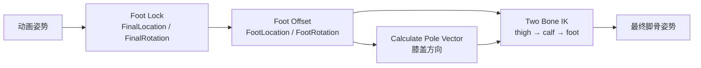

# 08.3 腿部 IK 解算

> Foot Lock 和 Foot Offset 只负责**算出脚该在哪**；真正把大腿、小腿摆过去的是 Control Rig 里的 Two Bone IK 节点。ALS 没有自己实现解算器，只用引擎自带的 Two Bone IK，并额外写了一个 `CalculatePoleVector` 节点来保证膝盖方向稳定。

## 解决的问题

Foot Lock 输出 `FinalLocation` / `FinalRotation`，Foot Offset 再把它修正成 `FootLocation` / `FootRotation`。但这两个结果只是**目标变换**——它们描述"脚骨希望处于哪个位置、朝向哪里"，本身并不会移动任何骨骼。

把大腿、小腿和脚骨真正解算到目标上，是腿部 IK 的工作。如果这一步缺了或做错：

- 脚目标算得再准，脚骨也不会跟过去，Foot Lock 和 Foot Offset 全都不生效；
- 膝盖会朝错误的方向弯，出现膝盖内翻、外翻或在快速转身时突然翻转。

所以腿部 IK 是整条脚部修正链的**最后执行者**，负责把前面算好的目标变成骨骼姿势。

## 在系统中的位置

腿部 IK 运行在 `CR_Als`（Control Rig 资产）里，位于 Foot Offset 之后，是脚部管线的终点：



左脚和右脚各有一条独立的 Two Bone IK 链：`thigh_l → calf_l → foot_l` 和 `thigh_r → calf_r → foot_r`，分别用各自脚的 Foot Offset 结果作为目标。

## ALS 没有自己的解算器

ALS-Refactored 的 C++ 里**不存在**自定义的腿部 IK 解算节点。`CR_Als` 里承担解算的是引擎自带的 Control Rig **Two Bone IK** 节点（`FRigUnit_TwoBoneIK`）。

这一点可以从两个地方确认：

- `Source\ALS\Private\Nodes\` 下的自定义 Rig Unit 只有 Foot Offset（Trace / Apply Location / Apply Rotation / Chain Length）、`CalculatePoleVector`、`DistributeRotationSimple`、`HandIkRetargeting` 等，没有一个负责解算腿链。
- 在 `CR_Als.uasset` 中扫描可读字符串，`TwoBoneIK` 出现数百次，且存在 `thigh_l`、`thigh_r`、`calf_l`、`calf_r`、`ik_foot` 等骨骼名——腿部就是由两条 Two Bone IK 链解算的。

因此理解 ALS 腿部 IK，重点是理解**Two Bone IK 的输入输出**，以及 ALS 为它补充的 `CalculatePoleVector`。

## Two Bone IK 做什么

Two Bone IK 求解的是一条两段骨骼链。对腿而言：

```text
A(thigh 大腿根部) ──L1── B(calf 小腿/膝盖) ──L2── C(foot 脚部末端)
```

它已知：

- `A` 的位置（由骨盆和大腿朝向决定）；
- `L1`、`L2` 两段骨长（固定）；
- 目标 `C`（这里就是 Foot Offset 输出的 `FootLocation` / `FootRotation`）。

要解的未知量是 `B` 处的弯曲：找到膝盖的朝向，使链末端正好落在目标 `C` 上。两段骨长固定，`A` 和 `C` 又确定后，`B` 的解通常有两个（膝盖朝里或朝外），因此必须再给一个**极向量（Pole Vector）**来决定膝盖朝哪个方向弯。

Two Bone IK 的典型输入因此是：

| 输入 | 对应腿部的值 | 作用 |
| --- | --- | --- |
| Root（Item A） | `thigh_l` / `thigh_r` | 链的根骨 |
| Mid（Item B） | `calf_l` / `calf_r` | 中间骨，其位置就是膝盖 |
| Effector 目标 | `ik_foot_l` / `ik_foot_r`（Foot Offset 输出的目标） | 脚要到达的位置/朝向 |
| Pole Vector | `CalculatePoleVector` 的输出 | 决定膝盖弯曲方向 |

（各 Pin 的精确名称以所用引擎版本为准，需在 `CR_Als` 中逐项核对。）

## CalculatePoleVector：ALS 补充的膝盖方向

Two Bone IK 需要极向量，但极向量不能随手给一个固定方向——脚目标随地形和转向不断变化时，固定方向会让膝盖乱翻。ALS 写了一个 `FAlsRigUnit_CalculatePoleVector` 节点，根据 A、B、C 三点的实时位置动态计算极向量。

它的核心在 `UAlsMath::TryCalculatePoleVector`（`AlsMath.cpp`）：

```text
Ab = B - A
Ac = normalize(C - A)

ProjectionLocation = A + Ab.ProjectOnToNormal(Ac)   // 把 B 投影到 A→C 直线上
PoleDirection      = B - ProjectionLocation          // 膝盖偏离腿轴的方向
```

几何含义是：先把膝盖点 `B` 投影到"大腿根到脚目标"的直线上，再从 `B` 指向投影点——得到的就是"膝盖相对腿轴朝哪个方向凸出"。Two Bone IK 拿这个方向当极向量，膝弯就会始终朝向当前腿姿最自然的一侧。

几个退化情况的处理：

- `A` 和 `B` 重合（`AbVector.IsNearlyZero()`）：算不出方向，返回失败。
- `A` 和 `C` 重合（`AcVector` 无法归一化）：直接返回 `Ab` 的方向。
- `A`、`B`、`C` 三点共线：投影方向为零向量，归一化失败，返回 `false`。

`CalculatePoleVector` 失败时（`bSuccess = false`），节点会**沿用上一次成功的结果**（`AlsRigUnits.cpp` 中的注释明确写了这一点），避免某一帧因为腿伸直或点位退化而让膝盖突然失去方向。

## 与 Foot Lock、Foot Offset 的分工

| 环节 | 运行位置 | 做什么 | 输出 |
| --- | --- | --- | --- |
| Foot Lock | `UAlsAnimationInstance`（C++） | 记住支撑脚锚点，补偿角色/平台位移旋转 | `FinalLocation` / `FinalRotation` |
| Foot Offset | `CR_Als`（Control Rig） | 用射线检测修正高度和坡面朝向 | `FootLocation` / `FootRotation` |
| Calculate Pole Vector | `CR_Als`（Control Rig） | 计算膝盖弯曲方向 | `PoleDirection` |
| Two Bone IK | `CR_Als`（Control Rig） | 把腿链解算到目标，膝盖朝极向量弯 | 最终脚骨姿势 |

一句话概括：**Foot Lock / Foot Offset 算目标，CalculatePoleVector 算方向，Two Bone IK 算骨骼**。前两者只产生"脚想去哪"，最后真正改变 thigh / calf / foot 骨骼变换的是 Two Bone IK。

## 常见问题

### 脚目标正确但脚骨不动

先确认 Two Bone IK 的 Effector 是否接的是 Foot Offset 输出的 `FootLocation` / `FootRotation`，而不是 Foot Lock 的 `FinalLocation`（后者还没经过地面贴合）。再检查 IK 骨 `ik_foot_l/r` 的骨架映射是否存在。

### 膝盖乱翻或快速转身时腿扭成螺旋

先查 `CalculatePoleVector` 是否成功（`bSuccess`），以及它的 Item A/B/C 是否绑对了骨骼（大腿、小腿、脚目标）。如果它持续失败并沿用旧结果，膝盖方向就会滞后。也检查 Two Bone IK 的极向量输入是否真的接了该节点，而不是用了固定向量。

### 腿被拉直、膝反弯或脚缩在身体下方

这是目标或腿长问题，不是 Two Bone IK 本身的问题。回查 Foot Offset 的 `MaxLegStretchRatio`、`LegLength` 和 Chain Length 的祖先/后代骨骼是否绑对。Two Bone IK 只会尽量够到目标，不会阻止目标本身不合理。

### 脚悬空/穿地，但腿 IK 看起来在工作

说明目标算错了（Foot Offset 的射线或限幅问题），腿 IK 只是忠实地解算到了错误目标。调试时先冻结 Two Bone IK 看目标值，再逐层往 Foot Offset、Foot Lock 排查。

## 证据边界

以下内容已从 C++ 源码和资产字符串确认：

- ALS 没有自定义腿链解算器，`CR_Als` 使用引擎 Two Bone IK 节点（`TwoBoneIK` 大量出现）。
- `CalculatePoleVector` 的输入、输出、退化处理和失败沿用旧值的逻辑。
- `TryCalculatePoleVector` 的投影与方向计算。
- 腿部骨骼名 `thigh_l/r`、`calf_l/r`、`ik_foot` 存在于 `CR_Als`。

以下内容仍需在 `CR_Als.uasset` 编辑器中核对：

- `CalculatePoleVector` 的 Item A/B/C 精确绑到哪三根骨骼。
- Two Bone IK 的 Root、Mid、Effector 和 Pole Vector 各 Pin 的精确连接。
- Two Bone IK 自身的参数（如 IK 权重、伸展限制、是否使用旋转目标）。
- 左右腿两条链是否共享某些输入，或各自独立计算极向量。

## 关键源码与资产

本地工程（`I:\UnrealProjects\GASP\Plugins\ALS-Refactored-4.17\`）：

- `Source/ALS/Public/Nodes/AlsRigUnits.h`：`CalculatePoleVector` 等辅助 Rig Unit 声明。
- `Source/ALS/Private/Nodes/AlsRigUnits.cpp`：极向量节点执行逻辑。
- `Source/ALS/Private/Utility/AlsMath.cpp:31-59`：`TryCalculatePoleVector` 的几何计算。
- `Content/ALS/Character/CR_Als.uasset`：Two Bone IK、Calculate Pole Vector 与 Foot Offset 的实际连线。

GitHub 对照（4.17）：

- [ALS-Refactored 4.17：AlsRigUnits.h](https://github.com/Sixze/ALS-Refactored/blob/4.17/Source/ALS/Public/Nodes/AlsRigUnits.h)
- [ALS-Refactored 4.17：AlsRigUnits.cpp](https://github.com/Sixze/ALS-Refactored/blob/4.17/Source/ALS/Private/Nodes/AlsRigUnits.cpp)
- [ALS-Refactored 4.17：AlsMath.cpp](https://github.com/Sixze/ALS-Refactored/blob/4.17/Source/ALS/Private/Utility/AlsMath.cpp)

## 相关主题

- [Foot IK 总览](./08-Foot-IK.md)
- [脚部 IK 锁定](./08.1-脚部IK锁定.md)
- [Foot Offset](./08.2-FootOffset.md)
- [UE5 现代动画节点：接触与 IK](../UE5现代动画节点/01-接触与IK.md)

## 参考资料

- [Unreal Engine：Two Bone IK](https://dev.epicgames.com/documentation/en-us/unreal-engine/control-rig-ik-in-unreal-engine)
- [ALS-Refactored 4.17：AlsRigUnits.cpp](https://github.com/Sixze/ALS-Refactored/blob/4.17/Source/ALS/Private/Nodes/AlsRigUnits.cpp)
- [ALS-Refactored 4.17：AlsMath.cpp](https://github.com/Sixze/ALS-Refactored/blob/4.17/Source/ALS/Private/Utility/AlsMath.cpp)
