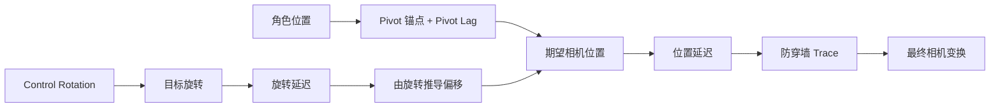

# 第三人称相机的核心机制

> 第三人称相机 = 一个带延迟平滑的锚点 + 由 Control Rotation 决定的偏移，而不是把相机硬挂在角色骨架上。

## 整体流程

## Pivot 锚点

相机围绕一个锚点旋转，锚点默认取角色位置（胶囊体中心附近）。锚点本身经过 `PivotLagSpeed` 平滑，隔离胶囊体在贴地、上下台阶时的高频抖动——如果相机直接跟随胶囊体每帧位移，这些抖动会直接传到画面。

## 旋转延迟（Rotation Lag）

相机的目标旋转来自 Control Rotation。实际输出旋转用 `CameraRotationLagSpeed` 向目标平滑逼近，形成「转动手感有轻微滞后、松手后有余量」的效果。

ALS v4 用 `CalculateAxisIndependentLag` 做这种平滑：它把插值拆到局部坐标轴（俯仰 / 偏航 / 翻滚）上分别 `FInterpTo`，避免用单一标量插值导致某些轴过度平滑或不足。这个函数同时被用于锚点、旋转和位置的延迟。

## 位置延迟（Location Lag / 弹簧臂效果）

期望相机位置 = 锚点 + 由旋转推导出的偏移（俯仰决定高低，距离 / 高度由配置决定）。实际位置再用 `CameraLagSpeed` 平滑，形成弹簧臂式的软跟随：角色急停时相机不会立刻停住，而是缓一下再跟上。

旋转延迟和位置延迟是两个独立的手感旋钮：前者管「看的方向跟手快慢」，后者管「相机位置跟角色快慢」。

## Camera Behind Character

角色移动时（速度超过阈值），可选地把相机目标 Yaw 逐渐回正到角色移动方向后方，避免相机长期偏离角色行进方向。它和「角色朝速度方向」的 RotationMode 配合时，画面会自然回到第三人称习惯的「角色背对镜头」。

## 为什么这样设计

这套结构把三类问题拆开处理：锚点负责隔离抖动、延迟负责手感、偏移负责取景。相比把相机直接绑在角色骨架上，它让每个旋钮只影响一件事，便于调参，也让相机与角色朝向解耦成为可能。

## 相关主题

- [01 相机系统概览与 3C 定位](./01-相机系统概览与3C定位.md)
- [03 碰撞检测与视角切换](./03-碰撞检测与视角切换.md)

## 参考资料

- [ALSV4_CPP `ALSPlayerCameraManager.cpp` 源码](https://github.com/Peralysis/ALSV4_CPP/blob/main/Source/ALSV4_CPP/Private/Character/ALSPlayerCameraManager.cpp)
- [ALSv4 分析(五)：镜头（supervj）](https://www.supervj.top/blog/AdvancedLocomotionSystem%E5%88%86%E6%9E%905_%E9%95%9C%E5%A4%B4/)
