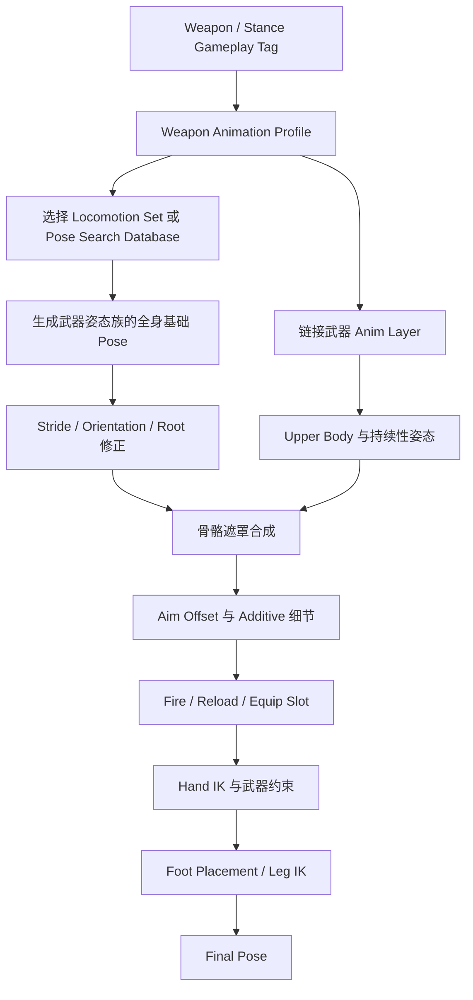

# 不同武器的姿态与重心如何实现

> 主流游戏中的“武器重量感”通常不是由一个物理节点实时计算出来的，而是先为不同武器姿态族准备合适的全身运动数据，再叠加瞄准、射击、换弹和 IK。武器对骨盆、步幅和转向影响越大，就越不能只替换上半身。

## 先给出结论

市场上的成熟角色动画系统通常不会在“每把武器制作一套完整动画”和“所有武器共用移动，只叠加手臂”之间二选一，而是采用混合方案：

```text
武器姿态族的全身 Locomotion
    + 武器专用 Upper Body / Aim Layer
    + 射击、换弹和装备 Montage
    + Hand IK 与武器约束
    + Foot Placement、Warping 和程序化修正
    = 最终武器姿势
```

武器通常先按照身体力学分组，而不是每个物品单独制作：

- 徒手或轻型单手物品；
- 单手手枪；
- 双手手枪；
- 步枪、霰弹枪等肩射武器；
- 火箭筒、机枪等重武器；
- 单手近战；
- 双手近战；
- 盾牌或双持组合。

同一组中的不同武器可以共享大量 Locomotion，只替换握持、瞄准、后坐力和换弹细节。只有当武器明显改变角色的骨盆、重心、步幅、肩胯协同或转向方式时，才需要另一套全身移动数据。

## 所谓“重心差异”实际由哪些内容产生

观众感受到角色拿着重武器，通常不是因为引擎真的计算了角色与武器的联合质心，而是动画同时改变了多个视觉信号。

### 骨盆和根骨

骨盆会向后、向下或向支撑侧偏移，用来表现身体正在抵消武器力矩。重武器若只降低双臂而不改变骨盆，角色会像在拿一件没有重量的模型。

### 脊柱和肩胯关系

胸腔可能向武器反方向补偿，肩膀会根据枪托、盾牌或双手武器的位置重新组织。轻武器可以让肩胯继续自然反向摆动，重武器通常会减少扭转并让躯干更加整体化。

### 站距、步幅和脚步节奏

重武器常表现为更宽的站距、更短的步幅、更长的双脚支撑时间，以及更保守的横向移动。单纯降低播放速率不能产生这些差异，因为脚的位置、膝盖弯曲和骨盆轨迹仍来自轻装动画。

### 起步、停止和转向

重量感最容易在状态变化中暴露：

- 起步前是否先压低身体或调整支撑脚；
- 停止时是否需要额外一步吸收惯性；
- 转向时武器、肩膀、骨盆和脚谁先开始运动；
- 反向移动时是否先收回武器或改变防守方向。

因此，Idle 看起来不同并不代表系统已经实现了武器重量。真正昂贵的是 Start、Stop、Pivot、Turn In Place、Strafe 和快速变向。

### 加速与制动参数

Gameplay Movement 也会参与表现。若角色拿着重机枪却仍能像手枪状态一样瞬间加速和急停，再好的动画也难以保持可信度。项目可能按武器或姿态调整最大速度、加速度、制动、转向速度和输入响应，再让动画与这些参数匹配。

## 三种常见实现级别

### 级别一：共享全身移动，只叠加武器上半身

适用于武器对身体力学影响较小的情况，例如多把尺寸接近的步枪，或者游戏并不强调武器重量差异。

```text
通用 Walk / Run / Crouch
        +
从脊柱开始的 Weapon Upper Body Pose
        +
Aim Offset、Recoil、Reload、Hand IK
```

优点是资源复用率高，缺点是骨盆、腿部和步幅仍然保持通用移动风格。遮罩从太高的脊柱开始时，腰部会继续进行与武器无关的摆动；从骨盆开始又可能破坏原本的步态。

### 级别二：共享部分移动结构，按武器替换动画层和参数

中等差异的武器通常会共享状态机或 Motion Matching 逻辑，但替换：

- Idle、Start、Stop 和 Turn In Place 资源；
- 上半身姿势和 Aim Offset；
- 骨盆或脊柱 Additive；
- Stride、Lean、转向和播放速率参数；
- 骨骼遮罩、Hand IK 目标和 IK 权重曲线。

这种方式不复制整套运行逻辑，只替换数据和局部实现。它适合手枪、步枪等仍能共享部分移动规律，但轮廓和瞄准基准明显不同的武器组。

### 级别三：为武器姿态族准备专用全身动作集或数据库

重武器、盾牌、双手近战和强战斗姿态通常需要专用全身数据：

```text
Heavy Weapon Database
  ├─ Idle 与移动循环
  ├─ 各方向 Start / Stop
  ├─ Pivot 与 Turn In Place
  ├─ Crouch 与 Strafe
  └─ 持续移动中的转向和加减速
```

状态机项目会切换 Locomotion Set 或 Linked Anim Layer；Motion Matching 项目会让 Chooser 或上下文筛选器改为搜索对应数据库。瞄准、后坐力、换弹和 Hand IK 仍可留在后续层中，不必全部烘焙进基础 Locomotion。

## 一条典型运行时链路



`Weapon Animation Profile` 通常会保存或指向：

| 数据 | 作用 |
| --- | --- |
| Locomotion Set / Database | 决定全身步态、重心和转向风格 |
| Anim Layer Class | 提供该武器的姿态组合逻辑 |
| Upper Body Pose / Aim Offset | 建立握持和瞄准基准 |
| Blend Mask | 决定武器层影响哪些骨骼 |
| Turn In Place Set | 让静止转身符合武器姿态 |
| Dominant / Off-hand Grip | 定义武器与双手的约束目标 |
| IK 和 Layer 曲线 | 换弹、装备和射击时释放或恢复约束 |
| Gait / Warping 参数 | 调整步幅、转向和速度适配 |

## 公开实现案例

### Lyra：每种武器可以替换动画层、Locomotion 和姿势修正

Lyra 的公共动画蓝图保存共享 Locomotion 和数据更新逻辑，武器则使用继承自 `ABP_ItemAnimLayersBase` 的 Child Animation Blueprint。每种武器可以替换动画资源和变量，也可以覆盖接口中与 Locomotion、Aiming 和 Skeletal Controls 有关的动画层。

Lyra 仍然使用全身 Locomotion 动画，再通过 `Layered Blend Per Bone` 和 Blend Mask 合并随时可能发生的上半身射击、换弹等动作。Turn In Place 动画集也可以在武器 Child AnimBP 中分别配置。

这意味着武器差异不只存在于一张 Upper Body Pose 中。项目可以让轻微差异只替换上半身，也可以让某种武器覆盖起步、静止转身、瞄准和骨骼控制等更大范围的实现，同时继续共享主动画蓝图。

Lyra 官方文档还说明其结构受到 Paragon 和 Fortnite 动画系统的启发；后两者使用自定义 C++ 达到相近目标。但仅凭 Lyra 文档不能反推出 Fortnite 当前版本的精确动画图或每种武器的数据划分。

### For Honor：战斗姿态属于可搜索的全身运动数据

For Honor 的 Motion Matching 演讲描述了另一种方向：团队不是把许多短动画手工组织成庞大转换网络，而是采集较长的连续运动，在运行时持续寻找同时匹配当前姿势和未来运动计划的数据库帧。

攻击类型和防守姿态等无法从骨骼运动自动推断的语义，会作为人工标记写在动画数据上。运行时搜索不仅考虑身体当前怎样运动，还要限制结果属于正确的战斗上下文。

这种方案特别适合强烈的战斗姿态，因为防守方向、武器准备状态和移动本身就是一个完整全身动作，不适合先搜索普通跑步，再只覆盖双臂。武器或角色姿态若需要完全不同的轮廓，可以使用不同数据集合或通过语义标签限制候选范围；公开演讲能够确认 Motion Matching 与姿态标记机制，但没有公开商业工程中每个英雄数据库的完整拆分表。

### The Last of Us Part II：全身 Locomotion 使用 Motion Matching

Naughty Dog 公开确认 The Last of Us Part II 将 Motion Matching 用于角色动画系统。它说明高质量商业项目会把大量全身运动连续性放到数据驱动搜索中，而不是完全依靠传统状态机和固定转换。

现有公开介绍不足以确认该项目是否为每一种枪械分别建立 Locomotion 数据库，也不足以恢复其武器 Overlay、IK 和搜索标签的内部组织。因此，它可以作为“全身运动由 Motion Matching 负责”的商业案例，但不能被引用为“每把武器必然拥有独立数据库”的证据。

### Game Animation Sample：基础搜索之后继续执行姿势叠加

Epic 的 Game Animation Sample 展示了 Motion Matching 只负责基础运动的一部分。搜索结果之后仍会经过 Orientation Warping、Steering、Additive Lean、Aim Offset、Montage、Offset Root Bone、Leg IK 和 Pose History。

这条链路说明，即使某种武器使用专用 Motion Matching Database，也通常不会把所有瞄准、射击、换弹和接触修正都塞进搜索数据。全身数据库负责身体力学，后续层负责连续参数、事件动作和精确约束。

## 武器切换如何保持连续

从普通姿态切换到重武器时，直接替换动作集容易让骨盆、脚相和双手跳变。常见处理包括：

1. 使用 Equip / Unequip Montage 表现取出和收回武器。
2. 在 Montage 的特定时间切换武器 Profile、Locomotion Set 或 Database。
3. 使用 Inertialization、Dead Blending 或 Motion Matching 从当前姿势寻找新动作集中的接近姿势。
4. 保持或重新匹配左右脚相位，避免切换后立即换脚。
5. 通过动画曲线逐渐降低旧 Hand IK，再逐渐启用新握点的 IK。
6. 在新姿态稳定后恢复 Aim Offset、Foot Placement 和其他最终修正。

Motion Matching 的优势是可以把当前骨骼姿势也作为查询条件，在新数据库中寻找较接近的帧；但如果两个动作集的基础姿态差异过大，仍然需要专门的装备转换动画或过渡姿势。

## 对 ALS、KAI 和 Motion Matching 的对应关系

### ALS

ALS 的 Overlay 非常适合处理武器上半身、瞄准、手部层、区域曲线和 Hand IK。但如果武器需要明显改变骨盆、步幅和转向，仅增加 Rifle Overlay 不够。此时需要增加武器专用的全身 Locomotion 资源或更换 Locomotion Layer，再让 Overlay 继续负责瞄准和局部细节。

### KAI

KAI 的 `MotionSet + MaskingSet` 很适合这种混合架构：

- `MotionSet` 替换影响全身力学的起步、循环、停止和转向；
- `MaskingSet` 处理局部武器姿势；
- Aim、Warping 和 Foot Placement 继续执行运行时修正。

如果 Rifle 和 Heavy Weapon 的重心明显不同，应优先准备不同 Motion Set，而不是只更换 Masking Set。

### Motion Matching

Motion Matching 可以按武器姿态族组织 Database，由 Chooser 根据 Weapon Type、Stance、Gait 和 Movement Mode 返回允许搜索的集合：

```text
Pistol Database
Rifle Database
Heavy Weapon Database
Two-Handed Melee Database
```

Database 负责全身步态和重心；Linked Anim Layer、Aim Offset、Montage 和 IK 继续负责武器细节。若多种武器的全身力学相同，可以共享 Database，只切换后续武器层。

## 如何判断是否需要专用全身动作集

| 观察问题 | 如果答案是“是” |
| --- | --- |
| 武器是否明显改变骨盆高度或横向偏移？ | 使用专用全身数据 |
| 步幅、站距或脚步节奏是否不同？ | 使用专用全身数据 |
| 起步、急停和 Pivot 是否需要体现惯性？ | 至少替换 Start / Stop / Pivot |
| 武器是否影响肩胯协同和躯干摆动？ | 扩大到 Spine、Pelvis 或完整全身层 |
| 差异是否只存在于握持、枪托和瞄准？ | 优先使用 Upper Body Layer |
| 是否只是后坐力、呼吸或轻微偏移？ | 使用 Additive |
| 双手是否必须精确接触武器？ | 在最终阶段使用 Hand IK |

最实用的判断标准是：**这个效果是否会改变脚步、骨盆、根骨或角色整体惯性？** 如果会，它就不应只存在于上半身 Overlay 中。

## 常见误区

- **每把武器都制作完整 Locomotion。** 资源规模很快失控，应先按身体力学划分姿态族。
- **重武器只把播放速度降低。** 速度变慢不会自动改变步幅、骨盆轨迹和支撑方式。
- **只制作不同 Idle。** 一移动、急停或转身，通用动作中的轻装重心会立即暴露。
- **把整个持枪效果交给 IK。** IK 只能满足末端约束，不能生成可信的骨盆、脊柱和步态。
- **专用 Database 后仍叠完整武器 Overlay。** 同一持枪姿势被表达两次，容易造成肩膀僵硬和脊柱过度旋转。
- **切换动画集时忽略脚相。** 即使上半身过渡平滑，左右脚突然交换仍会产生明显跳变。

## 相关主题

- [姿态叠加与动画分层](./01-姿态叠加与动画分层.md)
- [ALS：瞄准与 Overlay](../ALS/07-瞄准与Overlay.md)
- [KAI：姿态叠加与分层实现](../KAI/11_姿态叠加与分层实现.md)
- [Motion Matching：姿态叠加与分层实现](../MotionMatching/15-姿态叠加与分层实现.md)

## 参考资料

- [Epic Games：Animation in Lyra Sample Game](https://dev.epicgames.com/documentation/en-us/unreal-engine/animation-in-lyra-sample-game-in-unreal-engine)
- [Epic Games：Game Animation Sample Project](https://dev.epicgames.com/documentation/en-us/unreal-engine/game-animation-sample-project-in-unreal-engine)
- [Epic Games：Motion Matching](https://dev.epicgames.com/documentation/en-us/unreal-engine/motion-matching-in-unreal-engine)
- [GDC Vault：Motion Matching and the Road to Next-Gen Animation](https://www.gdcvault.com/play/1023280/Motion-Matching-and-The-Road)
- [GDC Vault：Motion Matching in The Last of Us Part II](https://www.gdcvault.com/play/1027118/Motion-Matching-in-The-Last)
- [Naughty Dog at GDC 2021](https://www.naughtydog.com/blog/naughty_dog_at_gdc_2021)

