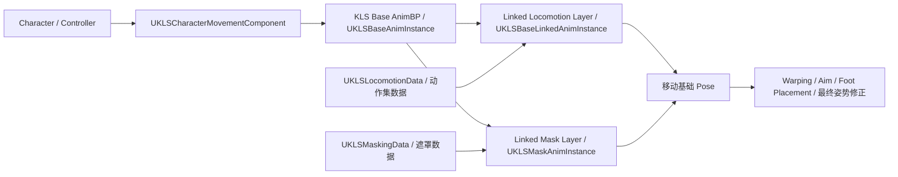

# Kai Locomotion：系统架构与资源入口

> 先识别 Kai 的动画层、数据层和移动层，才能把后续的地面状态、分层混合与姿势修正放到正确的位置。

## 解决的问题

Kai Locomotion 不是单个状态机或单个动画蓝图。若只从某个起步动画或某个自定义节点开始阅读，很容易把“选动作”“更新角色状态”和“修正最终姿势”混为一层，也难以判断一个资源是基础模板、可替换的动作集，还是上半身遮罩。

插件描述将其定位为一套基于距离匹配和旋转匹配的模板动画蓝图，以及一个补充复制功能的自定义角色移动组件。这里的第一步不是复刻所有资源，而是建立可追踪的入口。

## 工作方式

运行时由 `KaiLocomotion` 模块提供动画实例、动画节点、数据资产和 `UKLSCharacterMovementComponent`；`KaiLocomotionEditor` 模块只提供它们在 Anim Graph 中的编辑器节点。插件本身可携带 Content，因此基础蓝图、接口、示例动作及数据资产都随插件分发。

从职责上，可先按下图阅读：

这是一张职责图，不是已核验的蓝图连线图：它依据公开 C++ 类型、Layer Interface 和随附资源命名建立。后续笔记需要在编辑器中确认具体节点顺序和各个 Layer 的调用位置。

## 在系统中的位置

建议按下面顺序打开资源和源码。

1. `Content/Animation_Blueprint/Base_AnimInstances/KLS_BaseAnimBP`：基础动画蓝图入口；其 C++ 基类 `UKLSBaseAnimInstance` 持有角色数据、基础状态数据和自定义旋转数据。
2. `Content/Animation_Blueprint/Linked_AnimInstances/KLS_BaseLinkedAnimBP`：运动层模板；`UKLSBaseLinkedAnimInstance` 持有 `MotionSet`，并提供起步、循环、停止、Pivot、蹲伏与空中状态的选动画/更新函数。
3. `Content/Animation_Blueprint/Linked_AnimInstances/KLS_BaseMaskAnimBP`：遮罩层模板；其基类 `UKLSMaskAnimInstance` 持有 `MaskingSet`。
4. `Content/Animation_Blueprint/Animation_Interfaces/`：`KLS_AnimBPLayers_Interface`、`KLS_CustomStates_Layer_Interface`、`KLS_MaskLayers_Interface`。它们是核对 Layer 入口和职责边界的第一站。
5. 示例角色下的 `AnimBPs/Children_AnimBPs/`：`DA_Rifle_Locomotion`、`DA_Unarmed_Locomotion` 及对应 Linked AnimBP 展示了替换动作集和武器表现的资源组织方式；`DA_Shotgun_Mask` 则是遮罩数据的示例。

`UKLSBaseAnimInstance` 保存 `FKLSCharacterData`、`FKLSBaseAnimBPData` 与 `FKLSCustomRotationData`；`UKLSBaseLinkedAnimInstance` 以 `UKLSLocomotionData` 为 `MotionSet`，并提供 `SelectStartAnimation()`、循环动画选择、停止选择和各状态的 Setup/Update 函数。因此，基础层应负责汇总跨层共享状态，移动层应聚焦某个动作集下的地面/空中表现。这个分工是后续拆分专题的依据。

## 实现要点

- 插件版本为 3.5.0，目标引擎为 UE 5.8；笔记中的源码结论都以此版本为准。
- `KaiLocomotion` 是 Runtime 模块，`KaiLocomotionEditor` 是 `UncookedOnly` 编辑器模块。运行时逻辑不应依赖编辑器节点类。
- 已启用的依赖包括 Control Rig、PoseSearch、AnimationWarping、Enhanced Input、IK Rig、ACL 和 Animation Locomotion Library。依赖被启用只说明插件可使用它，不能单独证明某个蓝图已经采用它。
- 地面状态不会在本篇展开：移动层已经暴露了起步、停止、Pre/Post Pivot、循环、Turn in Place 和蹲伏相关函数，后续每个问题单列专题。

## 常见问题

- **把 `KLS_BaseAnimBP` 当成全部动作逻辑。** 基础实例保存共享数据，但具体动作选择和状态更新大量位于 `UKLSBaseLinkedAnimInstance`；应同时查看 Base、Linked 和 Mask 三层。
- **从依赖列表推导功能。** `PoseSearch` 虽处于插件依赖中，但本仓库尚未通过编辑器资源直接验证其在 Kai 蓝图中的用法；目前只把距离匹配、旋转匹配视为插件明确声明的设计。
- **把示例武器蓝图理解成玩法架构。** Rifle、Unarmed、Shotgun 示例在此仅用于观察动作集与遮罩层如何替换，不作为武器系统的权威实现。

## 相关主题

- [角色移动组件：旋转与网络同步](./02_角色移动组件_旋转与网络同步.md)
- [地面移动的输入与朝向模式](./03_地面移动的输入与朝向模式.md)
- [姿态叠加与分层实现](./11_姿态叠加与分层实现.md)

## 参考资料

- Kai Locomotion 3.5.0：`I:/UnrealProjects/GASP/Plugins/Kai_Locomotion/KaiLocomotion.uplugin:4-32`
- `UKLSBaseAnimInstance`：`I:/UnrealProjects/GASP/Plugins/Kai_Locomotion/Source/KaiLocomotion/Public/Animation/KLSBaseAnimInstance.h:20-114`
- `UKLSBaseLinkedAnimInstance`：`I:/UnrealProjects/GASP/Plugins/Kai_Locomotion/Source/KaiLocomotion/Public/Animation/KLSBaseLinkedAnimInstance.h:19-117`
- 随插件分发的动画蓝图、接口和示例资源：`I:/UnrealProjects/GASP/Plugins/Kai_Locomotion/Content/`
