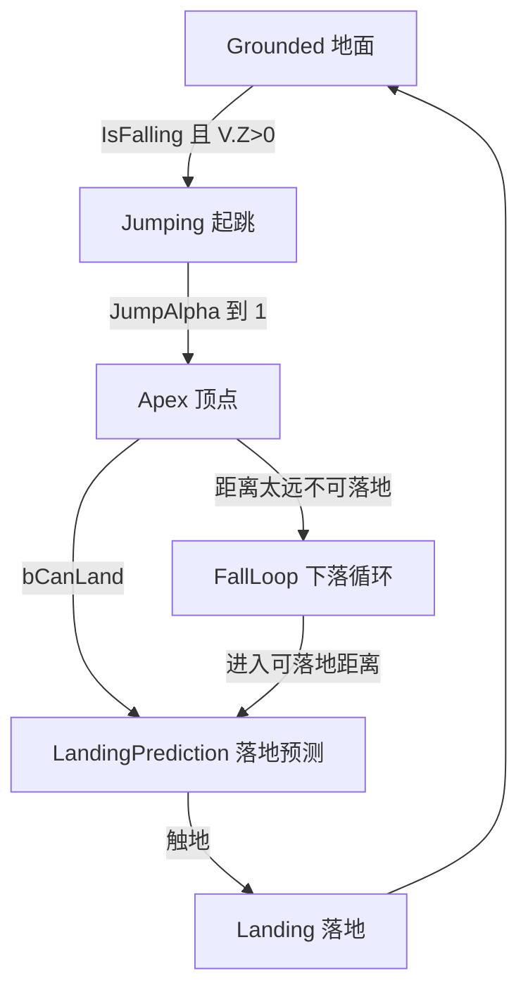

# Kai Locomotion：空中状态——落地预测与落地表现

> 空中状态把“上升/下降”和“落地”拆成可预测的连续过程：先预测跳跃轨迹与落点，再按剩余距离推进起跳、顶点、落地预测和落地动画，而不是离开地面时切一段固定时长的跳跃动画。

## 解决的问题

跳跃不是单段动画。从起跳、上升、顶点、下落到落地，每一段的开始和结束时间都由实际弹道决定，而不是固定时长。如果只按“离开地面 → 播跳跃 → 落地 → 播落地”来处理，会在不同跳跃高度、初速度下出现顶点卡顿、落地错位、脚提前着地或悬空。

落地时间尤其不确定：角色可能从不同高度下落，也可能跳上台阶或越过障碍。若落地动画固定从 0 秒开始播放，就无法和真实触地时刻对齐。

Kai 采用和地面停止、起步一致的“预测 + 距离匹配”思路：用弹道预测出顶点和落点，把跳跃动画里的特定时间区间映射到“距落地还剩多少”上，让动画进度跟随真实弹道推进。

## 工作方式

整个空中表现由三部分协作：

1. 每帧角色数据更新（`UKLSLocomotionBlueprintLibrary::UpdateCharacterData`）判定 `bIsJumping` / `bIsFalling` / `bCanLand`，并算出两个驱动动画进度的 alpha。
2. 进入空中时初始化（`UKLSBaseLinkedAnimInstance::SetupInAirState`）预测跳跃路径（顶点、落点、是否越障），据此选择 `FKLSJumpSet`。
3. 各子状态 Setup/Update 把 alpha 映射到跳跃动画的时间区间；落地单独在 `UKLSBaseAnimInstance` 处理。

这张图描述的是状态语义和数据依赖，不是已经逐节点核验的 Anim Graph 连线。具体哪个条件触发 Jumping/Apex/LandingPrediction/FallLoop/Landing 之间的过渡，以及它们如何混合，需要在编辑器中打开 `KLS_BaseLinkedAnimBP` 和 `KLS_BaseAnimBP` 确认。

## 每帧数据：JumpAlpha 与 LandPredictAlpha

`UpdateCharacterData` 的空中段逻辑（源码 `KLSLocomotionBlueprintLibrary.cpp`）在 `MovementComponent->IsFalling()` 时分支：

**上升段（`Velocity.Z > 1`）**

- 置 `bIsJumping = true`。
- 离开地面的第一帧记录 `TotalJumpTime = |Velocity.Z / GravityZ|`，并让 `CurrentJumpTime = TotalJumpTime`。
- 之后每帧 `CurrentJumpTime -= DeltaTime`。
- `JumpAlpha = GetMappedRangeValueClamped([TotalJumpTime, 0], [0, 1], CurrentJumpTime)`。

因此 `JumpAlpha` 从 0 走到 1，表示“刚离地 → 到顶”。

**下降段（否则）**

- 置 `bIsFalling = true`，并调用 `FindLandLocation` 预测落点。
- `LandingDistance = 当前 Z - 落点 Z`。
- `bCanLand = LandingDistance <= MinLandingDistance && Velocity.Z < -1`。
- 若 `bCanLand`，则 `LandPredictAlpha = GetMappedRangeValueClamped([MinLandingDistance, 2.5], [0, 1], LandingDistance)`。

`LandPredictAlpha` 把“距落地还剩多远”映射成 0–1：距离越近越接近 1，落地预测动画随之推进到落地锚点。`2.5` 是写死的近地面参考值。

**落地判定**

- `bHasLanded`：上一帧 `!bIsGrounded` 且这一帧 `IsMovingOnGround()` 时为真。
- `bIsGrounded` 最终取 `IsMovingOnGround()`；另有一个启发式：当 `LastZVelocity < Velocity.Z`（垂直速度开始回升）时也置为落地。

## 落点预测与跳跃路径预测

两处都用 UE 的弹道预测（`FPredictProjectilePathParams` + 胶囊扫掠），而不是简单向下打射线：

- `FindLandLocation`（下落时每帧调用）：以当前速度作 `LaunchVelocity`、角色重力作 `OverrideGravityZ`，预测胶囊轨迹与地面的命中点；若命中面不可行走，则从命中点向下再扫一次，找到真正的可站立落点。
- `PredictJumpPathDistance`（起跳时调用一次）：同样做胶囊扫掠（`MaxSimTime = 3`），得到 `LandLocation`、`ApexLocation`（路径数据里 Z 由升转降的拐点）和 `bObstacleHit`（命中点 Z 高于起跳点 Z + 20，表示头顶或前方有障碍）。

`PredictJumpPathDistance` 的结果写入 `FKLSJumpSelectorInfo`，供起跳动画选择使用；`FindLandLocation` 的结果写入 `CharacterData.Movement.LandingLocation`，用于每帧计算 `LandingDistance`。

## 关键概念

- **MinDistanceToLand**：来自 `FKLSInAirSettings.MinDistanceToLand`（默认 1500），是“开始预测落地并播放落地段的距离阈值”。高于它时 `bCanLand = false`，不进入落地预测，表现为持续下落。`SetupInAirState` 把它写入 `BaseAnimBPData.MinLandingDistance`，并作为参数传入每帧 `UpdateCharacterData`。
- **JumpAlpha / LandPredictAlpha**：两个 0–1 的进度 alpha。前者驱动“起跳 → 顶点”，后者驱动“顶点 → 落地”。它们是空中状态与距离匹配之间的接口。
- **FKLSJumpSet**：一套起跳数据，包含 `JumpAnimation`（`FKLSAnimData`，带距离/旋转曲线）、`TakeOffTime`、`ApexStartTime`、`ApexEndTime`、`LandingTime`、`FallLoop`、`CanBlendWithOtherSets`。四个时间是跳跃动画内部的关键帧锚点。
- **FKLSLandSet**：一套落地数据，包含 `LandAnim`、`bPlayAsMontage`、`Walk/Run/Sprint AdditiveAlpha`（非 Montage 时的叠加权重）、`BlendIn/OutTime`、`PlayRate`、`BlendOutTriggerTime`、`InTimeToStartMontageAt`。
- **自定义跳跃/落地**：`UKLSCustomJumps` / `UKLSCustomLand` 是 Blueprintable 对象，`SelectJumpAnimations` / `SelectLandAnimation` 是 `BlueprintNativeEvent`，返回 `FGameplayTag`，再从 `TMap<FGameplayTag, FKLSJumpSet/FKLSLandSet>` 里查表。没有自定义选择器时回退到第一个条目。

## 子状态的时间映射

空中子状态集中在 `UKLSBaseLinkedAnimInstance`（`SetupInAirState` 之后的分支），落地在 `UKLSBaseAnimInstance`。

| 子状态 | 播放器 | 时间映射 |
| --- | --- | --- |
| Jumping 起跳 | SequenceEvaluator | 显式时间 `TakeOffTime`；Update 把 `JumpAlpha` 映射到 `[TakeOffTime, ApexStartTime]`，用 PlayRate（clamp 0–1.5）追到目标时间 |
| Apex 顶点 | SequenceEvaluator | 显式时间 `ApexStartTime`；Update 每帧 +dt，clamp 在 `[ApexStartTime, ApexEndTime]`；到 `ApexEndTime` 或 `bCanLand` 时 `IsInApex = false` |
| LandingPrediction 落地预测 | SequenceEvaluator | 把 `LandPredictAlpha` 映射到 `[ApexEndTime, LandingTime]`（Setup 用 `[ApexEndTime, 动画长度]`，Update 用 `[ApexEndTime, LandingTime]`） |
| FallLoop 下落循环 | SequencePlayer | 循环播放 `FallLoop`，从 0 开始 |
| Landing 落地 | SequencePlayer / 动态 Montage | 见下 |

落地由 `UKLSBaseAnimInstance` 负责：

- `SetupLandingState` 构造 `FKLSLandSelectorInfo`：`LandDirection`（加速时用输入方向，否则用速度方向）、`LandFallDistance = JumpApexLocation.Z - 当前 Z`、`LandFallSpeed = FallZSpeed`、`JumpAnimTag`；再 `SelectLandAnimation` 选出 `FKLSLandSet`，并按当前步态取 `LandAdditiveAlpha`。
- `SetupLandingAnimation`：若 `bPlayAsMontage`，用 `PlaySlotAnimationAsDynamicMontage` 播到 `"FullBodyLanding"` Slot；否则用 SequencePlayer 播 `LandAnim`。
- `UpdateLandingState`：播放时间接近动画尾（`AnimLength - 0.2`）且仍处于落地，或再次离地时，结束落地。

## 实现要点

- 落地动画有两种呈现方式：**Montage**（走 Slot）或 **SequencePlayer + 按步态的 AdditiveAlpha 叠加**。Additive 让落地姿势叠加在移动姿势之上，避免落地瞬间下半身被整段替换。
- 空中旋转：`SetupInAirState` 把 `CustomRotationType` 设为 `EInterpolate`；插值速度来自 `InAirSettings.RotationInterpSpeed`（`GetCurrentInterpSpeed` 返回 `InAirInterpSpeed`）。
- 起跳选择上下文 `FKLSJumpSelectorInfo` 包含：`JumpDirection`（速度主方向）、`IsStrafing`、`JumpSpeed2D`、`bIsLeftFootUp`（来自 `LeftFootUpCurve`）、`ObstacleOverHead`、`PredictedJumpApexLoc`、`PredictedJumpLandLoc`、`JumpStartLoc`。
- 未在追踪路径中直接引用的数据：`FKLSJumpSetData`（含 `JumpAnim` / `FallAnim` / `FlailAnim`）存在于 `FKLSAnimationSet` 里，但本篇追踪到的空中运行路径使用的是 `FKLSJumpSet.FallLoop`；`FlailAnim` 的实际用途仍需在编辑器核对。

## 常见问题与误解

- **把 Flail 当成 `FallLoop`。** 源码里下落兜底循环来自 `FKLSJumpSet.FallLoop`；`FKLSJumpSetData.FlailAnim` 是另一处字段，未在本篇追踪的运行路径中使用（待核）。
- **认为落地动画固定从 0 播。** 实际由 `LandPredictAlpha` 映射到 `[ApexEndTime, LandingTime]`，与剩余落地距离对齐。
- **认为跳跃是一段动画。** 实际拆成起跳、顶点、落地预测三个 SequenceEvaluator 子状态 + FallLoop 兜底 + 独立的 Landing 处理。
- **忽略 `MinDistanceToLand`。** 它决定什么时候允许进入落地预测；设太小会让落地动画起步太晚、脚先着地；设太大又会在高处就提前进入落地段。

## 相关主题

- [角色移动组件：旋转与网络同步](./02_角色移动组件_旋转与网络同步.md)
- [停止：距离匹配与左右脚选择](./06_停止_距离匹配与左右脚选择.md)（同类的“预测 + 距离匹配”思路）
- [姿态叠加与分层实现](./11_姿态叠加与分层实现.md)（落地 Montage 走 Slot，Additive 落地叠加）
- [Mask 节点、Random Player 与 Slot](./15_Mask节点_RandomPlayer与Slot.md)（`AnimNode_SlotCustom` 与 `"FullBodyLanding"` Slot）
- [动画数据、曲线与制作约定](./16_动画数据_曲线与制作约定.md)（`FKLSAnimData` 距离/旋转曲线）

## 参考资料

- `UKLSBaseLinkedAnimInstance::SetupInAirState` 及空中子状态：`I:/UnrealProjects/GASP/Plugins/Kai_Locomotion/Source/KaiLocomotion/Private/Animation/KLSBaseLinkedAnimInstance.cpp:728-880`
- `UKLSBaseAnimInstance` 落地处理：`I:/UnrealProjects/GASP/Plugins/Kai_Locomotion/Source/KaiLocomotion/Private/Animation/KLSBaseAnimInstance.cpp:9-79`
- 角色数据空中段：`I:/UnrealProjects/GASP/Plugins/Kai_Locomotion/Source/KaiLocomotion/Private/Library/KLSLocomotionBlueprintLibrary.cpp:208-267`
- 落点与跳跃路径预测：`I:/UnrealProjects/GASP/Plugins/Kai_Locomotion/Source/KaiLocomotion/Private/Library/KLSLocomotionBlueprintLibrary.cpp:737-784, 875-944`
- 跳跃/落地数据与选择：`I:/UnrealProjects/GASP/Plugins/Kai_Locomotion/Source/KaiLocomotion/Public/Data/KLSAnimationData.h`、`.../Private/Data/KLSAnimationData.cpp:734-757`
- 自定义跳跃/落地：`I:/UnrealProjects/GASP/Plugins/Kai_Locomotion/Source/KaiLocomotion/Public/Data/KLSCustomJumps.h`
