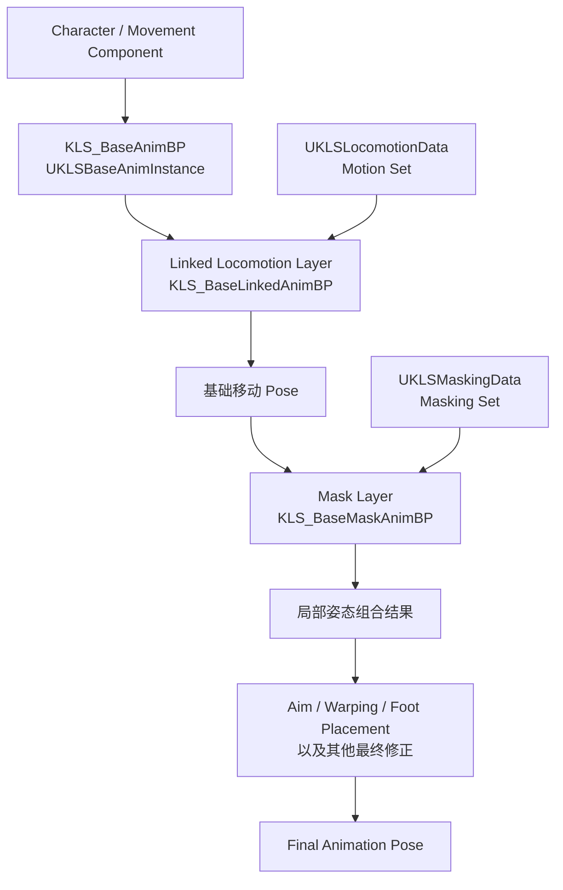

# Kai Locomotion：姿态叠加与动画分层实现

> Kai 将角色姿态拆成稳定的基础动画蓝图、可替换的 Locomotion Layer、独立的 Mask Layer，以及后续的 Aim、Foot Placement 等姿势修正；武器只是这套分层机制的一种使用场景。

## 解决的问题

角色最终显示的姿势通常不只来自一段移动动画。角色可能一边跑动，一边保持某种上半身姿态，再叠加瞄准方向、脚底贴合和骨骼约束。如果把这些逻辑全部塞进一个动画蓝图，切换角色类型或动作风格时，就需要复制整套状态机，并同时处理大量资源引用和条件分支。

Kai Locomotion 3.5.0 将问题拆成几个相对独立的层次：

- 基础动画实例保存角色状态和跨层共享数据。
- Linked Locomotion Layer 生成当前动作集的基础移动姿势。
- Motion Set 决定这套移动逻辑使用哪些动画和参数。
- Mask Layer 负责在基础姿势之上组合局部姿态。
- Masking Set 保存局部叠加所需的数据。
- Aim、Foot Placement、Warping 等节点继续修正组合后的姿势。

因此，“持枪跑动”不应只理解为播放一段持枪动画。它可能同时涉及动作集替换、上半身遮罩、瞄准修正和手脚约束。Rifle、Shotgun 和 Unarmed 资源只是用来展示这些层次能够被不同角色状态重新组合。

## 整体职责链

目前可以确认的系统职责可以整理为：



这张图表达的是**职责和数据依赖**，不是已经逐节点核验的 Anim Graph 执行顺序。当前笔记尚未重新导出 Mask、Aim、Warping 与 Foot Placement 的蓝图图表，因此它们的精确先后关系仍需在 Unreal Editor 中打开 `KLS_BaseAnimBP` 和各 Layer 图确认。

## 基础层：保存共享状态，而不是独占全部动作逻辑

`KLS_BaseAnimBP` 的 C++ 基类是 `UKLSBaseAnimInstance`。现有源码核对记录显示，它保存：

- `FKLSCharacterData`：速度、加速度、移动模式、朝向、瞄准和 Pivot 等角色数据。
- `FKLSBaseAnimBPData`：基础动画蓝图需要维护的状态与混合数据。
- `FKLSCustomRotationData`：动画驱动旋转和移动组件之间共享的数据。

基础层更接近整套动画系统的**组合入口**。它负责让各个 Layer 看到一致的角色状态，并把不同层返回的 Pose 组织成最终输出。起步、循环、停止、Pivot 和蹲伏等具体动作选择，大量位于 `UKLSBaseLinkedAnimInstance`，不能只阅读 Base AnimBP 就判断完整的姿态生成逻辑。

这种设计的关键价值是：切换动作风格时，角色数据采集、旋转同步和最终姿势修正仍可留在稳定的基础层，不必随每套动画资源一起复制。

## Linked Locomotion Layer：生成基础移动姿势

`KLS_BaseLinkedAnimBP` 以 `UKLSBaseLinkedAnimInstance` 为基类，并实现相应的 AnimBP Layer Interface。它负责执行一套 Locomotion 动作集的运行时逻辑，包括：

- 静止、起步、移动循环和停止。
- Pivot 与 Turn in Place。
- 站立、蹲伏和空中状态。
- 根据步态、方向、左右脚相位和靶向状态选择动画。
- 距离匹配、旋转匹配以及各状态的播放时间更新。

AnimBP Layer Interface 是层与主图之间的契约：接口规定 Layer 的名字、输入 Pose 和参数，具体 Linked AnimBP 提供实现。主动画蓝图因此只依赖接口，不需要把某套动作资源的状态机永久写死在主图中。

Unreal 的 Linked Anim Layer 既可以把复杂逻辑拆出主动画蓝图，也可以在运行时用另一个 AnimBP Class 覆盖接口中的 Layer。一个 Linked AnimBP 还可以同时覆盖接口中的多个入口。因此，Kai 可以把“更换 Locomotion 实现”和“只更换某个局部姿态入口”设计成不同粒度，而不必复制整张主 Anim Graph。

## 动作集替换：替换数据与替换实现是两件事

Kai 的 Locomotion 层同时存在两个容易混淆的可替换对象。

| 可替换对象 | 负责什么 | 适合解决的问题 |
| --- | --- | --- |
| `UKLSLocomotionData` / `MotionSet` | 动画资产、方向和步态动作集、匹配参数及混合配置 | 逻辑相同，只更换动作风格或动画资源 |
| `UKLSBaseLinkedAnimInstance` 的派生 AnimBP | Layer 图、状态机和运行时组合逻辑 | 某个角色或状态需要不同的动画流程 |

只更换 `MotionSet`，可以继续复用同一套起步、循环、停止和 Pivot 逻辑；更换 Linked AnimBP Class，则可以替换 Layer 的实现本身。数据资产回答的是“这套规则使用什么资源和参数”，Linked Anim Instance 回答的是“这些数据如何随角色状态运行并产生 Pose”。

`DA_Unarmed_Locomotion` 与 `DA_Rifle_Locomotion` 表明 Kai 将不同动作风格组织成独立的 Locomotion 数据。这里的 Rifle 不只是“在普通跑步上叠一双持枪手臂”的代名词：如果持枪状态的起步、循环、停止或转向动画本身不同，就可以通过整套 Motion Set 替换基础移动姿势。是否在运行时仅替换 `MotionSet`，还是同时链接一个派生 Linked AnimBP，需要在示例角色蓝图中继续核对。

## Mask Layer：在基础移动之上组合局部姿态

`KLS_BaseMaskAnimBP` 的 C++ 基类是 `UKLSMaskAnimInstance`，并持有 `UKLSMaskingData` 类型的 `MaskingSet`。同时存在独立的 `KLS_MaskLayers_Interface`。这些类型共同说明，Kai 没有把局部姿态遮罩直接混入每一套 Locomotion 状态机，而是把它作为另一层可替换实现。

从功能上，Mask Layer 需要完成下面这件事：

```text
基础移动 Pose
    + 局部姿态 Pose
    + 骨骼影响范围与混合权重
    = 保留下半身移动、替换或叠加指定部位后的 Pose
```

“上半身遮罩”只是最常见的例子。它通常保留骨盆和腿部的移动结果，只让脊柱、肩、手臂等骨骼受到另一段姿势影响。相同机制也可用于受击、携带物品、特定身体部位动作或其他局部状态，并不天然等同于武器系统。

`DA_Shotgun_Mask` 说明遮罩数据可以独立于 Locomotion 数据配置。由此可以形成两个互不绑定的选择维度：

- Locomotion Set 决定角色怎样站立、起步、跑动、停止和转向。
- Masking Set 决定基础移动之上，哪些局部姿态需要以什么数据参与组合。

这种拆分允许同一套 Locomotion 与多个 Masking Set 组合，也允许不同 Locomotion 动作集复用同一类局部叠加逻辑。当前尚不能仅凭资产名称确认 `DA_Shotgun_Mask` 内部保存的是 Blend Mask、动画资产、权重参数还是它们的组合，也不能确认图中最终使用 `Layered Blend per Bone`、Blend Mask 模式或其他自定义节点；这些细节必须打开数据资产和 Mask Layer 图验证。

## Override、Additive 与 Mask 不是同一个概念

姿态叠加至少包含三个不同问题：

- **Override**：局部 Pose 直接接管指定骨骼。例如用一套完整的持物上半身姿势替换普通手臂姿势。
- **Additive**：在已有姿势上增加旋转或位移差值。例如呼吸、后坐力、轻微瞄准修正。
- **Mask**：规定 Override 或 Additive 影响哪些骨骼以及影响程度。

Mask 本身不说明姿势是 Additive 还是 Override；“上半身混合”也不说明从哪根骨骼开始、是否包含骨盆、是否使用 Mesh Space Rotation Blend。若这些设置不匹配，常见结果是肩部断层、脊柱旋转突变、骨盆被意外覆盖，或者下半身移动相位被局部动作破坏。

因此，阅读 `KLS_BaseMaskAnimBP` 时不能只寻找一个 Mask 资产，还需要同时确认：输入 Pose 从哪里来、局部 Pose 是怎样生成的、使用何种混合节点、骨骼边界在哪里，以及输出之后还会经过哪些修正。

## Aim、Foot Placement 与最终姿势修正如何组合

从动画职责上，较合理的处理阶段是：

1. Linked Locomotion Layer 先生成完整的基础移动 Pose。
2. Orientation、Stride、Slope 等与移动方向和步幅有关的 Warping 修正移动姿势。
3. Mask Layer 将局部姿态与基础移动组合。
4. Aim 根据角色与控制器的相对旋转修正上半身或指定骨骼链。
5. Foot Placement 根据最终腿部姿势和地面检测调整骨盆、腿和脚。
6. 其他骨骼控制完成最终约束后输出 Pose。

这个顺序反映的是各节点的数据依赖，而不是当前已经确认的 Kai 蓝图连线：

- Aim 必须建立在已经选出的角色姿势上，否则切换动作集后瞄准基准可能不一致。
- 如果 Mask Layer 会覆盖脊柱和手臂，那么 Aim 放在 Mask 前后会得到不同结果。前置 Aim 可能被局部姿势覆盖，后置 Aim 则会继续旋转局部姿势。
- Foot Placement 应尽量读取接近最终状态的腿部 Pose。若在它之后还有会改变骨盆或腿部的全身修正，脚可能再次离开地面。
- 纯上半身 Mask 理论上不应改变 Foot Placement 的输入腿姿势；如果遮罩包含骨盆或根骨，它就会影响脚部解算。
- Warping 与 Foot Placement 解决的问题不同：前者调整移动方向、步幅或坡面姿态，后者解决脚底接触和腿链约束。它们可以串联，不能互相替代。

因此，Kai 的姿态叠加不能只画成“Locomotion + Weapon”。更准确的理解是：先决定全身运动基础，再决定局部接管和增量姿势，最后让程序化节点根据环境与控制方向修正骨骼。

## 数据资产与 Linked Anim Instance 的职责边界

### 数据资产负责描述

`UKLSLocomotionData` 和 `UKLSMaskingData` 应当被视为可复用配置：它们保存资源引用和参数，让内容制作者可以创建 Unarmed、Rifle、Shotgun 或其他风格的组合，而不必复制 C++ 运行逻辑。

数据资产不应承担逐帧状态推进。它不会自行判断角色是否进入 Pivot，也不会自行把局部姿态混到骨骼上；它只为执行逻辑提供选择表和配置。

### Linked Anim Instance 负责执行

`UKLSBaseLinkedAnimInstance` 和 `UKLSMaskAnimInstance` 是运行中的动画实例。它们接收基础层共享的数据，读取当前数据资产，并通过 Layer 图产生 Pose。需要缓存的播放状态、状态机进度、匹配时间和过渡过程属于实例，而不是静态数据资产。

### Layer Interface 负责约束连接方式

`KLS_AnimBPLayers_Interface`、`KLS_CustomStates_Layer_Interface` 和 `KLS_MaskLayers_Interface` 定义主图与可替换层之间的入口。它们使主图可以依赖稳定接口，同时让不同 AnimBP Class 提供具体实现。

可以将三者概括为：

```text
Data Asset       = 使用什么动画与参数
Linked Instance  = 如何运行、选择、过渡并产生 Pose
Layer Interface  = 主图从哪里调用，以及允许替换哪些部分
```

## 切换时需要注意什么

动作集或 Linked Layer 切换不只是替换一个对象引用。Kai 的角色数据更新逻辑会在 Linked Layer、移动模式或蹲伏状态变化时清除部分 Pivot 资格，避免新层继承旧层的反向动作上下文。类似地，实际接入时还应检查：

- 新旧 Locomotion Set 的方向、步态和左右脚资源是否完整。
- 切换时是否需要同步状态机状态、Sequence Evaluator 时间或惯性化过渡。
- 新 Motion Set 的距离曲线、旋转曲线和动画速度是否使用相同制作约定。
- Mask Layer 切换时，权重是平滑变化还是瞬间切换。
- Linked AnimBP 被解除链接后，默认 Layer 是否能接管输出。
- 新层是否继续收到 Base Anim Instance 中的角色数据和自定义旋转数据。

如果只替换动画资源但忽略这些运行状态，最容易出现的问题不是“动画没播放”，而是脚相跳变、Pivot 延续、停止距离错误或上半身突然弹回默认姿势。

## 当前必须在编辑器验证的节点

下面内容尚未从 `.uasset` 图表重新导出确认，后续应在 Unreal Editor 中逐项核对：

1. `KLS_BaseAnimBP` 中 Locomotion Layer、Mask Layer、Aim、Warping 和 Foot Placement 的精确执行顺序。
2. `KLS_AnimBPLayers_Interface`、`KLS_CustomStates_Layer_Interface` 与 `KLS_MaskLayers_Interface` 各自定义了哪些 Layer、输入 Pose 和参数。
3. `KLS_BaseMaskAnimBP` 是否使用 `Layered Blend per Bone`、Blend Mask、Blend Profile 或自定义节点。
4. 上半身遮罩从哪根骨骼开始，是否包含骨盆，以及是否启用 Mesh Space Rotation/Scale Blend。
5. Mask Layer 中的姿势属于 Override、Additive，还是两条独立分支。
6. Aim 位于 Mask 之前还是之后，以及哪些 Layer 可以覆盖 Aim 入口。
7. Foot Placement 的输入来自 Mask 后 Pose、Aim 后 Pose，还是独立缓存的 Locomotion Pose。
8. `DA_Rifle_Locomotion`、`DA_Unarmed_Locomotion` 和 `DA_Shotgun_Mask` 的字段、默认值及示例角色实际切换路径。
9. 示例是只替换 `MotionSet` / `MaskingSet`，还是调用 `Link Anim Class Layers` 切换派生 AnimBP Class。
10. Layer 切换是否配置 Inertialization、Blend Stack 或其他专门的姿势连续性处理。

在这些点核验前，可以确定 Kai 的分层职责，但不应把某一种常见 UE Anim Graph 接法写成 Kai 3.5.0 的已证实实现。

## 常见误解

- **把 Rifle 当作整套分层系统。** Rifle 只是一个 Locomotion 数据示例；局部姿态、受击、携带和角色风格同样可以使用 Layer 与 Mask 机制。
- **认为 Masking Set 会产生动作。** Mask 数据描述局部组合所需的资源或参数，真正的 Pose 计算发生在 Mask Anim Instance 和 Anim Graph 中。
- **认为更换 Motion Set 等于更换 Linked AnimBP。** 前者主要替换内容数据，后者能够替换 Layer 图和执行逻辑。
- **认为 Aim Offset 就是靶向系统。** 靶向还会影响移动组件朝向、动作选择和 Turn in Place；Aim 只是最终姿势的一部分。
- **把 Foot Placement 当成 Locomotion 状态。** Foot Placement 是建立在基础动作之上的环境修正，不负责选择起步、循环或停止动画。
- **只看最终 Pose，不看顺序。** 同一个 Aim 或 Foot Placement 节点放在 Mask 前后，得到的骨骼结果可能完全不同。

## 相关主题

- [公共基础：姿态叠加与动画分层](../Fundamentals/01-姿态叠加与动画分层.md)
- [系统架构与资源入口](./01_系统架构与资源入口.md)
- [地面移动的输入与朝向模式](./03_地面移动的输入与朝向模式.md)
- [循环：步态与方向的移动表现](./05_循环_步态与方向的移动表现.md)
- [Turn in Place：静止转身](./08_Turn_in_Place_静止转身.md)

## 参考资料

- Kai Locomotion 3.5.0 插件入口：`I:/UnrealProjects/GASP/Plugins/Kai_Locomotion/`（蓝图图表待重新核对）
- `UKLSBaseAnimInstance`：`I:/UnrealProjects/GASP/Plugins/Kai_Locomotion/Source/KaiLocomotion/Public/Animation/KLSBaseAnimInstance.h`
- `UKLSBaseLinkedAnimInstance`：`I:/UnrealProjects/GASP/Plugins/Kai_Locomotion/Source/KaiLocomotion/Public/Animation/KLSBaseLinkedAnimInstance.h`
- `UKLSMaskAnimInstance`：`I:/UnrealProjects/GASP/Plugins/Kai_Locomotion/Source/KaiLocomotion/Public/Animation/KLSMaskAnimInstance.h`
- `UKLSLocomotionData` 与 `UKLSMaskingData`：`I:/UnrealProjects/GASP/Plugins/Kai_Locomotion/Source/KaiLocomotion/Public/`
- KAI 已核验的资源与源码入口：[01 系统架构与资源入口](./01_系统架构与资源入口.md)
- Epic Games：[Animation Blueprint Linking](https://dev.epicgames.com/documentation/en-us/unreal-engine/animation-blueprint-linking-in-unreal-engine)
- Epic Games：[Using Layered Animations](https://dev.epicgames.com/documentation/unreal-engine/using-layered-animations-in-unreal-engine)
- Epic Games：[Animation Blueprint Blend Nodes](https://dev.epicgames.com/documentation/unreal-engine/animation-blueprint-blend-nodes-in-unreal-engine)
- Epic Games：[Aim Offset](https://dev.epicgames.com/documentation/unreal-engine/aim-offset-in-unreal-engine)
