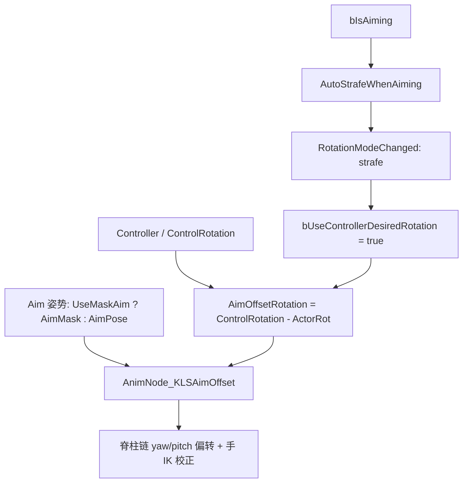

# Kai Locomotion：瞄准与 Aim Offset

> 瞄准不是给角色挂一个 AimOffset 资产。Kai 把“瞄准”拆成三层：移动组件切换到靶向/strafe 朝向、Locomotion/Mask 层选择瞄准姿势，最后由自定义 `FAnimNode_KLSAimOffset` 把控制器与角色之间的 yaw/pitch 偏转按权重分摊到脊柱链。

## 解决的问题

瞄准状态会同时影响三件事：角色朝哪个方向转、基础移动姿势之上的上半身用什么姿势、以及控制器和身体之间剩余的朝向差怎么补偿。如果只靠一个 AimOffset Blend Space 或只靠“瞄准时转 Actor”，会出现几个问题：

- 只转 Actor 会让脚底接触和网络表现突变，尤其在原地瞄准时身体不能无限扭。
- 只用一个全局 AimOffset 资产，无法针对不同角色/持枪姿势更换瞄准姿势，也无法控制“哪些骨骼承担多少偏转”。
- 瞄准会自然要求角色进入靶向移动（身体朝控制方向、移动方向退居其次），否则边跑边瞄会让朝向逻辑打架。

Kai 的答案是：瞄准状态由移动组件和角色数据共同驱动，瞄准姿势由分层机制提供，脊柱偏转由一个程序化骨骼控制节点完成，三者各自独立、可以分别替换。

## 工作方式



这张图描述的是数据依赖，不是逐节点核验的 Anim Graph 连线。图中的关键事实来自 C++ 源码：`AimOffsetRotation` 的计算、`AutoStrafeWhenAiming` 触发 strafe、`UseMaskAim` 在两种瞄准姿势之间选择；但 YawAngle/PitchAngle 具体如何接到节点引脚、Aim 姿势与节点谁先谁后，仍需在编辑器核对。

## 瞄准的朝向与旋转数据

**AimOffsetRotation** 是瞄准偏转的核心量，在 `UpdateCharacterData` 里每帧计算：

```cpp
CharacterData.Rotations.AimOffsetRotation = (ControlRotation - ActorRot).GetNormalized();
```

它表示“控制器的朝向”减去“角色 Actor 朝向”，得到一个完整的 yaw/pitch 偏转。同一函数里还会区分靶向与非靶向的期望旋转：

```cpp
DesiredRotation = Strafing ? ControlRotation : ComputeOrientToMovementRotation(...);
```

所以在 strafe（靶向）模式下，身体期望朝控制方向转，`AimOffsetRotation` 的 yaw 分量会随身体转动逐渐收敛；非靶向模式下身体朝移动方向，yaw 偏转全部留给脊柱节点补偿。pitch 分量始终由节点处理（角色只转 yaw）。

**瞄准自动进入 strafe** 发生在移动组件 `UpdateCharacterStateBeforeMovement`：

```cpp
const bool WantsToStrafe = IsCustomFlagSet(CFLAG_Strafing) || (IsCustomFlagSet(CFLAG_Aiming) && AutoStrafeWhenAiming);
if(WantsToStrafe != WasStrafing) RotationModeChanged(WantsToStrafe);
```

`ToggleAiming` 置/清 `CFLAG_Aiming`；`AutoStrafeWhenAiming`（默认 true）决定瞄准是否强制进入靶向。`RotationModeChanged(true)` 会切到 `bOrientRotationToMovement = false; bUseControllerDesiredRotation = true`，并置 `bIsStrafing = true`。

**原地转身的触发**也吃瞄准偏转：`UpdateCharacterData` 里当 `Strafing` 且 `TurnInPlaceWeight == 0` 时，`bTurnInPlace = (|AimOffsetRotation.Yaw| >= 60 || StrafeAlpha > 0)`。也就是说，静止瞄准时 yaw 偏转超过 60° 会交给 Turn in Place（见 [08](./08_Turn_in_Place_静止转身.md)），而不是让脊柱一直扭。

## 瞄准姿势：AimPose 与 AimMask

Kai 有两处“瞄准姿势”来源，通过 `UseMaskAim` 区分：

- **Locomotion 数据的 AimPose**：`FKLSLocomotionIdleAndTurnInPlace.AimPose`（`FKLSMaskAnimation`），带 `AimBlendInTime` / `AimBlendOutTime`（默认 0.4）。它属于运动层，供静止/待机状态下的瞄准姿势。
- **Masking 数据的 AimMask**：`UKLSMaskingData.AimMask`（`FKLSMaskAnimation`），另有 `CrouchAimMask` 及各自的 BlendIn/Out 时间。它属于遮罩层，作为基础移动姿势之上的局部叠加。

`UseMaskAim` 在 `UpdateCharacterData` 里判定：若 Mask 层的 `MaskingSet` 配置了 `AimMask.Animation` 则为 true。它决定瞄准时用遮罩层的 AimMask 还是运动层的 AimPose。

这两种“瞄准姿势”本质都是 `FKLSMaskAnimation`——一段动画的某个时刻（`MaskPoseTime`）+ 一套按骨骼划分的遮罩权重。因此 Kai 的瞄准不是 UE 原生 AimOffset Blend Space，而是“静态瞄准姿势 + 程序化脊柱偏转”。

## AnimNode_KLSAimOffset 节点

`FAnimNode_KLSAimOffset` 继承 `FAnimNode_SkeletalControlBase`，是一个程序化骨骼控制节点，不做 Blend Space 采样。

**输入**

- `YawAngle` / `PitchAngle`：期望的瞄准偏转（度）。
- `AimOffsetBonesNames`：脊柱链定义，每条是 `FAimOffsetBoneDefinition{BoneName, YawWeight, PitchWeight}`。默认三条：`spine_01(0.3, 0.3)`、`spine_02(0.3, 0.3)`、`spine_03(0.4, 0.4)`——越靠上的脊柱承担越多的偏转。
- `MinYawRotation` / `MaxYawRotation`（默认 -135 / 135）：yaw 的限幅。
- `YawRotationAxis`（Z）/ `PitchRotationAxis`（X）：偏转轴。
- `RotationInterpSpeed`（默认 3）：yaw 插值速度。
- `EnableHandIKCorrection`（默认 true）：是否把 IK 手骨对齐到真实手骨。

**求值**

1. `InternalYaw = YawAngle * ActualAlpha`、`InternalPitch = PitchAngle * ActualAlpha`（`ActualAlpha` 是节点混合权重）。
2. `ActualYawAngle = GetFinalYawValue(...)`，再 clamp 到 `[MinYawRotation, MaxYawRotation]`。
3. 对脊柱链里的每根骨骼（按紧凑索引排序，父先于子）：`BoneYawAngle = ActualYawAngle * YawWeight`、`BonePitchAngle = InternalPitch * PitchWeight`，先把 pitch 旋转、再把 yaw 旋转作用到该骨骼的组件空间旋转上；pitch 轴取自“经 yaw 旋转后的 X 轴”。
4. 手 IK 校正：把 `HandGunBone`、`RightHandIKBone`、`LeftHandIKBone` 的组件空间变换直接设为真实左右手的变换，保证武器和手跟随脊柱旋转。

**yaw 过 ±180 的插值（`GetFinalYawValue`）**

节点维护独立的“正 yaw”和“负 yaw”状态。当输入从 +179° 跳到 -179° 时，如果直接 clamp 会让脊柱瞬间甩过整个角度；`GetFinalYawValue` 用两个 alpha（`PositiveYawAlpha` / `NegativeYawAlpha`）分别朝目标 lerp，且离 0° 越远 blend 越慢（`|Yaw|` 从 0→180 映射到 alpha 1→0），从而在跨 ±180 时平滑过渡而不是弹跳。

## 实现要点

- 瞄准的最终效果 = 瞄准姿势（静态姿势 + 遮罩权重）+ 脊柱链 yaw/pitch 偏转 + 手 IK 校正，三者叠加，不是单一资产采样。
- `AimOffsetRotation` 是 `ControlRotation - ActorRot` 的完整旋转，yaw 与 pitch 都可用；节点只消费 yaw/pitch 两个标量引脚。
- 瞄准强制 strafe（`AutoStrafeWhenAiming`）后，身体负责大部分 yaw，脊柱节点主要负责 pitch 和残余 yaw；静止时大角度 yaw 交给 Turn in Place。
- 手 IK 校正存在的前提是骨骼命名匹配：`hand_r`/`hand_l`（真实手）、`ik_hand_gun`/`ik_hand_r`/`ik_hand_l`（IK 手）。换用不同骨骼命名时需要同步改 `HandBones`/`IKHandBones` 定义。
- 脊柱链权重是数据（`AimOffsetBonesNames`），可以按角色或姿态替换，而节点逻辑不变——与 11 篇“数据描述 vs 实例执行”的分层一致。

## 常见问题与误解

- **把瞄准当成 UE 原生 AimOffset Blend Space。** Kai 用的是自定义程序化节点 + 静态瞄准姿势，不做 Blend Space 采样。
- **认为瞄准只是上半身姿势。** 瞄准还驱动 strafe 朝向切换、原地转身触发和移动组件状态（`CFLAG_Aiming`）。
- **忽略 `UseMaskAim`。** 它决定瞄准姿势来自 Mask 层还是运动层；只配了 Locomotion AimPose 却没配 Masking AimMask 时，表现会落到另一条路径。
- **忽略 yaw 过 ±180 的插值。** 直接 clamp 会在转向临界点让脊柱瞬间甩动，`GetFinalYawValue` 专门处理了这一点。
- **把 `AimOffsetRotation` 的 yaw 当成永远由脊柱承担。** strafe 下身体会转向控制方向，yaw 主要由身体 + Turn in Place 消化，脊柱只补残余。

## 相关主题

- [系统架构与资源入口](./01_系统架构与资源入口.md)
- [地面移动的输入与朝向模式](./03_地面移动的输入与朝向模式.md)（靶向/非靶向朝向模式）
- [起步：靶向与非靶向的动画选择](./04_起步_靶向与非靶向的动画选择.md)
- [Turn in Place：静止转身](./08_Turn_in_Place_静止转身.md)（静止瞄准大角度 yaw 的承接）
- [姿态叠加与分层实现](./11_姿态叠加与分层实现.md)（AimPose/AimMask 的分层来源）
- [Warping：朝向与步幅修正](./13_Warping_朝向与步幅修正.md) 与 [Foot Placement](./14_FootPlacement_脚底贴合与腿链修正.md)（同为自定义运行时节点）

## 参考资料

- `FAnimNode_KLSAimOffset` 声明与求值：`I:/UnrealProjects/GASP/Plugins/Kai_Locomotion/Source/KaiLocomotion/Public/Animation/AnimNode_KLSAimOffset.h`、`.../Private/Animation/AnimNode_KLSAimOffset.cpp`
- Aim 骨骼定义：`I:/UnrealProjects/GASP/Plugins/Kai_Locomotion/Source/KaiLocomotion/Public/Data/KLSAnimationData.h`（`FAimOffsetBoneDefinition`、`FAimOffsetHandsDefinition`、`FAimOffsetIKHandsDefinition`、`FAnimNodesBonesData`、`FKLSAimOffsetBone`、`FKLSAimOffsetChain`）
- 瞄准姿势数据：`.../Public/Data/KLSDataAssets.h`（`UKLSMaskingData.AimMask`）、`.../Public/Data/KLSAnimationData.h`（`FKLSLocomotionIdleAndTurnInPlace.AimPose`）
- 角色数据中的瞄准偏转：`I:/UnrealProjects/GASP/Plugins/Kai_Locomotion/Source/KaiLocomotion/Private/Library/KLSLocomotionBlueprintLibrary.cpp:53, 68, 147-158, 183-198`
- 移动组件瞄准与 strafe：`I:/UnrealProjects/GASP/Plugins/Kai_Locomotion/Source/KaiLocomotion/Private/Character/KLSCharacterMovementComponent.cpp:161-201, 539-557`
