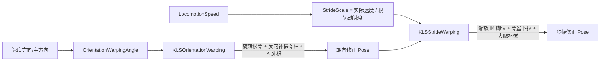

# Kai Locomotion：Warping——朝向与步幅修正

> Kai 把朝向修正和步幅修正拆成两个手动驱动的 Warping 节点：`KLSOrientationWarping` 按速度方向旋转下半身并反向补偿脊柱，`KLSStrideWarping` 按“实际速度/动画根运动速度”缩放 IK 脚位。两者解决不同问题，串联使用、不能互相替代。

## 解决的问题

循环移动动画的根运动速度是固定的，而角色实际速度会随输入、步态和加减速持续变化。这带来两个独立的问题：

- **朝向错位**：动画记录的是“朝某方向移动”，但角色可能侧移、后退或斜向移动。直接硬切姿势会破坏腿部朝向和脚底接触。
- **步幅错位**：动画的每一步跨幅固定，若角色实际速度比动画根运动快或慢，脚会在地上滑动或迈空。

Kai 用两个 Warping 节点分别处理：Orientation Warping 修正“朝哪走”，Stride Warping 修正“跨多远”。它们都继承自 UE 的 AnimationWarping 插件节点（文件头保留 `Copyright Epic Games` 并标注 `Edited By Sir.D.Kai Studio`），但默认切成手动模式，由 Kai 自己算好输入喂给节点。

## 工作方式



两个节点都是 `FAnimNode_SkeletalControlBase`，且 `Mode = EWarpingEvaluationMode::Manual`。这表示它们的输入（`OrientationAngle`、`StrideScale`/`StrideDirection`）由引脚手动提供，而不是从根运动属性流里提取。Kai 的角色数据里对应有 `OrientationWarpingAngle`、`StrideWarpingAlpha`、`OrientationWarpingAlpha`，具体如何映射到节点引脚需在 Anim Graph 核对。

## Orientation Warping：旋转下半身，反向补偿上身

`FAnimNode_KLSOrientationWarping` 的核心是“把朝向差分摊到根骨和脊柱”，由 `DistributedBoneOrientationAlpha`（默认 0.5）控制比例。

**角度计算**（Graph 模式，Manual 模式直接用引脚角度）：

- 从根运动方向到移动方向的旋转角 `WarpedRotation = FindBetween(RootMotionDeltaDirection, LocomotionForward)`，取绕 `RotationAxis`（Z）的 twist 角。
- 根运动速度低于 `MinRootMotionSpeedThreshold`（10）时角度归 0，避免起步/停止帧无根运动却强行转向。
- `LocomotionAngleDeltaThreshold`（90°）：当角度超过阈值（如正向跑动画但实际后退，理论要转 180°）时改用 `-LocomotionForward` 重算，等价于转 0° 而不是 180°，防止下半身被过度旋转破坏姿势。
- 可选 `FInterpTo`（`RotationInterpSpeed`）平滑过渡，再乘 `ActualAlpha * WarpingAlpha`。

**姿态分配**（`CombinedRootOffset = ActualOrientationAngle * DistributedBoneOrientationAlpha + HeadingOffset`）：

1. 根骨（索引 0）先旋转 `CombinedRootOffset`，一次性旋转整个姿势。
2. 脊柱链反向旋转 `-ActualOrientationAngle * DistributedBoneOrientationAlpha * Weight`，抵消根骨旋转，让上半身保持朝向。脊柱权重在 `InitializeBoneReferences` 里自动算：把链上剩余权重平均分给没有显式权重的骨骼，使整链权重和为 1。
3. IK 脚根旋转 `ActualOrientationAngle * (1 - DistributedBoneOrientationAlpha)`，IK 脚再反向旋转同样角度，保持脚的世界朝向不变。

也就是说：`DistributedBoneOrientationAlpha` 越大，越多的旋转由根骨承担、脊柱反向补偿越多；越小，越多的旋转直接作用在 IK 脚根上。

默认骨骼来自 `FAnimNodesBonesData`：脊柱链 `{spine_01, spine_02, spine_03, ik_hand_root}`，IK 脚根 `ik_foot_root`，IK 脚 `{ik_foot_r, ik_foot_l}`。注意脊柱链包含 `ik_hand_root`，因此瞄准用的手根也会一起反向补偿。

## Stride Warping：按速度比缩放 IK 脚位

`FAnimNode_KLSStrideWarping` 的核心是“把脚沿步幅方向拉伸/压缩”，让腿的跨幅匹配实际速度。

**缩放量**（Graph 模式）：

```text
StrideScale = LocomotionSpeed / RootMotionDeltaSpeed
```

即“角色实际速度 / 动画根运动速度”。动画根运动快而角色慢时 `StrideScale < 1`（收步），反之 `> 1`（迈大步）。根运动速度低于 `MinRootMotionSpeedThreshold` 时回到 1。`StrideScaleModifier`（`FInputClampConstants`）可对最终值做 clamp 和插值；Kai 的 Locomotion 数据里有 `StrideScaleClamp`（默认 {0.1, 1.25}）。

**脚位缩放**：

1. 取 IK 脚根变换，把地面法线、重力方向解析到组件空间；`bOrientStrideDirectionUsingFloorNormal` 时把步幅方向投影到地面平面。
2. 对每只脚：把大腿骨位置沿重力方向投影到“脚位置所在的地面平面”，得到 `StrideWarpingPlaneOrigin`；再把 IK 脚位置投影到过该点、沿步幅方向的直线上得到 `ScaleOrigin`。
3. `WarpedLocation = ScaleOrigin + (IKFootLocation - ScaleOrigin) * StrideScale`——沿步幅方向，以大腿投影点为基准缩放脚位。

**腿形保持**：

- `PelvisIKFootSolver.Solve(...)`：根据 FK 脚到骨盆的距离和 IK 脚位置，把骨盆下拉，防止步幅缩放导致腿部过度伸展或脚离地。
- `bCompensateIKUsingFKThighRotation`：用 `FindBetweenNormals(初始大腿→FK脚方向, 调整后大腿→IK脚方向)` 旋转大腿骨，保持腿部原始形状。
- `bClampIKUsingFKLimits`：若 IK 脚到调整后大腿的距离超过 FK 腿长，就沿目标方向把 IK 脚拉回 FK 腿长，防止过度伸展。

默认骨骼同样来自 `FAnimNodesBonesData`：骨盆 `pelvis`、IK 脚根 `ik_foot_root`、每脚 `{IKFoot, FKFoot, Thigh}`（如 `ik_foot_r / foot_r / thigh_r`）。

## 实现要点

- 两个节点都默认 **Manual 模式**，Kai 不依赖根运动属性流，而是自己计算输入。这使节点只做“姿态修正”，选择逻辑仍留在角色数据和运动层。
- Orientation Warping 的 `DistributedBoneOrientationAlpha` 是关键旋钮：0 全给 IK 脚根，1 全给根骨+脊柱反向补偿。
- Stride Warping 的 `StrideScale` 本质是速度比；`StrideScaleModifier` 里的 clamp 决定脚位最多能收/放多少，Kai 默认 0.1–1.25。
- 两者顺序有依赖：通常先 Orientation（定朝向）再 Stride（定跨幅）。若在 Stride 之后还有会改骨盆/腿的节点，步幅修正可能被破坏。
- 节点有效性校验要求骨骼齐全：Orientation 要求脊柱链、IK 脚根、IK 脚都存在；Stride 要求骨盆、IK 脚根、每只脚的 IK/FK/大腿三根骨骼都有效，缺一根就整体跳过。

## 常见问题与误解

- **把 Warping 当成动作选择。** Warping 只修正姿态，不决定播放哪段动画；选择仍在运动层的起步/循环/停止逻辑里。
- **用 Orientation 替代 Stride。** 一个管朝向、一个管跨幅，速度不匹配时只转方向不能让脚不滑。
- **忽略 Manual 模式。** 默认 Manual 意味着节点吃引脚输入；若引脚没接数据，节点不会自动从根运动算角度/缩放。
- **把 `DistributedBoneOrientationAlpha` 设成 1 或 0 而不检查副作用。** 极端值会把旋转全推给根骨或全推给脚，容易在上半身朝向或脚底朝向之间出现割裂。
- **Stride 过度伸展。** `bClampIKUsingFKLimits` 和骨盆下拉解算器是防过度伸展的保障，关掉后大步幅缩放会出现腿部拉长。

## 相关主题

- [循环：步态与方向的移动表现](./05_循环_步态与方向的移动表现.md)（`PlayRateClamp` / `StrideScaleClamp` 的来源）
- [停止：距离匹配与左右脚选择](./06_停止_距离匹配与左右脚选择.md)
- [姿态叠加与分层实现](./11_姿态叠加与分层实现.md)（Warping 在分层中的位置）
- [Foot Placement：脚底贴合与腿链修正](./14_FootPlacement_脚底贴合与腿链修正.md)（与 Stride 的分工）

## 参考资料

- `FAnimNode_KLSOrientationWarping`：`I:/UnrealProjects/GASP/Plugins/Kai_Locomotion/Source/KaiLocomotion/Public/Animation/AnimNode_KLSOrientationWarping.h`、`.../Private/Animation/AnimNode_KLSOrientationWarping.cpp`
- `FAnimNode_KLSStrideWarping`：`I:/UnrealProjects/GASP/Plugins/Kai_Locomotion/Source/KaiLocomotion/Public/Animation/AnimNode_KLSStrideWarping.h`、`.../Private/Animation/AnimNode_KLSStrideWarping.cpp`
- 骨骼与缩放默认值：`I:/UnrealProjects/GASP/Plugins/Kai_Locomotion/Source/KaiLocomotion/Public/Data/KLSAnimationData.h`（`FAnimNodesBonesData`、`StrideScaleClamp`、`PlayRateClamp`）
- 朝向角计算：`I:/UnrealProjects/GASP/Plugins/Kai_Locomotion/Source/KaiLocomotion/Private/Library/KLSLocomotionBlueprintLibrary.cpp:82-114`
