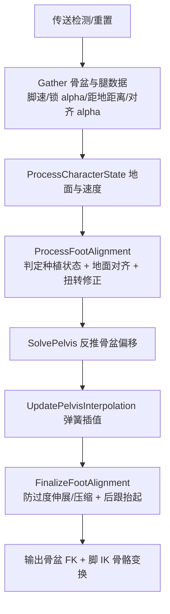

# Kai Locomotion：Foot Placement——脚底贴合与腿链修正

> `FAnimNode_KLSFootPlacement` 是一个实验性的 IK 脚部贴合节点：它按脚速曲线判断“该不该锁脚”，把锁住的脚贴到地面并对齐旋转，再反推骨盆偏移来防止腿部过度伸展或压缩。它修正的是脚与地面的接触，不做动作选择。

## 解决的问题

普通动画里的脚不会自动贴合地面：下坡时脚悬空、上坡时脚陷进地面、转身时脚底相对地面滑动，还会出现双腿过度伸展或互相穿插。Stride Warping 解决“跨多远”，但不管“脚贴不贴地、地面倾角对不对”。

Foot Placement 的职责是：在基础移动姿势之上，把已经或即将落地的脚锁到地面平面上，按地面法线对齐脚掌朝向，并让骨盆跟随偏移，使双腿保持在自然伸展范围内。它建立在基础动作之后，不负责选择起步/循环/停止动画。

## 工作方式

`FAnimNode_KLSFootPlacement` 是 Kai 自己的骨骼控制节点（头文件标注 `Experimental`），复用引擎 Foot Placement 的设置结构（`FFootPlacementPlantSettings` 等），求值逻辑自行实现。每帧求值管线如下：

## 种植判定：脚什么时候该锁

种植状态由 `DeterminePlantType` 维护，区分 `Unplanted`（离地）、`Planted`（刚落地锁住）、`Replanted`（脚还在原地微调、继续锁）。

**想不想锁**（`WantsToPlant`）需要同时满足：

- `LockType != Unlocked` 且当前帧锁 alpha（`LockAlpha`）> 0。
- `DistanceToPlant < PlantSettings.DistanceToGround`：脚离地面足够近。
- `Speed < PlantSettings.SpeedThreshold`：脚速足够慢。

脚速来源默认 `PlantSpeedMode = Manual`，即读取每条腿定义里的 `SpeedCurveName` 曲线；Graph 模式才从根运动属性算。`DisableLockCurveName` 可以精确地在某些帧禁用锁定。

**对齐 alpha**（`GetAlignmentAlpha`）把脚速从 `[UnalignmentSpeedThreshold, SpeedThreshold]` 映射到 `[0, 1]`：0 表示脚在空中、完全不对齐，1 表示已锁住、完全贴地。它用来在锁与不锁之间做连续过渡。

**种植/脱种条件**（基于 `UnplantRadius` / `UnplantAngle` 及比例）：

- 已锁时，若脚相对 FK 脚的位置偏移超过 `UnplantRadius`、或扭转角超过 `UnplantAngle`，就脱种（Unplanted）。
- 若仍在 `ReplantRadius`（=`UnplantRadius × ReplantRadiusRatio`）和 `ReplantAngle` 内，则继续 `Replanted`。

## 锁定方式（LockType）

锁住后，`CurrentPlantedTransformWS` 按 `LockType` 计算：

- `PivotAroundBall`：绕脚掌球骨（ball）旋转，让球骨保持在原地，脚掌以后跟抬起方式转动。
- `PivotAroundAnkle`：只锁位置，用上一帧的脚踝位置，允许旋转。
- `LockRotation`：完全沿用上一帧未对齐的脚变换，动态调整 roll/twist。

之后把锁定的世界变换转回组件空间，再按当前输入姿势的地面平面把位置投影回去，得到相对输入脚的偏移 `UnalignedFootOffsetCS`。

## 地面对齐与扭转修正

`ProcessFootAlignment` 中，脚的目标变换会被对齐到“种植平面”（ground plant plane）。种植平面来自地面检测（`TraceSettings` 控制），`AlignPlantToGround` 把脚掌按该平面法线对齐，并输出 `TwistCorrection`（沿地面平面的扭转角）。种植平面用插值（`UpdatePlantingPlaneInterpolation`）平滑变化，避免地面法线突变时脚掌突然弹跳。

两脚还会用 `SeparatingDistance` 保证最小间距：以两脚中点为基准建立分离平面，脚越过平面就被推回，防止双脚交叉。

## 骨盆求解

脚被锁到地面后，骨盆需要跟随偏移，否则腿会过度伸展。`SolvePelvis` 采用 Rune Skovbo Johansen 论文（第 7.4.2 节）的思路：

- `FindRelevantFeet` 选出参与求解的脚（由 `PelvisHeightMode` 决定，如 `AllLegs` 或按上坡/下坡选前脚）。
- 对每只相关脚，`FindPelvisOffsetRangeForLimb` 算出骨盆相对该脚的可达偏移范围：`DesiredExtension`（期望）、`MaxExtension`（允许伸展上限，由 `MaxExtensionRatio` 决定）、`MinExtension`（允许压缩下限，由 `MinExtensionRatio` 决定）。
- 综合所有脚的 `Min`/`Avg`/`Max`，按公式求出一个骨盆 Z 偏移，并 clamp 到 `[MinOffsetMax, MaxOffsetMin]`，兼顾“不过度伸展、也不过压缩”。
- `HorizontalRebalancingWeight` 可让骨盆水平重平衡（取所有脚偏移的水平均值）。

骨盆偏移再用 `UpdatePelvisInterpolation`（`PelvisSettings.bEnableInterpolation` + 弹簧）平滑。

## 最终调整与鲁棒性

- `FinalizeFootAlignment` 对每只脚做防过度伸展/压缩的最终修正，输出脚 IK 骨骼变换。
- 每帧开头做**传送检测**：根骨世界位置变化超过 `TeleportDistanceThreshold` 就 `ResetRuntimeData`，避免传送/进入载具时脚锁残留。
- 未锁定时用 `UpdatePlantOffsetInterpolation` 把锁定偏移平滑淡出，避免脱种瞬间脚突然弹回 FK 姿势。

默认骨骼来自 `FAnimNodesBonesData`：IK 脚根 `ik_foot_root`、骨盆 `pelvis`、每腿 `{foot_r, ik_foot_r, ball_r}` 与 `{foot_l, ik_foot_l, ball_l}`（`FFootPlacemenLegDefinitionNames`：FK 脚 / IK 脚 / ball，`NumBonesInLimb = 2`，`SpeedCurveName`/`DisableLockCurveName` 默认空）。

## 实现要点

- 节点默认 **Manual 速度模式**：脚速来自每条腿的 `SpeedCurveName` 曲线，而不是根运动属性流。制作动画时要给脚写速度曲线，否则种植判定可能不工作。
- `LockType` 决定锁定的“锚点语义”，`PivotAroundBall` 是常见选择（保留后跟抬起的脚掌滚动感）。
- `UnplantRadius`/`UnplantAngle` 与 `ReplantRadiusRatio`/`ReplantAngleRatio` 共同决定脚可以滑多远仍保持锁定；`ReplantRadiusRatio >= 1` 时会直接 clamp 偏移并滑动，而不是重新种植。
- 骨盆求解是“约束平衡”而非固定 IK：它综合所有相关脚的伸展范围求一个折中骨盆位置，因此蹲伏、坡面、单脚支撑等场景表现不同。
- 与 Stride Warping 的顺序依赖：Foot Placement 应尽量读接近最终状态的腿姿势；若它之后还有改动骨盆/腿的节点，脚可能再次离开地面（见 [11](./11_姿态叠加与分层实现.md)）。

## 常见问题与误解

- **把 Foot Placement 当成动作选择。** 它只修正脚与地面的接触，不决定起步/循环/停止。
- **忽略脚速曲线。** Manual 模式下脚速来自 `SpeedCurveName`，动画里没写这条曲线时种植判定会退化。
- **把 Foot Placement 与 Stride Warping 混为一谈。** 前者锁脚贴地、对齐地面；后者按速度比拉伸/压缩跨幅。
- **过度伸展/压缩。** 由 `MaxExtensionRatio`/`MinExtensionRatio` 和骨盆求解共同约束；把它们设得过大，腿部会明显拉长或压弯。
- **传送后脚锁残留。** 节点有传送检测 + `ResetRuntimeData`，但阈值来自组件 `TeleportDistanceThreshold`，场景传送距离较小时可能不触发。

## 相关主题

- [停止：距离匹配与左右脚选择](./06_停止_距离匹配与左右脚选择.md)（左右脚/脚相）
- [姿态叠加与分层实现](./11_姿态叠加与分层实现.md)（Foot Placement 在分层中的位置）
- [13 Warping：朝向与步幅修正](./13_Warping_朝向与步幅修正.md)（Stride 与 Foot Placement 的分工）
- [动画数据、曲线与制作约定](./16_动画数据_曲线与制作约定.md)（脚速曲线的制作约定）

## 参考资料

- `FAnimNode_KLSFootPlacement`：`I:/UnrealProjects/GASP/Plugins/Kai_Locomotion/Source/KaiLocomotion/Public/Animation/AnimNode_KLSFootPlacement.h`、`.../Private/Animation/AnimNode_KLSFootPlacement.cpp`
- 腿定义与骨骼默认值：`I:/UnrealProjects/GASP/Plugins/Kai_Locomotion/Source/KaiLocomotion/Public/Data/KLSAnimationData.h`（`FFootPlacemenLegDefinitionNames`、`FAnimNodesBonesData.FootPlacemenLegsDefinitions`）
- 骨盆求解参考：Rune Skovbo Johansen 论文《Character Animation in the Medial Axis Decomposition》第 7.4.2 节（源码注释引用）
