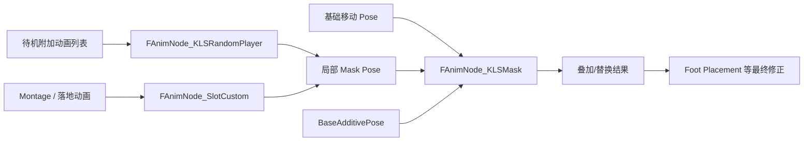

# Kai Locomotion：Mask 节点、Random Player 与 Slot Custom

> 这三个节点是 Kai 分层体系的“执行件”：`FAnimNode_KLSMask` 按骨骼权重和曲线把局部姿势叠加到基础移动上，`FAnimNode_KLSRandomPlayer` 随机播放待机附加动画，`FAnimNode_SlotCustom` 给 Slot 加上惯性化。它们都是姿态组合工具，不做动作选择。

## 解决的问题

[11 姿态叠加与分层实现](./11_姿态叠加与分层实现.md) 讲的是“分层”这一概念：基础移动、局部姿势、遮罩权重如何拆开。本篇讲这三个节点具体怎么把这些概念落到姿态上：

- Mask 节点：如何在保留下半身的同时，按骨骼和曲线把上半身（或任意局部）替换/叠加到基础姿势。
- Random Player：待机时如何随机播附加动画（呼吸、小动作）而不打断主循环。
- Slot Custom：通过 Slot 播放 Montage 时，如何用惯性化代替普通线性混合，避免切换瞬间姿势跳变。

## 工作方式

三者都属于 `FAnimNode_Base`（姿态组合节点），不同于 13/14 篇的骨骼控制节点（`FAnimNode_SkeletalControlBase`）。它们在 Anim Graph 里作为“姿势混合”环节存在：



## FAnimNode_KLSMask：按骨骼与曲线叠加局部姿势

Mask 节点有三个姿势输入：

- `AnimationPose`：基础姿势（通常来自运动层）。
- `MaskPose`：要叠加/替换的局部姿势。
- `BaseAdditivePose`：可选的附加基准，用于把基础姿势转成 additive。

### 每套 Mask 的配置

`BlendMasks` 是一组 `FKLSMaskSettings`，每套对应一个遮罩层：

| 配置 | 作用 |
| --- | --- |
| `BlendProfileName` / `BlendProfile` | 决定哪些骨骼参与混合（`CreateMaskWeights` 生成 per-bone 权重） |
| `UseMeshSpaceAdditive` | 附加姿势用 Mesh Space 还是 Local Space |
| `AddSlot` / `SlotName` | 是否让 MaskPose 走一个 Slot（嵌套 `FAnimNode_SlotCustom`） |
| `WeightCurves` | 四个权重曲线的名字：Override / Additive / LocalSpaceBlend / MeshSpaceBlend |
| `CurveBlendOption` | 曲线混合方式（默认 Override） |

运行时的四个权重来自 `FKLSNodeMaskWeights`（`MaskBlendWeights` 数组）：

```text
OverrideAlpha       局部姿势直接接管指定骨骼的程度
AdditiveAlpha       附加姿势叠加的程度
MeshSpaceBlendAlpha 按 Mesh Space 混合的程度
LocalSpaceBlendAlpha 按 Local Space 混合的程度
```

这些权重由 `UpdateWeightsFromCurves` 从 `WeightCurves` 指定的曲线读取。曲线名对应 [16](./16_动画数据曲线与制作约定.md) 里那套 `FKLSMaskCurveNames`（`LegsMask`、`PelvisMask`、`SpineMask`、`HeadMask`、双臂/双手，各带 `_Add` / `_LS` / `_MS` 后缀）。

### 求值流程

每个 Mask 依次执行：

1. 若 `AddSlot`，MaskPose 走 Slot；否则直接评估 `MaskPose`。
2. `UpdateWeightsFromCurves` 从曲线读四个权重。
3. 若 `AdditiveAlpha` 有效，把 additive 姿势（基础姿势相对 `BaseAdditivePose` 的差值，`MakeAdditivePose` 生成，支持 Mesh/Local Space）按 `AdditiveAlpha` 累加到 MaskPose。
4. `OverrideAlpha` 做两姿势整体混合（`BlendTwoPosesTogether`，权重 `1 - OverrideAlpha`）。
5. 按 per-bone 权重分别做 Local Space 和 Mesh Space 的 `BlendPosesPerBoneFilter`（Mesh Space 用 `MeshSpaceRotation` 标志）。

per-bone 权重由 BlendProfile 生成，缓存时按骨架 GUID 校验，骨架变化就重建；`UpdateDesiredBoneWeight` 让每根骨骼的 Local/Mesh 权重平滑插值到目标值。此外，节点会把曲线按骨骼元数据关联到对应骨骼（`LocalCurvePoseSourceIndices`/`MeshCurvePoseSourceIndices`），只让属于被遮罩骨骼的曲线参与。

`LODThreshold` 低于组件 LOD 时清空权重、跳过求值。

## FAnimNode_KLSRandomPlayer：随机播放待机附加

`FAnimNode_KLSRandomPlayer` 是引擎 Random Player 的 Kai 变体，数据暴露给蓝图（`FKLSRandomPlayerEntries`）。

每条 `FKLSRandomPlayerSequenceEntry` 含：`Sequence`、`ChanceToPlay`、`Min/MaxLoopCount`、`Min/MaxPlayRate`、`BlendIn`（`FAlphaBlend`）。两种选择模式：

- **非 Shuffle**：把 `ChanceToPlay` 归一化成累积分布（`NormalizedPlayChances`），用随机数 + 二分查找选条目，按权重随机。
- **Shuffle**（`bShuffleMode`）：打乱列表依次播放，保证不重复；`BuildShuffleList` 会让新列表首项不同于上次末项。

内部只有两个播放槽（current/next）。当前动画按 `Min/MaxLoopCount` 随机决定循环次数，`Min/MaxPlayRate` 随机决定播放速率；循环结束前进入 BlendIn 窗口时，下一动画开始按 `BlendIn` 的 alpha 混合，混合完成就 `AdvanceToNextSequence` 切换。

在 Kai 里它用于待机附加动画：`FKLSLocomotionIdleAndTurnInPlace.IdleAdditives` 就是 `FKLSRandomPlayerEntries`，所以待机小动作由这个节点随机播放，叠加在 Idle 帧之上。

## FAnimNode_SlotCustom：带惯性化的 Slot

`FAnimNode_SlotCustom` 继承引擎的 `FAnimNode_Slot`，唯一区别在 `Update_AnyThread`：

- 正常读取 Slot 权重、更新缓存。
- 额外调用 `GetSlotInertializationRequest` 查询该 Slot 是否请求惯性化，若请求则 `RequestInertialization` 触发。

这意味着通过 Kai 的 Slot 播放 Montage 时，切入/切出可以用惯性化（Inertialization）代替线性 blend，避免 Montage 结束瞬间姿势硬切或脚相跳变。

它有两个使用点：

- [10 空中状态](./10_空中状态_落地预测与落地表现.md) 里落地动画 `bPlayAsMontage` 时播到 `"FullBodyLanding"` Slot。
- Mask 节点的 `AddSlot` 嵌套（MaskPose 走 Slot）。

## 实现要点

- Mask 节点同时支持 Override、Additive、Mesh/Local Space 三种语义，由四个权重分开控制，而不是一个 Mask 资产一锤定音。
- 权重来自曲线（`WeightCurves`），因此可以在动画里逐帧驱动遮罩的强弱，制作侧无需改图。
- Random Player 的数据（`FKLSRandomPlayerEntries`）挂在 Locomotion 数据的 `IdleAdditives` 上，替换动作集即可换整套待机附加。
- Slot Custom 的关键价值是惯性化；若目标场景不依赖 Montage 惯性化，普通 `FAnimNode_Slot` 也能用。
- 三者都不是骨骼控制节点，而是姿势混合节点；它们输出的 Pose 之后还会经过 Warping、Aim、Foot Placement 等骨骼控制修正（见 [11](./11_姿态叠加与分层实现.md) 的顺序讨论）。

## 常见问题与误解

- **把 Mask 权重当成单个 alpha。** 实际有 Override / Additive / LocalSpace / MeshSpace 四个正交权重，分别对应不同混合语义。
- **认为 MaskPose 只能做上半身。** BlendProfile 决定哪些骨骼参与，任意局部（腿、头、单臂）都可以。
- **把 Random Player 当成主循环。** 它只用于附加/待机小动作，主移动循环由运动层负责。
- **忽略 Slot Custom 的惯性化前提。** 惯性化需要图中存在 `IInertializationRequester`；没有 requester 时只会记录错误日志。
- **认为这三个节点会做动作选择。** 它们只组合/播放已选好的姿势，选择逻辑仍在数据资产和运动层。

## 相关主题

- [姿态叠加与分层实现](./11_姿态叠加与分层实现.md)（分层概念与职责边界）
- [空中状态：落地预测与落地表现](./10_空中状态_落地预测与落地表现.md)（`"FullBodyLanding"` Slot）
- [13 Warping：朝向与步幅修正](./13_Warping_朝向与步幅修正.md)、[14 Foot Placement](./14_FootPlacement_脚底贴合与腿链修正.md)（后续骨骼控制修正）
- [动画数据、曲线与制作约定](./16_动画数据_曲线与制作约定.md)（Mask 曲线命名）

## 参考资料

- `FAnimNode_KLSMask`：`I:/UnrealProjects/GASP/Plugins/Kai_Locomotion/Source/KaiLocomotion/Public/Animation/AnimNode_KLSMask.h`、`.../Private/Animation/AnimNode_KLSMask.cpp`
- `FAnimNode_KLSRandomPlayer`：`I:/UnrealProjects/GASP/Plugins/Kai_Locomotion/Source/KaiLocomotion/Public/Animation/AnimNode_KLSRandomPlayer.h`、`.../Private/Animation/AnimNode_KLSRandomPlayer.cpp`
- `FAnimNode_SlotCustom`：`I:/UnrealProjects/GASP/Plugins/Kai_Locomotion/Source/KaiLocomotion/Public/Animation/AnimNode_SlotCustom.h`、`.../Private/Animation/AnimNode_SlotCustom.cpp`
- Mask 权重与曲线结构：`I:/UnrealProjects/GASP/Plugins/Kai_Locomotion/Source/KaiLocomotion/Public/Data/KLSAnimationData.h`（`FKLSMaskingWeights`、`FKLSNodeMaskWeights`、`FKLSMaskAnimation`、`FKLSMaskCurveNames`、`EKLSAdditiveMode`）
