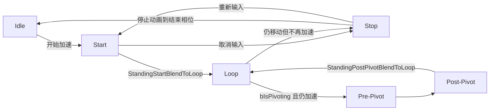

# Kai Locomotion：地面状态——过渡条件与交棒

> 起步、循环、停止和 Pivot 不是按动画播完才机械地串起来；运动数据决定该进入哪类瞬态状态，瞬态状态在合适相位写出“可交给 Loop”的标记。

## 解决的问题

分别阅读 Start、Loop、Stop 和 Pivot 时，很容易只看到各自的选动作和时间推进，遗漏“状态图为什么现在切换”的问题。这样会产生两个误解：以为起步必须播完才能进 Loop，或以为一松开输入就应立即进 Idle。

Kai 将过渡职责分成两层：状态图读取角色的运动状态，决定该进入 Start、Stop 还是 Pivot；状态内部根据动画相位、步态和方向是否仍匹配，决定何时可以把瞬态表现交给 Loop。`Setup...()` 函数属于后者的入口回调——它在状态图已经选择目标状态后才执行，并不自己决定从哪个状态跳进来。

## 先读三个运动信号

`UpdateCharacterData()` 每帧从 Character Movement 更新以下信号：

| 信号 | 成立条件 | 对地面状态的意义 |
| --- | --- | --- |
| `bIsMoving` | 平面速度非零 | 角色仍有残余位移，Stop 才有可匹配的制动距离。 |
| `bIsAccelerating` | 平面加速度非零 | 当前仍有移动输入；起步和 Post-Pivot 需要它，取消输入后则应进入停止语义。 |
| `bIsPivoting` | 移动组件判定速度与加速度近似反向，且仍有 Pivot 资格 | 角色同时有旧速度和新输入，应让 Pivot 优先处理，而不是把它当普通 Stop 或直接切新方向 Loop。 |

`bIsMoving` 和 `bIsAccelerating` 不等价。松开摇杆的数帧内，常见组合是“仍在移动、已经不加速”：这正是 Stop 的工作窗口。反向推摇杆则是“仍在移动、正在加速、正在 Pivot”：这是 Pre/Post Pivot 的工作窗口。

## 状态图负责路线，状态函数负责放行

下图是据角色数据和 C++ 出口标记整理的**地面移动主线模型**。菱形的运动判断来自角色数据；蓝色的 `...BlendToLoop` 是 C++ 更新函数写出的交棒信号。`KLS_BaseLinkedAnimBP` 的每条 Transition Rule 连线仍需在编辑器资源中逐条导出后才能作为精确图；实际图还会处理蹲伏、Turn in Place 和空中分支，本图不把这些分支混进来。

这里的箭头不要理解为“所有条件都写在同一个函数里”：

- 状态图读取 `bIsMoving`、`bIsAccelerating`、`bIsPivoting` 等运动语义，选择 **Start / Stop / Pivot / Idle** 这些路线；图中箭头表达其应有的状态语义，而非替代对蓝图每条 Transition Rule 的直接核验。
- `UpdateStandingStartState()` 和 `UpdateStandingPostPivotState()` 在满足自身相位保护后写入 `StandingStartBlendToLoop` 或 `StandingPostPivotBlendToLoop`；状态图读取该标记，才允许进入稳定的 Loop。
- `UpdateStandingStopState()` 将 Stop 推进到末尾 0.2 秒时写入 `StandingStopBlendToLoop`。虽然字段名沿用了“BlendToLoop”，它表示 Stop 的结束相位已到；最终去 Idle 还是因新输入改走 Start，仍由同帧的运动状态和状态图路线决定，不能只根据这个字段名推断为“Stop 必定回 Loop”。

## Start 何时交给 Loop

Start 初始化时清除 `StandingStartBlendToLoop`，随后每帧都做距离匹配和旋转匹配（若是旋转起步）。它不会只因播放时间经过就无条件切 Loop；以下任一情况会置位交棒标记：

1. **当前移动方向已不再适合继续播这段非旋转起步。** 第一脚完成后，若 `RotationOffset` 至少为 `50°`，或入状态时记录的速度卡迪纳尔方向已变化，立即交给 Loop，用最新速度方向重新选循环资源。
2. **步态改变，或距离匹配要求的播放速率超出资源可接受范围。** 此时还必须满足：角色已达到目标速度（`EffectiveSpeedScaler` 接近 `MaxSpeed2D`，或动画时间超过 1.5 秒），并且已经越过安全的起步相位。非旋转起步要求第一脚完成且已播放至少 0.3 秒；旋转起步要求旋转曲线已到末尾。
3. **动画临近结束。** Evaluator 时间达到动画长度前 0.2 秒时强制交棒，防止一次性动画播穿后停在最后一帧。

所以“起步到循环”的核心条件不是“速度大于某个固定阈值”，而是：**起步的第一脚/转身已具备可混合性，且该起步资源已无法或无须继续表达当前运动。**

## Loop 何时交给 Stop 或 Pivot

Loop 只表达已稳定的持续移动，不承担减速和反向的瞬态。路线判断应先区分两种输入变化：

- **松开输入：** `bIsAccelerating` 变为假，但角色通常仍因惯性保持 `bIsMoving`。此时进入 Stop；Stop 以预测剩余制动距离定位动作，并持续匹配到实际停止点。
- **反向输入：** 角色仍在加速，且移动组件给出 `bIsPivoting`。此时进入 Pre-Pivot，而不是 Stop；Pre-Pivot 消化旧速度，Post-Pivot 再建立新方向，之后才回到 Loop。

这两个分支的优先级很重要：反向输入并非“松开输入后的 Stop”，因为它仍有新的加速度。若先按“速度方向变了”直接换 Loop，会跳过制动和换向的脚步。

## Stop 如何结束或被打断

Stop 仅在“仍移动且不加速”时持续距离匹配。动画接近末尾 0.2 秒后，函数标记 Stop 已到可退出相位。若角色此时速度也归零，状态图应回到 Idle；若玩家在 Stop 未结束时重新给输入，`bIsAccelerating` 会变为真，Stop 更新函数立即停止推进距离匹配，状态图应改走新的 Start（若构成反向输入则改走 Pivot）。

因此 Stop 不是不可打断的“刹车 Montage”：它始终服从当前运动状态。距离匹配负责让尚未打断的停止动作落在正确的减速相位，状态图负责在停止、重新起步和反向之间选择路线。

## 实现要点

- `StandingStartBlendToLoop`、`StandingPostPivotBlendToLoop` 和 `StandingStopBlendToLoop` 都是由瞬态状态内部写出的**出口就绪标记**；它们不是通用的“角色正在移动”布尔值。
- 调整 `PlayRateClamp`、步态阈值或动作长度后，应同时检查交棒条件：动作要求的播放速率长期越界会提前结束 Start/Post-Pivot，而不是只表现为脚滑。
- 状态图条件应使用 `bIsMoving`、`bIsAccelerating`、`bIsPivoting` 等已规整的角色数据，避免在每条 Transition Rule 中重新用速度和输入各写一套阈值。
- 本文的主线省略了蹲伏、Turn in Place、空中及状态机混合时长；它们会改变可达状态，但不改变“运动信号选路线、瞬态状态按相位交棒”的职责划分。

## 相关主题

- [03 地面移动的输入与朝向模式](./03_地面移动的输入与朝向模式.md)
- [04 起步：靶向与非靶向的动画选择](./04_起步_靶向与非靶向的动画选择.md)
- [05 循环：步态与方向的移动表现](./05_循环_步态与方向的移动表现.md)
- [06 停止：距离匹配与左右脚选择](./06_停止_距离匹配与左右脚选择.md)
- [07 Pivot：反向输入的预转向与衔接](./07_Pivot_反向输入的预转向与衔接.md)

## 参考资料

- 运动、加速与 Pivot 信号更新：`I:/UnrealProjects/GASP/Plugins/Kai_Locomotion/Source/KaiLocomotion/Private/Library/KLSLocomotionBlueprintLibrary.cpp:72-178`
- Start / Stop / Pre-Pivot / Post-Pivot 的初始化、更新和出口标记：`I:/UnrealProjects/GASP/Plugins/Kai_Locomotion/Source/KaiLocomotion/Private/Animation/KLSBaseLinkedAnimInstance.cpp:199-568`
- 三个出口标记：`I:/UnrealProjects/GASP/Plugins/Kai_Locomotion/Source/KaiLocomotion/Public/Animation/KLSBaseAnimInstance.h:21-38`
