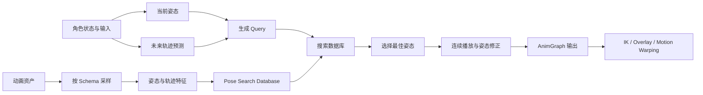

# Motion Matching 整体概念

> Motion Matching 根据角色当前的姿态和希望采取的运动轨迹，从动作数据库中选择最合适的动画片段，从而减少大量手工状态切换和过渡规则。

## 解决的问题

传统 Locomotion 通常由状态机、Blend Space、起步停止动画和转身动画共同组成。角色一旦进入某个上下文，动画系统就按照预先写好的规则选择动作：速度变化对应某个 Blend Space，停止对应某个 Stop 动画，转身对应某个 Turn 分支。

这种方法容易理解，也容易控制，但动作数量增加后，状态和过渡会快速膨胀：

- 不同速度、方向和转向组合需要更多动画分支。
- 起步、停止、转身和移动循环之间的衔接需要单独制作和调节。
- 状态机知道“应该进入哪个分支”，却不一定能找到当前姿态最自然的下一帧。
- 同一套规则面对不同地形、不同移动意图和不同动作库时，往往需要继续增加特殊条件。

Motion Matching 将问题换一种方式表达：不预先为每一种情况写出完整的切换路径，而是把动作整理成可搜索的样本，在运行时寻找与当前运动需求最接近的样本。

## 核心思路

系统会把动作库中的动画采样成许多姿态样本。每个样本除了包含某一时刻的骨骼姿态，还可以包含该时刻附近或之后的运动信息，例如根骨骼位置、朝向和未来轨迹。

运行时，系统根据角色当前状态生成一个查询（Query），然后把查询与数据库中的样本进行比较：

```text
当前姿态 + 期望的未来轨迹
            ↓
        生成 Query
            ↓
与数据库中的姿态样本计算差异
            ↓
       选择代价最低的样本
            ↓
       输出并继续播放该动作
```

可以把匹配过程抽象为：

```text
总匹配代价 = 各项特征差异 × 对应权重 的总和
```

例如，查询要求角色继续向前并逐渐向右转，系统可能会比较：

- 当前身体姿态是否相近。
- 根骨骼的速度和朝向是否相近。
- 未来一段时间的移动位置和方向是否相近。
- 脚部、骨盆或其他重要骨骼是否处于相似状态。

最终选择的不是“标签上最像”的动画，而是特征空间中代价最低的样本。

## 主要工作流程



这个流程可以分成两个阶段：

1. **离线准备**：将动画资产按照统一的特征定义进行采样，并建立可搜索的数据库。
2. **运行时搜索**：根据角色当前姿态和运动意图生成 Query，在数据库中寻找最合适的姿态。

离线阶段决定“数据库里记录了什么”，运行时阶段决定“当前应该选择什么”。如果数据库样本质量差，运行时再怎么调权重也很难得到稳定结果。

## 关键概念

| 概念 | 含义 | 作用 |
| --- | --- | --- |
| Pose | 某个时间点的骨骼姿态及其相关特征 | 描述角色此刻是什么姿势 |
| Trajectory | 根骨骼或角色在一段时间内的运动轨迹 | 描述角色接下来想往哪里移动 |
| Query | 运行时根据当前状态生成的查询特征 | 用来和数据库样本进行比较 |
| Schema | 定义采样哪些骨骼、轨迹和属性 | 决定姿态如何被转换为特征 |
| Database | 由动画样本及其特征组成的搜索集合 | 提供运行时搜索的数据来源 |
| Cost | Query 与某个样本之间的差异 | 用来比较候选样本的优先级 |
| Search Result | 搜索得到的动画、时间点和匹配代价 | 决定从哪里开始播放或切换 |

其中最重要的区分是 **Pose 和 Trajectory**：

- Pose 主要描述“我现在是什么姿态”。
- Trajectory 主要描述“我接下来想怎么运动”。

只有姿态而没有轨迹时，角色可能选择到当前身体姿势相似、但运动方向错误的动画。只有轨迹而没有姿态时，运动方向可能正确，但切入动作时容易出现身体或脚步的突变。实际效果通常依赖两者的平衡。

## Motion Matching 不是什么

### 不是机器学习模型

Motion Matching 通常不需要训练神经网络。它的核心是特征设计、样本预处理和运行时搜索。决定结果质量的重点往往是：

- 动画库是否覆盖目标运动范围。
- Schema 是否选取了真正有区分度的特征。
- 轨迹预测是否符合角色的实际运动。
- 不同特征的权重是否表达了正确的优先级。

### 不是完全取消动画逻辑

Motion Matching 主要负责基础运动姿态的选择。项目仍然可能需要使用动画蓝图、状态或其他系统处理：

- 上半身 Overlay、瞄准和武器姿态。
- 脚部 IK、脚锁定和地形适配。
- Root Motion、Motion Warping 或网络移动修正。
- 受击、交互、攻击和其他不能自由切换的动作。

因此更准确的理解是：Motion Matching 改变了基础 Locomotion 的选择方式，而不是取代整个动画系统。

## 与传统 Locomotion 的关系

| 方面 | 状态机 / Blend Space | Motion Matching |
| --- | --- | --- |
| 动作选择 | 通过状态和过渡规则选择 | 通过特征搜索选择 |
| 过渡维护 | 通常需要显式配置 | 由相似姿态和轨迹促成切换 |
| 扩展方式 | 增加状态、分支或过渡 | 增加样本、特征或调整数据库 |
| 可解释性 | 分支路径清晰 | 需要检查 Query、特征和代价 |
| 对动作库依赖 | 依赖每个状态的资产 | 依赖数据库覆盖范围和样本质量 |
| 控制方式 | 规则控制较直接 | 通过 Query、权重和搜索限制间接控制 |

两种方式也可以共存。例如，项目可以让 Motion Matching 负责 Grounded Locomotion，同时保留状态机处理 In Air、攻击、受击和特殊交互；也可以在不同运动上下文中使用不同的数据库。

## 在 Unreal Engine 中的对应关系

在 Unreal Engine 5 的 Pose Search / Motion Matching 工作流中，常见的资源和节点关系如下：

- **Pose Search Schema**：定义数据库和查询使用哪些姿态、骨骼、轨迹或其他通道。
- **Pose Search Database**：引用动画资产，并根据 Schema 构建可搜索的姿态样本。
- **Pose Search Query**：运行时由角色当前姿态、运动状态和轨迹信息生成。
- **Motion Matching 节点**：执行搜索，并将选中的姿态接入动画图。
- **Pose Search 调试工具**：用于查看查询数据、候选姿态、匹配代价和搜索结果。

具体资源名称和节点参数会随 Unreal Engine 版本变化，但“Schema 定义特征、Database 保存样本、运行时 Query 驱动搜索”是理解系统的稳定主线。

## 适用范围与限制

Motion Matching 更适合动作连续、变化空间较大、希望减少人工过渡维护的基础移动系统。它对动作数据的要求也更高：如果动作库缺少某种转向、速度或步态，系统无法凭空生成高质量动作，只能在现有样本中选择一个相对接近的结果。

因此引入 Motion Matching 后，工作重点会从“不断增加状态机分支”转移到：

- 规划动作库覆盖范围。
- 设计可区分动作的特征。
- 保持姿态和轨迹数据的一致性。
- 观察搜索结果，并根据实际表现调整权重和约束。

## 相关主题

- [系统架构与数据流](./02-系统架构与数据流.md)
- [Pose Search 核心概念](./03-Pose-Search核心概念.md)
- [Schema 配置](./06-Schema配置.md)

## 参考资料

### 官方文档

- [Motion Matching in Unreal Engine](https://dev.epicgames.com/documentation/en-us/unreal-engine/motion-matching-in-unreal-engine)
- [Pose Search in Unreal Engine](https://dev.epicgames.com/documentation/en-us/unreal-engine/pose-search-in-unreal-engine)

### 其他资料

- [Motion Matching — SIGGRAPH 2016 Course](https://www.youtube.com/watch?v=4uyGv1h4p7M)
