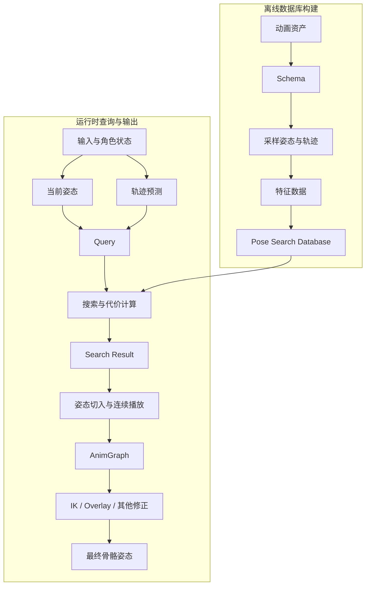
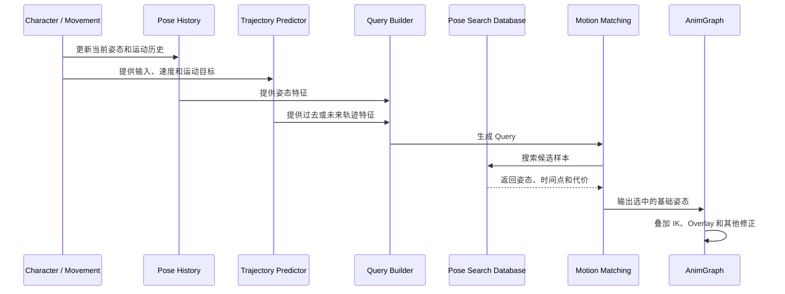

# Motion Matching 系统架构与数据流

> Motion Matching 的数据流可以分为离线数据库构建和运行时姿态搜索两条链：前者把动画转换成可比较的特征，后者把角色当前运动需求转换成查询并选择结果。

## 解决的问题

Motion Matching 的运行时节点并不是直接读取一组动画然后“凭感觉”选择动作。它依赖一套提前准备好的样本数据，并且要求运行时查询和离线样本使用相同的特征定义。

如果只关注动画图中的 Motion Matching 节点，容易忽略几个关键问题：

- 动画资产何时被采样成姿态样本。
- 样本中保存了哪些骨骼、轨迹和时间信息。
- 运行时的当前姿态如何与数据库样本保持同一种表达方式。
- 输入方向、速度和加速度如何变成未来轨迹。
- 搜索得到的时间点如何接入当前播放过程。

理解这些边界后，可以把系统拆成“准备数据 → 生成查询 → 执行搜索 → 输出和修正”四个部分。

## 总体架构



离线链和运行时链之间的接口是 **特征定义**。Schema 决定样本和 Query 应该以什么方式表达；如果两边使用的骨骼、空间、采样时间或权重不一致，搜索结果就会失去意义。

## 离线阶段：从动画资产到数据库

### 1. 选择和整理动画资产

首先确定哪些动画可以作为数据库样本。常见内容包括移动循环、起步、停止、转向、变向和不同速度下的 locomotion 动作。

资产整理时需要关注：

- Root Bone 或角色根节点的定义是否一致。
- 动画的朝向、移动方向和 Root Motion 约定是否一致。
- 不同动画的骨架、姿势和比例是否兼容。
- 是否需要排除攻击、受击或强制时序动作。
- 是否需要通过标签、通知或其他元数据限制某些动画的使用上下文。

Motion Matching 会在数据库中自由寻找切入点，因此数据库中的动画不只是“作为完整片段播放”。如果某个片段中存在不适合作为切入点的时间段，就需要在资产配置或数据库规则中排除，或者通过特征和约束降低它被选中的可能性。

### 2. 使用 Schema 定义特征

Schema 是离线采样和运行时查询共同依赖的特征契约。它通常需要回答：

- 采样哪些骨骼或关节点。
- 使用位置、速度、朝向还是其他姿态信息。
- 记录根骨骼或角色的哪些轨迹点。
- 轨迹要观察当前时刻、过去时刻还是未来时刻。
- 不同特征之间如何进行归一化和加权。

Schema 不只是数据库的配置面板。它实际上决定了系统认为“两个动作相似”的标准：如果没有记录脚部信息，系统就不会主动关心脚部是否接近；如果未来轨迹权重过低，系统就可能优先选择当前姿态相似但行进方向不合适的动作。

### 3. 采样并计算特征

系统按照 Schema 和采样间隔遍历动画，在多个时间点生成样本。每个样本通常至少关联以下信息：

```text
动画资产 + 时间点
姿态特征
轨迹特征
样本所在的上下文或元数据
```

采样后，动画不再只是“一个可以按时间播放的 Sequence”，而是被转换成一组可以参与比较的特征记录。数据库构建阶段还会为这些记录建立搜索所需的数据结构。

## 运行时阶段：从角色状态到 Query

### 1. 收集角色当前状态

运行时首先需要知道角色当前正在做什么，以及希望接下来怎么运动。输入可能来自角色移动组件、玩家输入、AI 导航或其他控制逻辑，常见信息包括：

- 当前速度、加速度和移动方向。
- 角色朝向与期望朝向。
- 地面或空中状态。
- 当前步态、站姿和运动上下文。
- 当前播放姿态或最近一段姿态历史。

这些数据通常不会原样传给搜索系统，而是经过空间转换、平滑和时间预测后形成动画侧数据。

### 2. 保存姿态历史

当前姿态只能说明角色此刻的状态，姿态历史则可以帮助系统判断角色从哪里来，以及是否应该保持当前动作的连续性。

姿态历史常用于：

- 提供当前姿态或最近姿态作为 Query 的一部分。
- 计算速度、方向和旋转变化。
- 防止搜索结果频繁跳到另一个不连续的动作。
- 支持继续播放代价或其他连续性判断。

这里的历史不是为了保存完整的游戏回放，而是保存搜索所需的有限时间窗口。实际保存哪些数据，取决于 Schema、节点配置和引擎版本。

### 3. 预测未来轨迹

轨迹预测描述角色未来一段时间的位置、速度或朝向。它可以由当前速度和加速度外推，也可以结合输入、导航目标、转向规则或移动组件的预测结果。

例如，角色当前正在向前移动，玩家开始向右推摇杆，运行时可能生成一条逐渐向右弯曲的期望轨迹。搜索系统会更倾向于选择本身就包含右转过程的动画，而不是先播放直行循环、再等待状态机切换到右转动作。

轨迹预测的重点不在于预测得绝对准确，而在于它和角色实际运动模型保持一致。如果动画查询认为角色会快速右转，而移动组件仍然让角色直线前进，数据库搜索和最终角色运动就会互相矛盾。

### 4. 生成 Query

Query 是运行时按照 Schema 组织起来的一组特征。它通常由两类数据组成：

| Query 数据 | 描述 |
| --- | --- |
| 当前姿态特征 | 角色当前骨骼姿态、根骨骼状态或局部运动信息 |
| 轨迹特征 | 过去或未来若干时间点的位置、速度和方向 |

Query 与数据库样本必须使用相同的坐标空间、骨骼参考、时间采样方式和特征顺序。否则即使数值看起来正常，也无法进行有意义的比较。

## 搜索阶段：从 Query 到 Search Result

系统将 Query 与数据库中的候选样本进行比较，并根据各项特征差异计算代价：

```text
Query
  ├─ 当前姿态差异
  ├─ 过去轨迹差异
  ├─ 未来轨迹差异
  ├─ 其他通道差异
  └─ 连续性或上下文代价
          ↓
      总匹配代价
          ↓
      选择候选样本
```

搜索结果通常至少需要知道：

- 命中的动画资产。
- 动画中的命中时间点。
- 该样本的匹配代价。
- 是否满足当前上下文、标签或数据库限制。

代价最低并不一定意味着结果在视觉上绝对最好。搜索结果还可能受到样本密度、特征权重、连续性处理、数据库范围和其他约束影响。因此调试时需要同时查看“选中了什么”和“为什么选中”。

## 输出阶段：姿态切入与后续修正

搜索结果确定后，系统需要从当前输出姿态切入命中的动画时间点。这个过程可能涉及继续播放、短暂混合、姿态跳转或其他连续性处理，具体行为取决于节点和引擎版本。

基础姿态输出后，动画图仍可以继续执行其他处理：

```text
Motion Matching 基础姿态
        ↓
分层混合 / Overlay / Slot
        ↓
脚部 IK / 脚锁定 / 地形适配
        ↓
Motion Warping 或其他动态修正
        ↓
最终骨骼姿态
```

这条边界很重要：Motion Matching 负责从动作库中选择合适的基础动作，但不自动解决所有接触、瞄准、装备和特殊动作问题。

## 一帧中的简化数据流



这是理解运行时问题的主要检查顺序：

1. 角色当前状态是否正确。
2. 姿态历史是否在更新。
3. 轨迹预测是否符合实际移动。
4. Query 是否使用了正确的 Schema 和坐标空间。
5. 数据库是否包含覆盖目标运动的样本。
6. 搜索结果是否因为代价或连续性设置而被改变。
7. 最终姿态是否在动画图的后续节点中被修改。

## 一个具体例子：从直行变为右转

假设角色正在向前跑，玩家突然要求向右转：

1. 移动系统和输入产生新的期望方向。
2. AnimInstance 或查询相关逻辑读取当前速度、方向和姿态历史。
3. 轨迹预测生成一条从直行逐渐转向右侧的未来轨迹。
4. Query 同时包含当前跑步姿态和这条未来轨迹。
5. 数据库中的直行、右转、停止和变向样本参与比较。
6. 如果某个右转样本在当前姿态和未来轨迹上代价更低，系统切入该样本的合适时间点。
7. 输出姿态再经过脚部 IK、Overlay 或其他动画图逻辑。

如果结果仍然先直行很久再突然右转，优先检查轨迹预测是否及时变化、未来轨迹特征权重是否过低，以及数据库中是否真的存在合适的右转样本。

## 数据职责边界

| 模块或资源 | 主要职责 | 不应该承担的内容 |
| --- | --- | --- |
| 角色 / 移动组件 | 产生实际运动、输入和目标状态 | 直接决定最终骨骼姿态 |
| Pose History | 保存搜索所需的姿态和运动历史 | 保存完整游戏状态或替代移动系统 |
| Trajectory Predictor | 根据运动意图预测未来轨迹 | 保证角色一定按照预测轨迹移动 |
| Schema | 定义特征、通道、采样和权重规则 | 保存完整动画片段 |
| Database | 保存动画样本及其搜索数据 | 运行时决定所有角色状态 |
| Motion Matching | 根据 Query 搜索最佳样本并输出基础姿态 | 自动处理所有 IK、瞄准和特殊动作 |
| AnimGraph | 组合基础姿态和后续动画层 | 替代数据库的样本搜索 |

## 常见的边界问题

- **Query 看起来正确，但动作方向错误**：检查 Query 和数据库样本是否使用相同坐标空间和轨迹定义。
- **角色运动正确，但动画跟不上转向**：检查轨迹预测的更新速度、未来轨迹权重和数据库覆盖范围。
- **动作经常跳到不相关片段**：检查当前姿态特征、上下文限制、连续性代价和不合适的数据库样本。
- **匹配结果合理，但脚步或身体接触不稳定**：检查脚部特征、脚锁定、IK 和地形修正，而不只是继续调搜索权重。
- **修改动画后结果没有变化**：检查数据库是否重新构建，以及修改后的动画是否实际被数据库引用。

## 相关主题

- [整体概念](./01-整体概念.md)
- [Pose Search 核心概念](./03-Pose-Search核心概念.md)
- [动画资产准备](./05-动画资产准备.md)
- [调试与可视化](./14-调试与可视化.md)

## 参考资料

### 官方文档

- [Motion Matching in Unreal Engine](https://dev.epicgames.com/documentation/en-us/unreal-engine/motion-matching-in-unreal-engine)
- [Pose Search in Unreal Engine](https://dev.epicgames.com/documentation/en-us/unreal-engine/pose-search-in-unreal-engine)
- [Animation Blueprints in Unreal Engine](https://dev.epicgames.com/documentation/en-us/unreal-engine/animation-blueprints-in-unreal-engine)

### 其他资料

- [Motion Matching — SIGGRAPH 2016 Course](https://www.youtube.com/watch?v=4uyGv1h4p7M)
