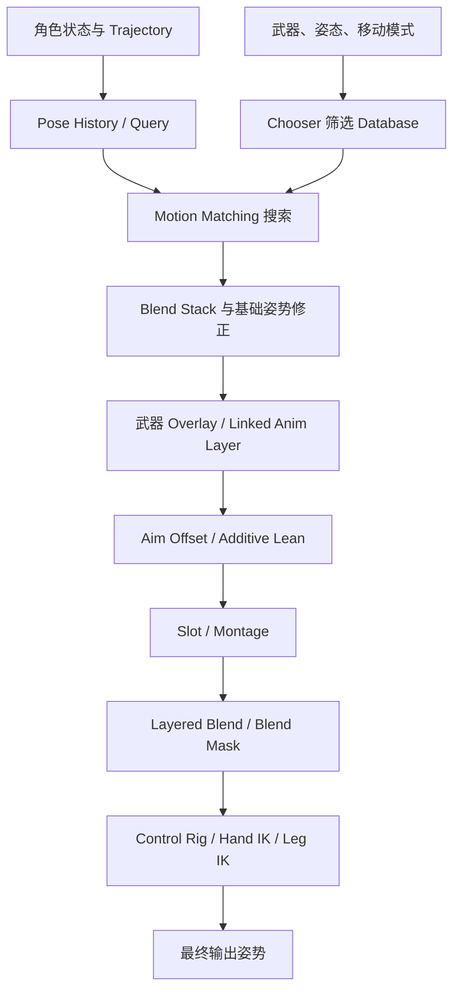

# Motion Matching 输出后的姿态叠加与分层

> Motion Matching 负责从数据库中选择并连续输出基础运动姿势；武器姿态、瞄准、Montage 和 IK 通常由后续动画层继续加工，而不是塞进同一次 Pose Search 搜索中。

## 解决的问题

完成 Motion Matching 后，角色通常仍只有一套基础 Locomotion：走、跑、起步、停止、转向和变向。实际角色还需要同时表现：

- 持枪、持刀、举盾等装备姿态。
- 视角驱动的抬头、低头和左右瞄准。
- 转弯侧倾、加速前倾和其他 Additive 动态。
- 换弹、射击、受击、翻越等具有明确时序的动作。
- 双手握持、脚部贴地和地形适配等 IK 修正。

这些需求并不改变 Motion Matching 的基本职责。Pose Search 仍然回答“基础运动应该从哪段动画的哪个时间点开始”，后续动画图再回答“在这套运动上怎样增加武器、瞄准、动作事件和接触约束”。

## 先划清职责边界

| 模块 | 主要职责 | 不负责什么 |
| --- | --- | --- |
| Pose History | 保存查询需要的历史姿势，并持有或接收 Trajectory | 不选择武器姿态，也不执行姿势混合 |
| Chooser | 根据移动模式、姿态、武器等上下文筛选 Database、Montage 或其他资源 | 不输出骨骼姿势，不在两个 Pose 之间混合 |
| Motion Matching | 在候选 Database 中搜索并输出基础姿势 | 不自动生成瞄准、换弹和手脚 IK |
| Blend Stack | 管理搜索结果切换和持续重定向的姿势流 | 不判断哪个 Database 或姿势最合适 |
| Linked Anim Layer | 把武器、瞄准、IK 等动画子图组织成可替换模块 | 本身不规定使用 Additive 还是覆盖混合 |
| Layered Blend / Blend Mask | 决定某个姿势影响哪些骨骼 | 不决定动作的播放时序 |
| Slot / Montage | 注入由玩法触发并带有 Section、Notify 等时序的动作 | 不承担持续 Locomotion 搜索 |
| Control Rig / Leg IK | 在已有姿势上满足手脚、武器或地面接触约束 | 不应重新选择基础移动动画 |

其中最容易混淆的是 Chooser。持枪时用 Chooser 返回 Rifle Database，只是在搜索前改变候选范围；真正的姿势混合仍发生在 Motion Matching 节点、Linked Anim Layer、Slot 或 Layered Blend 等动画图节点中。

## 从查询到最终姿势的数据流

可以把一帧中的处理分成四层：



这不是唯一合法顺序。Aim Offset、Montage 和 Layered Blend 的相对位置取决于动作是否还需要响应瞄准，以及 Montage 应覆盖全身还是只覆盖上半身。稳定的设计原则是：

1. 先产生基础运动，再叠加语义更具体的姿势。
2. 先完成会大范围改变身体的层，再做手脚接触等末端约束。
3. 同一种修正只保留一个主要负责人。

## Game Animation Sample 的基准链路

Game Animation Sample 的 AnimGraph 注释给出了一条很清楚的基准链：

```text
Motion Matching
  └─ Blend Stack Graph：Orientation Warping + Steering
        ↓
Simple Additive Lean
        ↓
Simple Aim Offset + Dead Blending
        ↓
Default Slot：注入 Traversal Montage
        ↓
Offset Root Bone
        ↓
Leg IK
        ↓
Pose History
        ↓
Output Pose
```

这条链说明 Motion Matching 并没有吞掉整个动画图。它输出 Locomotion 后，示例仍继续处理侧倾、瞄准、Montage、根骨偏移和腿部 IK。

Motion Matching 节点内部的 Blend Stack Graph 会应用 Orientation Warping 和 Steering，使每个被选中的基础动画都经过一致的移动方向修正。若又在主 AnimGraph 外层重复放置同类 Warping，身体和根运动会被修正两次。

Pose History 虽然为下一次搜索提供历史姿势和 Trajectory，但它不是 Overlay 层。示例将它放在输出链末端，使其持续收集动画图产生的姿势。若项目让 Pose History 采样上半身、脚部 IK 或其他被后处理显著改变的骨骼，这些变化也可能进入下一帧 Query；采样骨骼和权重应与搜索目标保持一致。

## Linked Anim Layer 如何组织 Overlay

Linked Anim Layer 的价值主要是模块化。主动画蓝图可以只维护公共数据和总装顺序，把不同武器或角色风格的实现放进遵循同一 Animation Layer Interface 的子动画蓝图：

```text
主 AnimBP
  ├─ Locomotion Layer：Motion Matching 基础姿势
  ├─ Weapon Overlay Layer：Unarmed / Rifle / Pistol / Shield
  ├─ Aim Layer：Aim Offset、瞄准权重和脊柱限制
  └─ IK Layer：Hand IK、Foot IK 或 Control Rig
```

武器切换时可以替换实现这些层的 Anim Class，而不必复制整张主 AnimGraph。没有使用到的 Linked AnimBP 及其动画资产也可以不常驻，从而降低大型角色动画图的耦合和资源占用。

Linked Anim Layer 只提供“从哪里取得这一层姿势”的接口。层内部仍要明确：

- 输入是完整基础姿势，还是只需要角色状态参数。
- 输出是全身姿势、上半身覆盖姿势，还是 Additive 姿势。
- Layer 内是否包含 Aim Offset、Slot 和 Hand IK。
- 这一层与主图中的 Blend Mask、Montage 和最终 IK 谁先执行。

如果主图和武器层都各自做一次 Aim Offset 或手部 IK，模块化反而会隐藏重复修正。

## 武器姿态的三种实现方式

### 1. 在通用 Locomotion 上叠加上半身 Overlay

Motion Matching 继续使用通用的走跑数据库，武器层提供持枪基准姿势，再通过 Layered Blend Per Bone 或 Blend Mask 从脊柱某处开始覆盖上半身。瞄准、呼吸和后坐力通常使用 Additive Pose 继续叠加。

优点是动作复用率高，一套 Locomotion 可以支持多种武器；缺点是武器重量、肩胯协同和持枪横移并未真正存在于下半身动画中。覆盖范围从骨盆开始时可能破坏步态，从过高的脊柱开始时又会让腰部和枪械脱节。

这种方案适合武器对步态影响较小、武器种类多，或项目还没有完整武器 Locomotion 数据的情况。

### 2. 为武器准备独立 Motion Matching Database

Rifle、Pistol 或 Heavy Weapon 可以分别拥有包含对应全身姿态的 Database，由 Chooser 根据武器类型、移动模式和姿态返回当前允许搜索的数据库。

优点是肩部、骨盆、步幅和转向都来自一致的全身动作，快速横移和急停时更自然；缺点是动画数据量、数据库维护和上下文切换成本明显增加，每种武器都需要足够的起步、循环、停止和转向覆盖。

这里的“切换武器数据库”不是 Overlay。Chooser 只是让 Motion Matching 改为搜索另一组基础动作；从旧数据库到新数据库的连续性仍需要搜索条件、Blend Stack 和合理的切换姿势共同保证。

### 3. 独立 Database 与上层 Overlay 组合

实际项目常采用混合方案：

- Database 负责会影响全身力学的部分，例如持枪步态、横移、急停和重武器重心。
- Overlay / Aim Offset 负责连续变化的枪口方向、呼吸、轻微后坐力和武器细节。
- Montage 负责换弹、射击事件、近战或交互时序。
- Hand IK 在最终阶段把辅助手重新约束到武器握点。

这种方式的数据成本更高，但职责最清楚。判断某个效果应该进入 Database 还是 Overlay，可以问：它是否显著改变脚步、骨盆、重心或根运动？如果答案是肯定的，单纯上半身叠加通常不足。

## Aim Offset 和 Additive Lean

Aim Offset 本质上是使用 Additive 样本的 Blend Space。它通常以“向前瞄准”的中立持枪姿势为参考，再根据 Aim Yaw 和 Aim Pitch 生成相对变化。

因此武器分层时应保证参考姿势一致：

```text
Rifle 基准姿势
      + Rifle Aim Offset
      = Rifle 最终瞄准姿势
```

若把以无武器 Idle 为参考制作的 Aim Offset 直接叠到 Rifle Overlay 上，肩、肘和脊柱会产生额外偏差。极端水平 Yaw 还可能与角色转身或 Orientation Warping 同时扭转脊柱，因此移动时通常会限制 Aim Yaw，把更大的水平角度交给角色朝向和转身系统。

Additive Lean 则根据横向加速度等动态量给全身或躯干增加侧倾。官方示例明确提醒：当 Database 已加入带转弯弧线的动画后，需要重新评估 Lean，否则动画本身的倾斜和程序化倾斜会叠加成过度侧倾。

## Montage 应该插在哪里

Montage 通过 Slot 进入 AnimGraph。Slot 是插入点，Montage 的 Section、Notify、Slot Group 和 Root Motion 决定动作的播放与控制方式；它并不会自动决定影响哪些骨骼。

常见布置方式有三种：

### 上半身动作

换弹、轻度受击或射击 Montage 可以先在上半身分支中经过 Slot，再通过 Blend Mask 与下半身 Locomotion 合并：

```text
Motion Matching 基础姿势 ───────────────┐
                                       ├─ Layered Blend → Hand IK
基础姿势 → Weapon Layer → UpperBody Slot ┘
```

这种结构让双腿继续由 Motion Matching 驱动。若换弹仍需要跟随玩家瞄准，可以让 Aim Offset 位于 Montage 之前或把瞄准作为 Montage 之上的受控 Additive；若动作必须严格保持动画作者设计的枪械轨迹，则让 Montage 覆盖 Aim Offset，或在动作期间降低 Aim 权重。

### 全身动作

翻越、处决和强制交互通常使用全身 Slot。此时 Montage 可以覆盖 Motion Matching 输出，并配合 Root Motion 或 Motion Warping 到达场景目标。需要同时处理 Motion Matching 是否继续更新、Montage 结束后的重新匹配，以及脚部 IK 是否应该在动作期间关闭或降权。

Game Animation Sample 将 Traversal Montage 注入 Default Slot，并指出 Montage 播放时 Offset Root Bone 的释放可能与 Montage 的 Motion Warping 共同产生不期望的移动。这是根骨修正重复负责同一位移的典型例子。

### Additive 动作

呼吸、后坐力和小幅受击可以使用 Additive Montage。它适合叠加短暂差值，但必须核对 Additive 类型和参考姿势。若武器层、Aim Offset 和 Montage 都包含同一份后坐力，最终幅度会被重复累加。

## Layered Blend 和 Blend Mask

Layered Blend Per Bone 或 Blend Mask 决定 Overlay 和 Montage 的骨骼作用范围。对于武器姿态，常见分界点位于脊柱，但不能只凭“从 spine_01 开始”机械配置：

- 起点过低会覆盖骨盆和腿部，削弱 Motion Matching 的脚步与重心。
- 起点过高会让腰部完全保持跑步摆动，双手与枪械像粘在胸口上。
- 只覆盖手臂而不包含锁骨、胸椎和肩胛，举枪时容易出现肩部断层。
- 头部是否属于武器层，要看 Aim Offset、Look At 和摄像机逻辑由谁负责。

使用 Blend Mask 时可以为脊柱到手臂设置渐进权重，让腰部保留部分 Locomotion，胸椎和手臂逐渐过渡到武器姿态。左右手也可以使用不同权重，但最终仍应由 Hand IK 保证双手与武器握点一致。

## IK 为什么通常放在后面

IK 处理的是“最终应该接触哪里”。如果先做 IK，再让 Overlay、Aim Offset 或 Montage 改变肩膀、骨盆和四肢，前面求得的接触结果会被覆盖。

典型末端顺序是：

```text
基础姿势与 Warping
    → 武器 / Aim / Montage 分层
    → Root Bone 或骨盆整体修正
    → Hand IK / Weapon IK
    → Leg IK / Foot Placement
```

- Hand IK 将辅助手约束到武器 Socket 或握把目标，解决瞄准、换弹和不同体型造成的手枪分离。
- Control Rig 适合处理双手、武器、胸椎和其他多约束关系，也可以实现地面对齐等程序化接触。
- Leg IK 或 Foot Placement 应看到已经完成的根骨、骨盆和腿部姿势，再把脚约束到目标位置。

“IK 放最后”也不是绝对规则。换弹过程中辅助手需要离开握把时，必须按动画曲线或 Montage 状态降低 Hand IK；攀爬 Montage 若已经准确提供手脚 Root Motion 和接触轨迹，也可能只在特定窗口启用 IK。

## Blend Stack、Dead Blending 和 Inertialization

这三者都与连续性有关，但作用层级不同。

### Blend Stack

Blend Stack 管理 Motion Matching 不断改选动画时的姿势过渡。Game Animation Sample 还在 Motion Matching 节点内部的 Blend Stack Graph 中对每个候选姿势执行 Orientation Warping 和 Steering。它属于基础姿势输出阶段。

### Inertialization

Inertialization 在收到过渡请求时保留切换瞬间的骨骼位置、旋转及运动趋势，再让旧姿势相对新姿势的残差逐渐衰减。它适合状态切换、层权重切换和不再需要持续评估来源 Pose 的场景。

### Dead Blending

Game Animation Sample 使用 Dead Blending 处理 Aim Offset 的反复启用和重置。这样在 Aim Offset 尚未完全淡出时再次进入，也能从当前运动趋势平滑转向新的目标，而不是重新开始一段普通线性 Blend。

这些过渡不能修复错误的姿势职责。如果 Rifle Database 已经包含强烈瞄准上身，又叠加完整 Rifle Overlay，增加 Blend 时间只会让重复姿势更缓慢地出现。调试时应先确认层是否重复，再调整过渡方式和时长。

## 一条可落地的武器分层顺序

下面是一条适合多数第三人称武器系统的起点：

```text
1. 更新角色状态、武器类型、Aim Yaw / Pitch 和 Trajectory
2. Chooser 按移动模式、姿态和武器筛选 Pose Search Database
3. Motion Matching 搜索基础 Locomotion
4. Blend Stack 对候选姿势过渡，并执行公共 Orientation Warping / Steering
5. 应用全身 Additive Lean，但避免与数据库弧线重复
6. 进入对应 Weapon Linked Anim Layer
7. 用 Layered Blend / Blend Mask 合并武器上身和基础下身
8. 应用与该武器参考姿势一致的 Aim Offset
9. 在 UpperBody Slot 或 FullBody Slot 注入 Montage
10. 完成 Offset Root Bone、Motion Warping 等根部处理
11. 按动作窗口执行 Hand IK、Control Rig、Leg IK / Foot Placement
12. 更新 Pose History 并输出最终姿势
```

实际图中 Aim Offset 和 UpperBody Slot 可以互换，关键取决于“Montage 是否还应响应瞄准”。根部处理和 Pose History 的位置也应以目标 UE 版本、节点输入及项目的查询骨骼为准，不应只按节点名称照抄示例。

## 常见的双重修正

| 现象 | 常见原因 | 检查方式 |
| --- | --- | --- |
| 转弯时身体侧倾过大 | Database 已有弧线倾斜，又叠加 Additive Lean | 分别关闭数据库弧线与 Lean 比较 |
| 腰和胸椎扭成麻花 | Orientation Warping、角色转身和 Aim Yaw 同时处理水平角 | 逐层关闭，确认大角度 Yaw 的唯一负责人 |
| 持枪跑步肩部过度僵硬 | 专用武器 Database 已包含上身姿态，又覆盖完整 Weapon Overlay | 降低 Overlay 范围或只保留细节 Additive |
| 换弹时左手被拉回握把 | Hand IK 在整个 Montage 期间保持满权重 | 用曲线或 Montage 窗口释放并重新锁定 |
| Montage 后角色根部滑动 | Offset Root Bone、Root Motion 和 Motion Warping 同时补偿 | 明确动作期间哪个系统拥有根位移 |
| 脚在地面来回跳 | Leg IK、Foot Placement 或自定义 Foot Lock 重复执行 | 每次只启用一套最终脚部求解链 |
| 瞄准启停有拖影或越叠越慢 | 多层 Inertialization / Dead Blending 连续衰减同一差值 | 只在拥有该层切换的边界保留一个过渡节点 |
| Motion Matching 选姿势被上身动作干扰 | Pose History / Schema 对被 Overlay 改写的上身骨骼赋予较高权重 | 检查历史采样骨骼和 Query Channel |

## 调试顺序

遇到持枪或分层问题时，按输出链从前向后逐层验证：

1. 固定 Chooser 结果，确认使用的是预期 Database。
2. 只看 Motion Matching 和 Blend Stack 的基础姿势。
3. 打开 Additive Lean，观察是否与动画原有倾斜重复。
4. 打开 Weapon Layer，并显示骨骼 Mask 权重。
5. 打开 Aim Offset，检查参考姿势、Yaw / Pitch 和极限角。
6. 单独播放 Montage，确认 Slot、Section、Root Motion 和 Layer 范围。
7. 最后打开 Hand IK、Control Rig 和 Leg IK。
8. 检查 Pose History 采样骨骼是否包含被后处理大幅修改的部分。

如果关闭某一层后问题立即消失，不要先延长 Blend 时间；先判断这一层是否使用了错误参考姿势、错误骨骼范围，或与上一层重复表达了同一个动作。

## 相关主题

- [公共基础：姿态叠加与动画分层](../Fundamentals/01-姿态叠加与动画分层.md)
- [Motion Matching 整体概念](./01-整体概念.md)
- [系统架构与数据流](./02-系统架构与数据流.md)
- [UE5 现代动画节点](../UE5现代动画节点/README.md)

## 参考资料

### Epic 官方文档

- [Motion Matching in Unreal Engine](https://dev.epicgames.com/documentation/en-us/unreal-engine/motion-matching-in-unreal-engine)
- [Pose Search in Unreal Engine](https://dev.epicgames.com/documentation/en-us/unreal-engine/pose-search-in-unreal-engine)
- [Game Animation Sample Project](https://dev.epicgames.com/documentation/en-us/unreal-engine/game-animation-sample-project-in-unreal-engine)
- [Animation Blueprint Linking](https://dev.epicgames.com/documentation/en-us/unreal-engine/animation-blueprint-linking-in-unreal-engine)
- [Aim Offset in Unreal Engine](https://dev.epicgames.com/documentation/en-us/unreal-engine/aim-offset-in-unreal-engine)
- [Animation Montage in Unreal Engine](https://dev.epicgames.com/documentation/en-us/unreal-engine/animation-montage-in-unreal-engine)
- [Using Layered Animations](https://dev.epicgames.com/documentation/en-us/unreal-engine/using-layered-animations-in-unreal-engine)
- [Control Rig in Animation Blueprints](https://dev.epicgames.com/documentation/en-us/unreal-engine/control-rig-in-animation-blueprints-in-unreal-engine)
- [Full-Body IK](https://dev.epicgames.com/documentation/en-us/unreal-engine/control-rig-full-body-ik-in-unreal-engine)
- [Pose Warping](https://dev.epicgames.com/documentation/en-us/unreal-engine/pose-warping-in-unreal-engine)
